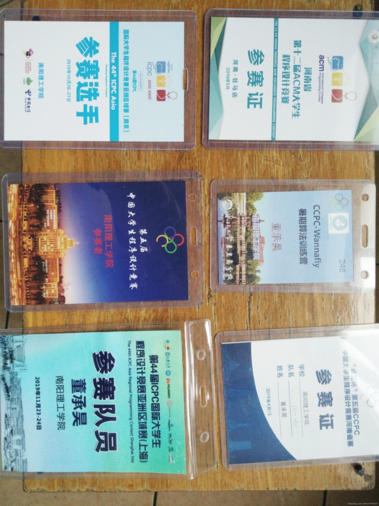
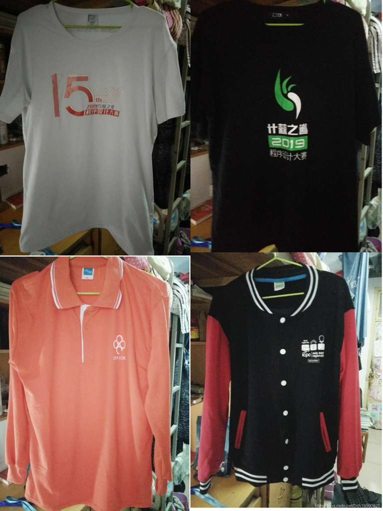
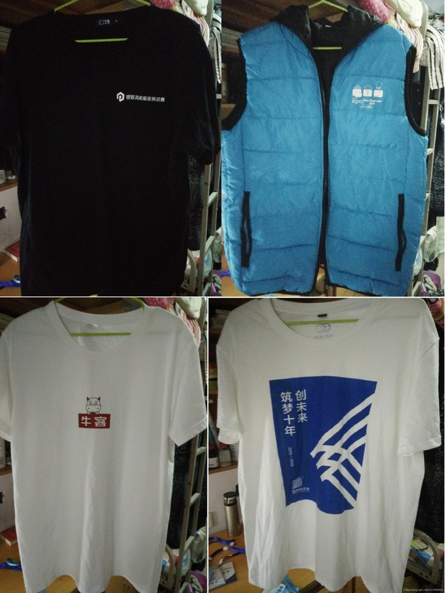

## 退役帖

最后一站ICPC上海站结束了，虽然有点遗憾（E题自己为什么写prim的时候没好好想想，为什么不写kruskal呢），但还是稳了个铜奖，也算是一个比较好的收尾吧（打都打完了，不想了，好好吸取教训！），此处膜下队友。

最后一站ICPC上海站结束了，虽然有点遗憾，但还是稳了个铜奖，也算是一个比较好的收尾吧（打都打完了，不想了，好好吸取教训！），此处膜下队友。

两年零三个月，从大一到大三，从小白到算法痴迷者，期间经历了风风雨雨，感触深切。中途也有过几次想要退出的念头，好在还是坚持了下来，在此感谢教导我的16级学长，给我了很多帮助，带我算法从无到有，给我学习的方向，虽然是学长，但是相处的时候根本没划分级别界限啊，学长太好了太有趣了。

大一的时候没有参加一个acm相关的竞赛，一直在学长的指导下学习算法，不管是在校还是寒假或暑假，都会有很长时间在工作室集训，那段时间现在想想很是怀念啊，寒假期间，路上都是白雪，中午吃饭屁颠屁颠的跟在学长后面到南门吃饭去，时不时ctx和djh学长请喝一瓶果啤，吃完回来继续集训。然后不知不觉就大二了，和队友第一次打的acm正式比赛是的郑轻的ccpc河南省省赛，赛前满怀信心叫着队友说这次看能不能夺冠，然后比赛期间就自闭了，赛后拿了银首，现在想想当时自己有多么智障，连树状数组和LCA都不会信心还那么足还那么能吹…，之后就总结经验滚回去学算法了。之后又参加ICPC河南省省赛，这时候的我还是不改当年吹的姿态，跟队友说咱们稳金，争取打到前三名！然后比赛就自闭了(期间发生了种种原因从而也看出了我省的举办ACM竞赛的水平，实在是太差了），也暴漏出了队伍的内部问题，比赛结果还是银牌首。大二下半学期蓝桥杯省赛A组打了一等奖原因，去北京参加国赛，然后因为种种原因就打铁了。。。之后就吸取教训了。大二暑假期间有一个对我ACM生涯起到关键作用的事情，在赵老师（也是我们的教练）的帮助下和队友去秦皇岛参加了ccpc-wannafly训练营，在那次训练营中学到了在学校里学不到了东西，从而知道了算法竞赛这个域的所有算法，对大三期间的实力提升起了至关重要的作用，在此Very Super感谢我们的教练！

又不知不觉大三了，打了第一场国赛级别的ACM竞赛，CCPC哈尔滨站，这场队伍水平发挥到了极致顺利拿了银牌，自己也是很是激动，毕竟本校每年的国家级银牌比例还是极低的。然后回去我就有点飘了（我咋总是飘呢…），在第二场ICPC亚洲区域赛南京站顺利打铁，比赛时在南京航空航天大学，在此处考研的15级lyq学长当我们教练，正式赛前天晚上带我们到学校和周围转了转，深切感受到什么是”别人家的学校“，真是差别太大了，学长很是热情，我是很感动的，唯一对不起的就是在学长的照顾下我们打了铁…，赛后回去调整好了自己的心态，准备了最后一场也是退役赛的ICPC亚洲区域赛上海站，前面也提到了，我们队伍的排名是93，银牌是90以内，我们只需要比赛期间少一发罚时或A了那道签到题我们就能顺利拿到银牌，可惜没有如果。

竞赛生涯总共参加了五场比赛，中间经常和队友闹矛盾，真的很感谢队友能包容我到现在，在此再次感谢队友lgp和wzy！

目前为止的参赛牌

到现在打专业竞赛和竞赛所获得的衣服

 

 然后就到了今天晚上一个光着膀子的男人坐在床上敲着键盘的这一幕，最后写些什么好呢？放一些比赛期间有趣的图片吧。

##### 剩下的放到这个链接啦：[传送门](https://blog.csdn.net/Dch19990825/article/details/103248050)

