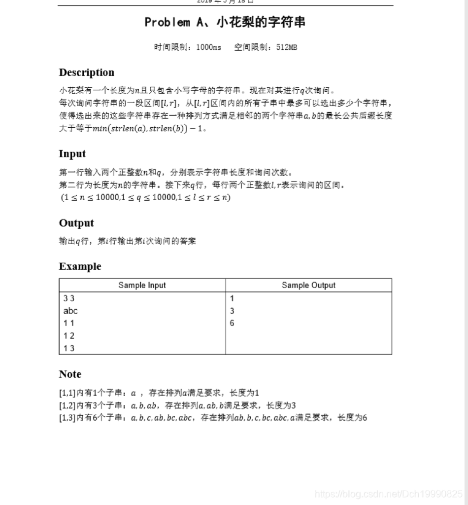
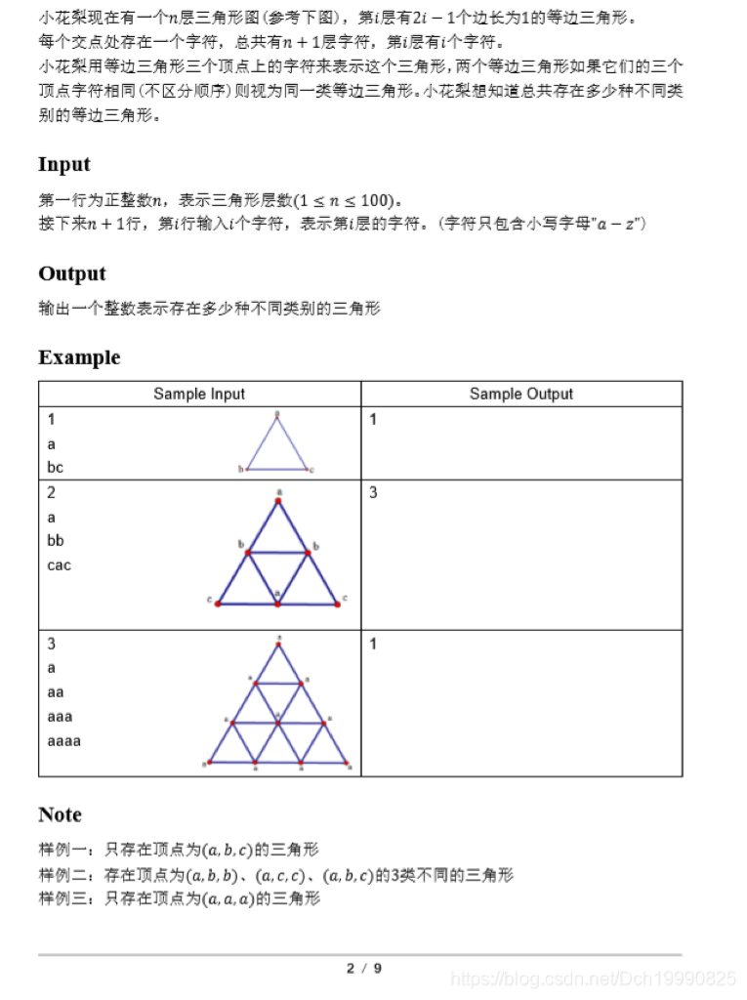
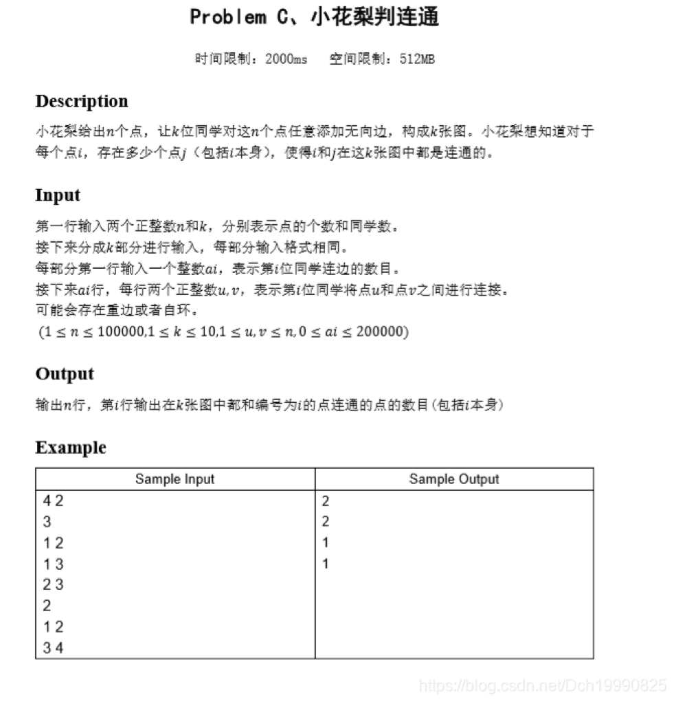
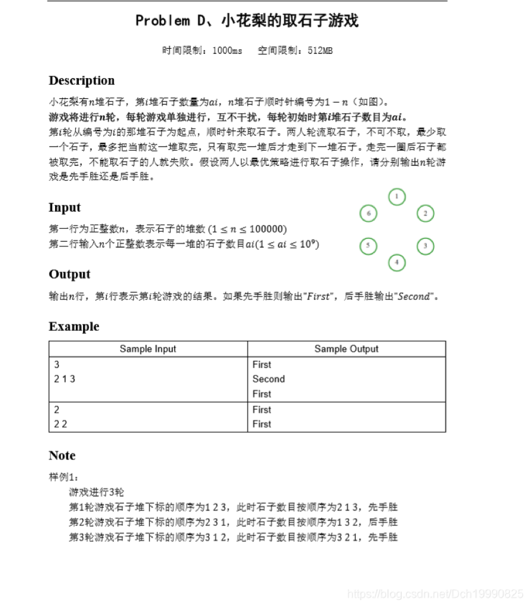

比赛链接：[https://acm.ecnu.edu.cn/contest/173](https://acm.ecnu.edu.cn/contest/173)

这次比赛A了4道题，因为SQL等课程的原因，做了3个多小时做不动就放弃了

###  


### Problem A、小花梨的字符串





 

第一眼以为防ak，过了5分钟看下榜，这么多人过，猜了一下答案应该是他的全部子串， 就这样过了

难度未知.....

```cpp
#include<bits/stdc++.h>
#define mset(a,b) memset(a,b,sizeof(a))
using namespace std;
typedef long long ll;
string s;
int main()
{
    ios::sync_with_stdio(false);
    cin.tie(0);
    ll n,q,l,r;
    cin>>n>>q>>s;
    while(q--)
    {
        cin>>l>>r;
        ll k=r-l+1;
        ll ans=k*(k+1)/2;
        cout<<ans<<endl;
    }
    return 0;
}```


 

### Problem B、小花梨的三角形 





 

这题第一次读错题意了，没过样例，以为只有小三角形，测了才知道是所有三角形。

因为每一行的两个端点l,r都确定一个或者两个三角形的下底，且不同的端点对应的三角形不同。所以枚举每一行(第 i 行)的l，r端点，找出向上方向的三角形和向下方向的三角形，其实把每一行字符串输入时都从下标0输入，那么可以看作这个大三角形是靠着左边的墙的样子。如果下底的端点分别是l，r的话，令h=r-l，那么向上方向的端点坐标是(i-h,l)，向下方向的端点坐标是(i+h,r)，然后判断是否在数据范围内，如果在就得到一个三角形。最后用set储存所有三角形的编号(从小到大排序，这样能保证每一个三角形都对应一个顺序串) 

难度:简单

```cpp
#include<bits/stdc++.h>
#define mset(a,b) memset(a,b,sizeof(a))
using namespace std;
typedef long long ll;
set<string> mmp;
string calc(string s)
{
    sort(s.begin(),s.end());
    return s;
}
char str[110][110];
int main()
{
    int n;
    string s;
    scanf("%d",&n);
    for(int i=0; i<=n; ++i)
        scanf("%s",str+i);
    for(int i=1; i<=n; ++i) //第i层 i+1个字符
        for(int r=0; r<=i; ++r)
            for(int l=0; l<r; ++l)
            {
                int h=r-l;
                if(i-h>=0){
                    s="";
                    s+=str[i-h][l];
                    s+=str[i][l];
                    s+=str[i][r];
                    s=calc(s);
                    mmp.insert(s);
                }
                if(i+h<=n){
                    s="";
                    s+=str[i+h][r];
                    s+=str[i][l];
                    s+=str[i][r];
                    s=calc(s);
                    mmp.insert(s);
                }
            }
    cout<<mmp.size()<<endl;
    return 0;
}

```


###  


### Problem C、小花梨判连通 





这道题是比较有水平的了，（比赛时候没做出来）首先复习了一下类函数模板，map的自定义排序。然后熟悉这种新的题型（不同图的联通块交集，只要染色序列相同，那么这两个顶点就在最后结果的同一个联通快中）

思路： 1.对于每个图用并查集对每个联通块染色 2.k次染色可以的得出每个点(1~n)的染色序列 3.如果i j两个点联通那么他们的染色序列相同,所以map所有染色序列即可 

难度：偏难

```cpp
/*
思路：
1.对于每个图用并查集对每个联通块染色
2.k次染色可以的得出每个点(1~n)的染色序列
3.如果i j两个点联通那么他们的染色序列相同,所以map所有染色序列即可

*/
#include<bits/stdc++.h>
#define mset(a,b) memset(a,b,sizeof(a))
using namespace std;
typedef long long ll;
int father[100005];
int n,k;
void init()
{
    for(int i=1; i<=n; ++i) father[i]=i;
}
int Find(int x)
{
    if(x==father[x]) return x;
    return father[x]=Find(father[x]);
}
class cmp{
    public:
    bool operator()(vector<int> aa,vector<int> bb)
    {
        for(int i=0; i<k; ++i)
            if(aa[i]!=bb[i]) return aa[i]<bb[i];
        return false;//相等时候一定要返回false,想一下两个数之间判断是否相等的原理就知道了
    }
};
vector<int> seq[100005];
map< vector<int>,int,cmp> mmp;
int main()
{
    ios::sync_with_stdio(false);
    cin.tie(0);
    cin>>n>>k;
    for(int pp=0; pp<k; ++pp)
    {
        int m;
        cin>>m;
        init();
        for(int i=1; i<=m; ++i)
        {
            int u,v,fu,fv;
            cin>>u>>v;
            fu=Find(u);
            fv=Find(v);
            father[fu]=fv;
        }
        for(int i=1; i<=n; ++i)
        {
            int bb=Find(i);//这个顶点所在联通快的颜色为 该集合代表顶点的顶点号
            seq[i].push_back(bb);
        }
    }
    for(int i=1;i<=n;++i)
         mmp[seq[i]]+=1;

    for(int i=1;i<=n;++i)
        cout<<mmp[seq[i]]<<endl;
    return 0;
}```


### Problem D、小花梨的取石子游戏





一道博弈题。

我是怎么博出来的呢？有点靠感觉A了。对于一个序列如果前k个都是1的话，那么他们拿石子的情况是确定的，不能改变，所以这时候什么最优策略都用不出来了。从第一个不是1的地方开始后面的几堆石子你会发现永远是先手的胜，因为先手的可以利用游戏规则，这一堆我可以取完，也可以只剩一个让另一个人来取。这样给我的感受就是局势永远掌握在先手的手中（什么博弈没用上别骂我。

所以只需求出每个序列开始连续1的个数即可。因为n太大两层for实现不太现实，不过下一次的结果可以利用上一次的结果，故我们可以双指针O(n)复杂度实现

难度：中等以上(我推了1h多...)

```cpp
#include<bits/stdc++.h>
#define mset(a,b) memset(a,b,sizeof(a))
using namespace std;
typedef long long ll;
vector<int> A(100000+100);
vector<int> ans(100000+100);
int main()
{
    ios::sync_with_stdio(false);
    cin.tie(0);
    int n;
    cin>>n;
    for(int i=0;i<n;++i) cin>>A[i];
    int k=0,val=0;
    for(int i=0;i<n;++i)
    {
        k=max(k-1,0);//利用上一次计算的结果
        while(k<n&&A[(i+k)%n]==1) k++;//求下标i开始的连续1的个数，为k个
        ans[i]=k;
    }
    for(int i=0;i<n;++i)
    {
//        printf("%d\n",ans[i]);
        if(ans[i]==n) cout<<((n%2==0)?"Second":"First")<<endl;
        else cout<<(ans[i]%2==0?"First":"Second")<<endl;
    }
    return 0;
}
```


### Problem I、小花梨点外卖 


签到题

```cpp
#include<bits/stdc++.h>
#define mset(a,b) memset(a,b,sizeof(a))
using namespace std;
typedef long long ll;
vector<int> val(100*2);
int main()
{
    int sum=0,ans,a,b,c,d,n;
    cin>>n>>a>>b>>c>>d;
    for(int i=0;i<n;++i)
    {
        cin>>val[i];
        sum+=val[i];
    }
    ans=sum;
    if(sum>=a)
        ans=min(ans,sum-b);

    if(sum>=c)
        ans=min(ans,sum-d);
    cout<<ans<<endl;
    return 0;
}```


 

比赛总结

1.map自定义比较是通过map类模板的第三个参数实现的，且第三个参数必须是一个类函数模板

2.求几个图的联通快的交集可以通过染色序列相同判断是否在同一个联通块中

