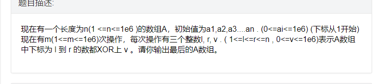

最近在做cometoj看题解的时候发现了异或差分这一性质。随性就在本校oj上出了个题，题是离线的，可以O（n）过，如果改成在线的可以用树状数组在O（n*logn） 。

问题链接：[http://acm.nyist.cf/problem/1605](http://acm.nyist.cf/problem/1605)

问题描述





与差分相似，我们构建一个异或差分数组B，那么B[i]=A[i]^A[i-1].，B[1]=A[1]。这样A[i]就可以B[i]的前缀异或得出。

这样有什么用呢？ 当我们将区间[l，r]全异或上v的时候，只有端点出B[l] 和B[r+1]改变了，我们只需将B[l]^=v,B[r+1]^=v即可

所以离线情况下直接O(m)就可以处理出m次操作后的结果

```cpp
#include<bits/stdc++.h>
#define mset(a,b) memset(a,b,sizeof(a))
typedef long long ll;
using namespace std;
const int N=1e6+10;
int A[N],C[N],L[N],R[N],V[N];
int main()
{
//    freopen("big_2.in","r",stdin);
//    freopen("big_2.out","w",stdout);```


