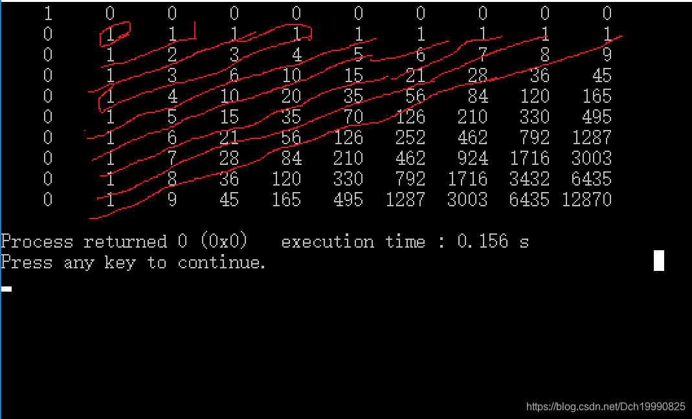

有一个无限大的矩形，初始时你在左上角（即第一行第一列），每次你都可以选择一个右下方格子，并瞬移过去（如从下图中的红色格子能直接瞬移到蓝色格子），求到第nn行第mm列的格子有几种方案，答案对1000000007取模。 


**Input**

多组测试数据。  两个整数n,m(2≤n,m≤100000)n,m(2≤n,m≤100000) 

**Output**

一个整数表示答案

**Sample Input**

```
4 5```


**Sample Output**

```
10```


### 分析：


打表找规律

代表代码

```cpp
#include<cstdio>
#include<algorithm>
#include<stack>
#include<queue>
#include<map>
#include<set>
#include<cmath>
#include<vector>
#include<cstring>
#include<string>
#include<iostream>
#include<iomanip>
#define mset(a,b)   memset(a,b,sizeof(a))
using namespace std;
typedef unsigned long long ull;
typedef long long ll;
const int maxn=1e3+100;
const int branch=26;
const int inf=0x7fffffff;
ll val[100][100];
int book[100][100];
ll dfs(int i,int j)
{
    if(book[i][j])
        return val[i][j];
    ll ans=0;
    for(int x=1;x<i;++x)
    {
        for(int y=1;y<j;++y)
            ans+=dfs(x,y);
    }
    book[i][j]=1;
    val[i][j]=ans;
    return ans;
}
void init()
{
    mset(book,0);
    mset(val,0);
    val[1][1]=1;
    book[1][1]=1;
}
int main()
{
    init();
    int x,y;
    for(int i=1;i<=10;++i)
    {
        for(int j=1;j<=10;++j)
             printf("%5lld ",dfs(i,j));
        puts("");
    }
    return 0;
}
```


 

 

规律





 

 

### 是个杨辉三角 


那么第n行第m列对应杨辉三角的第(n+m-3)行，第m-1列

求C(n+m-4,m-2)即可，

因为有除法，所以需要用到逆元

```cpp
#include<cstdio>
#include<algorithm>
#include<stack>
#include<queue>
#include<map>
#include<set>
#include<cmath>
#include<vector>
#include<cstring>
#include<string>
#include<iostream>
#include<iomanip>
#define mset(a,b)   memset(a,b,sizeof(a))
using namespace std;
typedef unsigned long long ull;
typedef long long ll;
const int maxn=1e3+100;
const int branch=26;
const int inf=0x7fffffff;
const ll mod=1e9+7;
ll quick(ll a,ll b)
{
    ll ans=1;
    while(b)
    {
        if(b&1)
        {
            ans=(a*ans)%mod;
        }
        a=(a*a)%mod;
        b>>=1;
    }
    return ans;
}
ll inv(ll a,ll q)//a模q的逆元
{
    return quick(a,q-2);
}
ll C(ll a,ll b)//线性求组合数
{
    ll ans=1;//C(a,0)的值
    for(int i=1;i<=b;++i)
    {
        ans=((ans*(a-i+1)%mod)*inv(i,mod))%mod;
    }
    return ans;
}
int main()
{
    ll n,m;
    while(~scanf("%I64d %I64d",&n,&m))
    {
        n--;
        m--;
        printf("%I64d\n",C(n+m-2,m-1));//杨辉三角的第 n+m-1行 第m列
    }
    return 0;
}
```


 

