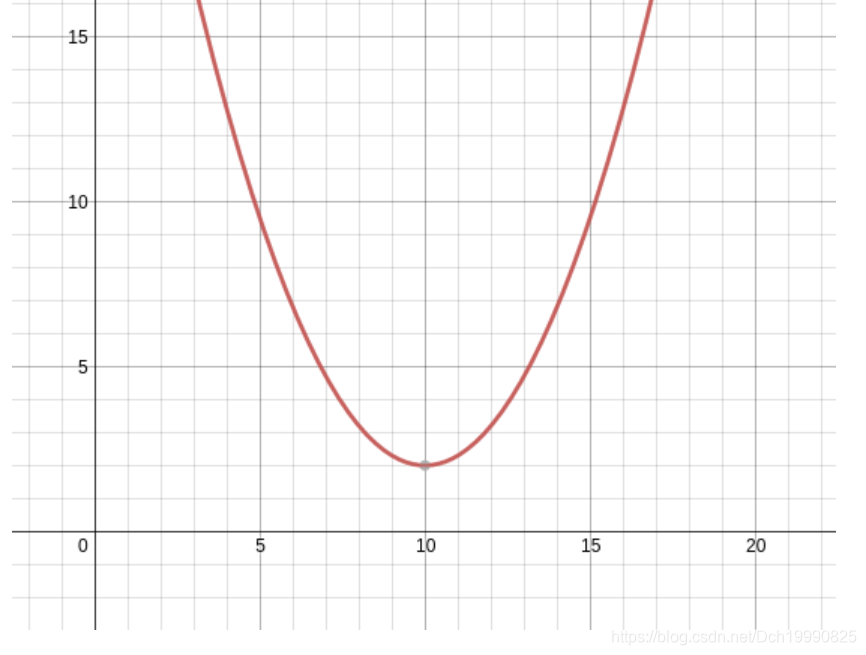

#### 问题：

假设现在有一个开头向上的抛物线，怎么快速求出其极值点呢？

#### 例子：

当然就是三分了

图片借用[https://www.cnblogs.com/whywhy/p/4886641.html](https://www.cnblogs.com/whywhy/p/4886641.html)博主

假设在[L,R]区间内仅有一极值点，要求该极值点，则可令

M1=L+(R-L)/3，M2=R-(R-L)/3。

如果像上面的抛物线一下具有则极小值点，那么存在下列性质：

**因为M1<M2**

如果f(M1)<=(M2)  

+    那么M1,M2要么在极值点的右侧，要么在极值点的两侧，但因为此时M2一定在极值点的右侧，则可缩小区间至区间[L,M2]

否则f(M1)>f(M2)

+    那么M1,M2要么在极值点的左侧，要么在极值点的两侧，但因为此时M1一定在极值点的左侧，则可缩小区间至区间[M1,R]

**每次可减少区间的1/3大小，故称为三分**

