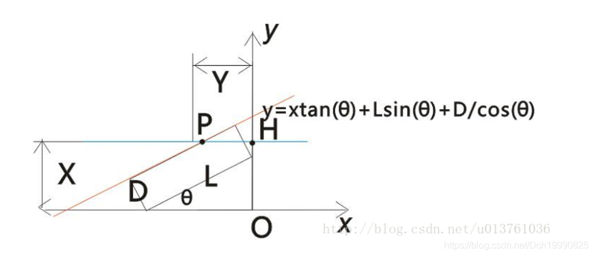

## 2019CCPC哈尔滨Artful Paintings（二分+差分约束）


题目链接：[传送门](https://codeforces.com/gym/102394/problem/A)

思路：


这题现场赛的时候TLE了，赛后才发现spfa可以剪枝，而且还缺少一约束。


我们假设答案是k，那么k+1也可行，所以可行性具有单调性。设函数S( i )为前 i 个cube画的个数。

那么有约束


+ $1 ≥ S ( i ) − S ( i − 1 ) ≥ 0 1\ge S(i)-S(i-1)\ge0$
+ 对于第一种条件，$S ( r ) − S ( l − 1 ) ≥ k S(r)-S(l-1)\ge k$
+ 对于第二种条件，$S ( n ) − S ( r ) + S ( l − 1 ) ≥ k S(n)-S(r)+S(l-1)\ge k$


因为对于第二种条件， $S ($


## [2012年NOIP全国联赛提高组] 1022: 借教室


##### 题目描述


在大学期间，经常需要租借教室。大到院系举办活动，小到学习小组自习讨论，都需要向学校申请借教室。教室的大小功能不同，借教室人的身份不同，借教室的手续也不一样。 面对海量租借教室的信息，我们自然希望编程解决这个问题。 我们需要处理接下来n天的借教室信息，其中第i天学校有ri个教室可供租借。共有m份订单，每份订单用三个正整数描述，分别为dj, sj, tj，表示某租借者需要从第sj天到第tj天租借教室（包括第sj天和第tj天），每天需要租借dj个教室。 我们假定，租借者对教室的大小、地点没有要求。即对于每份订单，我们只需要每天提供dj个教室，而它们具体是哪些教室，每天是否是相同的教室则不用考虑。 借教室的原则是先到先得，也就是说我们要按照订单的先后顺序依次为每份订单分配教室。如果在分配的过程中遇到一份订单无法完全满足，则需要停止教室的分配，通知当前申请人修改订单。这里的无法满足指从第sj天到第tj天中有至少一天剩余的教室数量不足dj个。 现在我们需要知道，是否会有订单无法完全满足。如果有，需要通知哪一个申请人修改订单。

##### 输入


每组输入数据的第一行包含两个正整数n, m，表示天数和订单的数量。 第二行包含n个正整数，其中第i个数为ri，表示第i天可用于租借的教室数量。 接下来有m行，每行包含三个正整数dj, sj, tj，表示租借的数量，租借开始、结束分别在第几天。 每行相邻的两个数之间均用一个空格隔开。天数与订单均用从1开始的整数编号。

数据规模： 对于10%的数据，有1≤n, m≤10； 对于30%的数据，有1≤n, m≤1000； 对于70%的数据，有1≤n, m≤105； 对于100%的数据，有1≤n, m≤106，0≤ri, dj≤109，1≤sj≤tj≤n。

##### 输出


如果所有订单均可满足，则输出只有一行，包含一个整数0。否则（订单无法完全满足）输出两行，第一行输出一个负整数-1，第二行输出需要修改订单的申请人编号。

下面是对样例数据的解释： 第1份订单满足后，4天剩余的教室数分别为0，3，2，3。第2份订单要求第2天到第4天每天提供3个教室，而第3天剩余的教室数为2，因此无法满足。分配停止，通知第2个申请人修改订单。

##### 样例输入 [Copy](javascript:CopyToClipboard($(’#sampleinput’).text()))


```bash
4 3
2 5 4 3
2 1 3
3 2 4
4 2 4
```


##### 样例输出 [Copy](javascript:CopyToClipboard($(’#sampleoutput’).text()))


```bash
-1
2
```


### 思路：


​ 众所周知这虽然是一个线段树模板题，但线段树会T。（可能常数太大了

​ 我们可以对于每次借教室的操作 $d d$, $l l$ , $r r$，用差分的方法把$[ l , r ] [l,r]$


## [1156C - Match Points](https://codeforces.com/contest/1156/problem/C)（二分 贪心）


### 题意：


​ 给出一个整数n和一个整数z。代表下面有n个数，如果 $a b s ( a [ i ] − a [ j ] ) &gt; = z abs(a[i]-a[j])&gt;=z$


+  
## J 分班(class)(NYIST 2019年校赛)
 


内存限制:256MB 时间限制:1s Special Judge: No

### 题目描述:


jsb 是 XX 市第一中学的校长。一轮模拟考试结束后，jsb 想让所有学生重新分班。

XX 市第一中学共有 n 位学生，其中第 i 个学生的该次模拟考试的成绩为 bi。jsb 打算将所 有学生分配到 m 个班级里，第 i 个班级的人数为 ai，即需要将恰好 ai 个人分配到第 i 个班级 内。

然而，如果班级里的学霸和班级内的其他同学水平差距过大，会使学霸产生自满度。具体 来说，如果第 i 个学生在第 j 个班级中，他的成绩比第 j 个班级的所有其他人的分数最大值 还高，那么的自满度等于他的成绩减去第 j 个班级第二名的成绩；否则他的自满度为 0。

jsb 希望所有学生的自满度的最大值尽量小。请你安排分班方案，使得所有学生自满度的 最大值最小。

例如，假设一共有 10 位学生，他们的成绩分别为 1,2,3,4,5,6,7,8,9,10，现在需要将他们 分到人数分别为 4 和 6 的两个班级内。可以把成绩为 1,2,3,4 的同学分成一个班，成绩为 5,6,7,8,9,10 的同学分成一个班，这样成绩为 4 和 10 的同学自满度为 1，其他同学的自满度 为 0，最大的自满度为 1。显然，最大的自满度不可能小于 1；当然，使自满度最大值为 1 的 分班方法还有其他很多种。

### 输入描述:


```bash
第一行 2 个正整数 n, m (2 ≤ n ≤ 100000, 1 ≤ m ≤ 50000)，表示学生人数以及班级的个数。

接下来一行 m 个正整数 a1, a2, ..., am (ai ≥ 2,∑m i=1 ai = n) ，表示每个班级的人数。

接下来一行 n 个正整数 b1, b2, ..., bn (0 ≤ bi ≤ 109)，表示每个人的成绩。
```


### 输出描述:


```bash
一行一个正整数，表示答案，即所有学生的自满度最大值的最小值。
```


### 样例输入:


```bash
10 2
4 6
1 2 3 4 5 6 7 8 9 10
```


### 样例输出:


```bash
1
```


### 提示:


### 分析：


​ 可以采用二分求解。

下面解释为什么可以使用二分求解

​ 假设答案的所要求的最小值为$k$, 现在测试$valmax$为分班后的自满度最大值

+ 如果$valmax&lt;k$ 则不管采用何种方法进行分班肯定不成功的+ 如果$valmax&gt;k$，则最优的分班方法可定能成功分班


那么对于一个$valmax$怎么去检验该值是否可行？

下面设计一个最优的分班方法：

​ 我们可以将学生成绩从小到大排序，将班级人数从小到大排序，接下来 开始从大到小开始遍历学生成绩，如果挨着的两个学生成绩之差$&lt;=valmax$ 则将这一对作为某一个班级的前二名，就这样一直下去，直到遍历完所有学生，或者选出的对数已经等于班级个数则退出遍历。下面即开始检验分班人数是否满足.

​ 记录下**每对前面可选的人数**(还未分到班级的人数)。 可以这样计算：假设班级共$m$个，总共有$n$个人，这一组前面还有$i$个人，这是第$tot$对，那么该对下前面未分班的人数为$(i-(m-tot))*2)$

​ 按照先前选出对的顺序分别作为第$m,m-1,m-2, ...1$个班的**前二名** (第$m$班的班级人数最多，第$m-1$的班级人数次多，依此类推)

​ 如果对于第$i$个班 可以分够人数，则需要满足下面两点要求

+  ​ 前i个班可以分够人数 +  ​ 如果**前i个班的需要塞的人数**(即不包括每个班前二名)<=第i个班前二名之前的人数(即还可以塞的人数) ， 那么则该班可以分够要求的人数。 


​ 如果所有的班都可以分够要求的人数，则该maxval可行。

### 代码：


```
#include<bits/stdc++.h>
#define mset(a,b)   memset(a,b,sizeof(a))
using namespace std;
const int maxn=1e5+100;
int total[maxn];//班级需要分的人数 从大到小
int frontot[maxn];//从大到小  表示 后面未分班的学生
int score[maxn<<1],book[maxn];
int m,n;
bool cmp(int a,int b)
{
    return a>b;
}
bool Check(int val)
{
/*
1.符合要求的对数，到达m对即可
2.再记下m对前面可以塞的个数
*/
    int tot=0;
    mset(book,0);
    for(int i=n-2;i>=0;--i)
    {
        if(book[i+1]||book[i])
            continue;
        if(score[i+1]-score[i]<=val)
        {
            frontot[tot]=i-(m-tot-1)*2;
            tot++;
            if(tot==m)
                break;
            book[i+1]=book[i]=1;
        }
    }
    if(tot<m)
        return 0;
    int sum=0;
    for(int i=m-1;i>=0;--i)
    {
        sum+=total[i]-2;
        if(frontot[i]<sum)
            return 0;
    }
    return 1;
}
int main()
{
    scanf("%d%d",&n,&m);
    for(int i=0;i<m;++i)
    {
        scanf("%d",total+i);
    }
    for(int i=0;i<n;++i)
        scanf("%d",score+i);
    sort(score,score+n);
    sort(total,total+m,cmp);
    int mid,ans=-1,l,r;
    l=0,r=1e9;
    while(l<=r)
    {
        mid=(l+r)>>1;
        if(Check(mid))
        {
            r=mid-1;
            ans=mid;
        }
        else
        {
            l=mid+1;
        }

    }
    printf("%d\n",ans);
    return 0;
}

```


 

[题目链接](http://poj.org/problem?id=3104)

 

 

It is very hard to wash and especially to dry clothes in winter. But Jane is a very smart girl. She is not afraid of this boring process. Jane has decided to use a radiator to make drying faster. But the radiator is small, so it can hold only one thing at a time.

Jane wants to perform drying in the minimal possible time. She asked you to write a program that will calculate the minimal time for a given set of clothes.

There are n clothes Jane has just washed. Each of them took ai water during washing. Every minute the amount of water contained in each thing decreases by one (of course, only if the thing is not completely dry yet). When amount of water contained becomes zero the cloth becomes dry and is ready to be packed.

Every minute Jane can select one thing to dry on the radiator. The radiator is very hot, so the amount of water in this thing decreases by k this minute (but not less than zero — if the thing contains less than k water, the resulting amount of water will be zero).

The task is to minimize the total time of drying by means of using the radiator effectively. The drying process ends when all the clothes are dry.

Input 

The first line contains a single integer n (1 ≤ n ≤ 100 000). The second line contains ai separated by spaces (1 ≤ ai ≤ 109). The third line contains k (1 ≤ k ≤ 109).

Output 

Output a single integer — the minimal possible number of minutes required to dry all clothes.

Sample Input 

```
sample input #1
3
2 3 9
5

sample input #2
3
2 3 6
5```

3
2 3 9
5

sample input #2
3
2 3 6
5

Sample Output 

```
sample output #1
3

sample output #2
2```

3

sample output #2
2

 

 

 

 

题目大意：

给你n件衣服，这些衣服都带有自己的水分，其中每分钟自然蒸发1滴水。你有一个小型烘干机，你可可以选择一件衣服用烘干机

一分钟内吹掉k滴水，当然烘干机每分钟只能对一件衣服进行操作。

输入：

第一行  n，接下来n个数a1,a2,a3,a4......an 分别代表衣服的水分，然后一个数k表示烘干机一分钟内吹k滴水。

 

题意也可以这样理解，所有衣服每分钟减少1滴水分，每分钟可以选择一件衣服额外减少(k-1)滴水。

 

 

这题乍看贪心，实则二分。（因为一般的贪心会超时）

**这n件衣服中，设水分最大的衣服含的水分为max, 所以答案一定在0到max之间。**

**l=0，    r=max;**

**枚举中间值mid=(l+r)/2，每件衣服先减去mid的水分，额外的水分用烘干机吹干，所用时间为t，**

**若t<=mid证明答案在mid或者mid的左边。**

**t>mid证明答案在mid 的右边**

**就这样每次减半------ - - -  - - - - - - - - - - -  直至 l=r出答案**

 

此题注意以下几点

1.开long long   int会爆

 

 

```cpp
#include<cstdio>
#include<iostream>
#include<cstring>
#include<string>
#include<cmath>
#include<algorithm>
#include<cstdlib>
#define N 100100
#define INF 0x3f3f3f3f
using namespace std;
long long  a[N];
int main()
{
    long long n,k,l,r,mid,maxx,t;
    while(~scanf("%lld",&n))
    {
        maxx=-1;
        for(int i=0; i<n; i++)
        {
            scanf("%lld",&a[i]);
            maxx=maxx>a[i]?maxx:a[i];
        }
        scanf("%lld",&k);
        l=0,r=maxx;
        if(k==1)//k=1对下面的情况不易判断，所以在此特判
        {
            printf("%lld\n",maxx);
            continue;
        }
        while(r!=l)
        {
            t=0;
            mid=(r+l)/2;
            for(int i=0; i<n; i++)
            {
                if(a[i]>mid)
                {
                    t+=(a[i]-mid)/(k-1);
                    if((a[i]-mid)%(k-1)!=0)
                        t++;
                }
            }
            if(t<=mid)
                r=mid;
            else
                l=mid+1;
        }
        cout<<l<<endl;
    }
    return 0;
}
```


 

 

 

 

 


题目：

K的因子中只包含2 3 5。满足条件的前10个数是：2,3,4,5,6,8,9,10,12,15。

所有这样的K组成了一个序列S，现在给出一个数n，求S中 >= 给定数的最小的数。

例如：n = 13，S中 >= 13的最小的数是15，所以输出15。

Input

第1行：一个数T，表示后面用作输入测试的数的数量。（1 <= T <= 10000)  第2 - T + 1行：每行1个数N(1 <= N <= 10^18)

Output

共T行，每行1个数，输出>= n的最小的只包含因子2 3 5的数。

Sample Input

```
5
1
8
13
35
77```


Sample Output

```
2
8
15
36
80```


 

几个月没打ACM了 ，第一眼看到这个题  咦 要数论解方程吗，然后在纸上一顿推公式，

推到一半 发现 emmmmmm   2^64>1e18    3^64>1e18  5^64>1e18 所以 在 1e18内是 2  3 8 因子的数字count<64*64*64

所以可以直接暴力 然后二分找出大于等于n的值就OK了  时间完全不是问题

 

```cpp
#include<stdio.h>
#include<string.h>
#include<iostream>
#include<algorithm>
using namespace std;
typedef long long ll;
ll num[30000];//注意数据范围
int main()
{
    int t,cnt=0;
    ll n;
    for(ll i=1;i<=1e18+1000;i*=2)
    {
        for(ll j=1;i*j<=1e18+1000;j*=3)
        {
            for(ll k=1;i*j*k<=1e18+1000;k*=5)
            {
                num[cnt++]=i*j*k;
            }
        }
    }
    sort(num,num+cnt);
    scanf("%d",&t);
    while(t--)
    {
        scanf("%lld",&n);
        int ans=lower_bound(num,num+cnt,n)-num;
        if(ans)//特别的 如果ans=0  即num[ans]为1  因子并没有2 3 5 需要特判一下
         cout<<num[ans]<<endl;
        else
            cout<<2<<endl;
    }
}
```


 


　　Haoren is very good at solving mathematic problems. Today he is working a problem like this:  　　Find three positive integers X, Y and Z (X < Y, Z > 1) that holds  　　 X^Z + Y^Z + XYZ = K  　　where K is another given integer.  　　Here the operator “^” means power, e.g., 2^3 = 2 * 2 * 2.  　　Finding a solution is quite easy to Haoren. Now he wants to challenge more: What’s the total number of different solutions?  　　Surprisingly, he is unable to solve this one. It seems that it’s really a very hard mathematic problem.  　　Now, it’s your turn. 

Input　　There are multiple test cases.  　　For each case, there is only one integer K (0 < K < 2^31) in a line.  　　K = 0 implies the end of input.  　　  Output　　Output the total number of solutions in a line for each test case.  Sample Input

```
9
53
6
0```


Sample Output

```
1
1
0
　　

        
  ```


Hint                                                                                                                                                                      

```
9 = 1^2 + 2^2 + 1 * 2 * 2
53 = 2^3 + 3^3 + 2 * 3 * 3

        
 ```


 

题意 给你一个k

解方程 X^Z + Y^Z + XYZ = K   其中x>=1 y>x,z>1 让你解出有多少种解

 

枚举所有x的可能情况 ，在每个x上z的可能情况枚举，然后用二分求出y，并且判断y是否符合方程。

代码：

```cpp
/*
1.x 范围为1~sqrt(k/2)  time:1~3w
2.z 范围为2~log2(k);//times:1~30
3.二分求 y  y的范围为(x+1)~pow(k,1/z);times:log(3w);
*/
#include<stdio.h>
#include<cstring>
#include<string>
#include<algorithm>
#include<math.h>
#define INF 0x3f3f3f3f
#define N 10010
using namespace std;
typedef long long ll;
//int k,x,z;
ll k;
ll qucikpow(ll a,ll b)
{
    ll ans=1;
    while(b)
    {
        if(b&1)
            ans*=a;
        a=a*a;
        b/=2;
    }
    return ans;
}
ll compute(ll x,ll y,ll z)
{
    ll ans=qucikpow(x,z)+qucikpow(y,z)+x*y*z;
    return ans;
}
int Slove(ll x,ll z)//根据此时的x z和y的范围找y 并且判断答案是否存在
{
    ll l=x+1;
    ll r,mid,ans;
    r=(ll)pow(k*1.0,1.0/z);
    while(l<r)
    {
        mid=(l+r)/2;
        ans=compute(x,mid,z);
        if(ans<k)
            l=mid+1;
        else
            r=mid;
    }
    if(l!=r)//防止r比l小
        return 0;
    ans=compute(x,r,z);
    if(ans==k)
        return 1;
    else
        return 0;
}
int main()
{
    int ans;
    ll lz;
    ll mid;
    while(~scanf("%lld",&k)&&k)//优化数据范围
    {
        ans=0;
        lz=log(k*1.0)/log(2.0);
        for(ll x=1;2*x*x<=k;x++)
        {
            mid=x*x;   
            for(ll z=2;mid<k&&z<=lz;z++)//
            {
                if(Slove(x,z))
                    ans++;
                mid*=x;
            }
        }
        printf("%d\n",ans);
    }
    return 0;
}```


#### 问题：


假设现在有一个开头向上的抛物线，怎么快速求出其极值点呢？

#### 例子：


当然就是三分了

图片借用[https://www.cnblogs.com/whywhy/p/4886641.html](https://www.cnblogs.com/whywhy/p/4886641.html)博主


假设在[L,R]区间内仅有一极值点，要求该极值点，则可令

M1=L+(R-L)/3，M2=R-(R-L)/3。

如果像上面的抛物线一下具有则极小值点，那么存在下列性质：

**因为M1<M2**

如果f(M1)<=(M2)  

+    那么M1,M2要么在极值点的右侧，要么在极值点的两侧，但因为此时M2一定在极值点的右侧，则可缩小区间至区间[L,M2]


否则f(M1)>f(M2)

+    那么M1,M2要么在极值点的左侧，要么在极值点的两侧，但因为此时M1一定在极值点的左侧，则可缩小区间至区间[M1,R]


**每次可减少区间的1/3大小，故称为三分**


Mr. West bought a new car! So he is travelling around the city.  One day he comes to a vertical corner. The street he is currently in has a width x, the street he wants to turn to has a width y. The car has a length l and a width d.  Can Mr. West go across the corner? 


**Input**

Every line has four real numbers, x, y, l and w.  Proceed to the end of file. 

**Output**

If he can go across the corner, print "yes". Print "no" otherwise. 

**Sample Input**

```
10 6 13.5 4
10 6 14.5 4```


**Sample Output**

```
yes
no```


#### 思路：


用下[https://blog.csdn.net/u013761036/article/details/24588987](https://blog.csdn.net/u013761036/article/details/24588987)博主的图





意思当车的右侧按不同的角度angle靠着右侧的墙走的时候，看是否能碰着拐角。即此时车身左侧的直线当y=X时，此时的横坐标在-Y的左边还是右边，如果满足情况下，-x<Y,证明车子可以过去，否则则不能。

因为随着angle角的增大，-x的值是一个形似开头向下的抛物线，故可以利用三分来求此抛物线的极点的值

 

```cpp
#include<cstdio>
#include<algorithm>
#include<cmath>
using namespace std;
const double wc=1e-6;
const double pi=acos(-1);
double X,Y,l,w;
double f(double x)//传弧度，返回Y=X时的-x的值
{
    return (l*sin(x)+w/cos(x)-X)/tan(x);
}
int main()
{
    while(~scanf("%lf%lf%lf%lf",&X,&Y,&l,&w))
    {
        double ll=0,rr=pi/2.0;
        while(rr-ll>wc)
        {
            double M1=ll+(rr-ll)/3;
            double M2=rr-(rr-ll)/3;
            if(f(M1)<f(M2))
                ll=M1;
            else
                rr=M2;
        }
        if(f(ll)<Y)
            printf("yes\n");
        else
            printf("no\n");
    }
    return 0;
}```


 


### G - Light Bulb


Compared to wildleopard’s wealthiness, his brother mildleopard is rather poor. His house is narrow and he has only one light bulb in his house. Every night, he is wandering in his incommodious house, thinking of how to earn more money. One day, he found that the length of his shadow was changing from time to time while walking between the light bulb and the wall of his house. A sudden thought ran through his mind and he wanted to know the maximum length of his shadow.

**Input**

The first line of the input contains an integer *T* (*T* <= 100), indicating the number of cases.

Each test case contains three real numbers *H*, *h* and *D* in one line. *H* is the height of the light bulb while *h* is the height of mildleopard. *D* is distance between the light bulb and the wall. All numbers are in range from 10-2 to 103, both inclusive, and *H* - *h* >= 10-2.

**Output**

For each test case, output the maximum length of mildleopard’s shadow in one line, accurate up to three decimal places…

**Sample Input**


3 2 1 0.5 2 0.5 3 4 3 4


**Sample Output**


1.000 0.750 4.000


##### 题意：


[https://vjudge.net/contest/277059#problem/G](https://vjudge.net/contest/277059#problem/G) 对着题中的图看，可以假设人距离灯x米，那么每一个距离都可以利用几何关系得到一个L‘（影子的长度）

当$x=D-(H*D)/H$ 的的时候刚好影子的头部在墙角处，所以，根据几何关系求出来长度f关于x的关系式

$f(x)=x*h/(H-h)...........当x&lt;=D-h*D/H$

$f(x)=D+H-x-D(H-h)/x............当x&gt;=D-h*D/H$

对应第一种情况x的范围是$[0,D-h*D/H]$ 故最大值在端点处取

对应第二种情况x的取值范围为$[D-h*D/H,D]$,求导以后最大值点对应的$x=\sqrt{D*(H-h)}$

如果极值点在该区间则最大值在该点，否则，最大值在两端取。

```cpp
#include<cstdio>
#include<algorithm>
#include<stack>
#include<queue>
#include<map>
#include<set>
#include<cmath>
#include<vector>
#include<cstring>
#include<string>
#include<iostream>
#include<iomanip>
#define mset(a,b)   memset(a,b,sizeof(a))
using namespace std;
typedef unsigned long long ull;
typedef long long ll;
const int maxn=1e5+10;
const int branch=26;
const int inf=0x7fffffff;
const double wc=1e-6;
const ll MOD=1e9+7;
int t;
double H,h,D;
double f(double x)
{
    return D+H-x-D*(H-h)/x;
}
int main()
{
    double ans;
    scanf("%d",&t);
    while(t--)
    {
        scanf("%lf %lf %lf",&H,&h,&D);
        ans=D*h/H;
         double xx=D-(h*D/H);
        double jx=sqrt(D*(H-h));
        if(xx<=jx&&jx<=D)
        {
            ans=max(ans,f(jx));
        }
        else
            ans=max(ans,f(D));
        printf("%.3lf\n",ans);
    }
    return 0;
}
```


### E - River Hopscotch


Every year the cows hold an event featuring a peculiar version of hopscotch that involves carefully jumping from rock to rock in a river. The excitement takes place on a long, straight river with a rock at the start and another rock at the end, *L* units away from the start (1 ≤ *L*≤ 1,000,000,000). Along the river between the starting and ending rocks, *N* (0 ≤ *N* ≤ 50,000) more rocks appear, each at an integral distance *Di* from the start (0 < *Di* < *L*).

To play the game, each cow in turn starts at the starting rock and tries to reach the finish at the ending rock, jumping only from rock to rock. Of course, less agile cows never make it to the final rock, ending up instead in the river.

Farmer John is proud of his cows and watches this event each year. But as time goes by, he tires of watching the timid cows of the other farmers limp across the short distances between rocks placed too closely together. He plans to remove several rocks in order to increase the shortest distance a cow will have to jump to reach the end. He knows he cannot remove the starting and ending rocks, but he calculates that he has enough resources to remove up to *M* rocks (0 ≤ *M* ≤ *N*).

FJ wants to know exactly how much he can increase the shortest distance **before** he starts removing the rocks. Help Farmer John determine the greatest possible shortest distance a cow has to jump after removing the optimal set of *M* rocks.

**Input**

Line 1: Three space-separated integers: *L*, *N*, and*M* Lines 2… *N*+1: Each line contains a single integer indicating how far some rock is away from the starting rock. No two rocks share the same position.

**Output**

Line 1: A single integer that is the maximum of the shortest distance a cow has to jump after removing *M* rocks

**Sample Input**

```bash
25 5 2
2
14
11
21
17
```


**Sample Output**

```bash
4
```


**Hint**

Before removing any rocks, the shortest jump was a jump of 2 from 0 (the start) to 2. After removing the rocks at 2 and 14, the shortest required jump is a jump of 4 (from 17 to 21 or from 21 to 25).

##### 题意：


一条河的长度为L，中间有n个石头，我现在可以去掉其中的m个石头，使得最小相邻石头距离的最大.

求最大是多少

##### 分析：


枚举最小距离，每个最小距离可以确定去除石头的和数，且最小距离与去除石头的个数之间正相关，所以枚举最小距离二分求解即可。

```cpp
#include<cstdio>
#include<algorithm>
using namespace std;
typedef unsigned long long ull;
typedef long long ll;
const int maxn=5e4+10;
int a[maxn];
int n,m,L;
int f(int x)
{
    int l,r;
    l=0,r=1;
    int ans=0;
    while(r<n+2)
    {
        if(a[r]-a[l]<x)//若最后的end都不满足 就把l所在去了，代码没写那个因为效果一样
        {
            r++;
            ans++;
        }
        else
        {
            l=r;
            r++;
        }
    }
    return ans;
}
int solve()
{
    int l=0,r=L,ans,mid;
    while(l<=r)
    {
        mid=(l+r)/2;
        if(f(mid)<=m)
        {
            ans=mid;
            l=mid+1;
        }
        else
            r=mid-1;
    }
    return ans;
}
int main()
{
    while(~scanf("%d %d %d",&L,&n,&m))
    {
        a[0]=0;
        a[n+1]=L;
        for(int i=1;i<=n;++i)
            scanf("%d",a+i);
        sort(a,a+n+2);
        printf("%d\n",solve());
    }
    return 0;
}
```


### D - Expanding Rods


When a thin rod of length L is heated n degrees, it expands to a new length L’=(1+n*C)*L, where C is the coefficient of heat expansion. When a thin rod is mounted on two solid walls and then heated, it expands and takes the shape of a circular segment, the original rod being the chord of the segment.

Your task is to compute the distance by which the center of the rod is displaced.

**Input**

The input contains multiple lines. Each line of input contains three non-negative numbers: the initial lenth of the rod in millimeters, the temperature change in degrees and the coefficient of heat expansion of the material. Input data guarantee that no rod expands by more than one half of its original length. The last line of input contains three negative numbers and it should not be processed.

**Output**

For each line of input, output one line with the displacement of the center of the rod in millimeters with 3 digits of precision.

**Sample Input**

```bash
1000 100 0.0001
15000 10 0.00006
10 0 0.001
-1 -1 -1
```


**Sample Output**

```bash
61.329
225.020
0.000
```


##### 题意：


一个长度为L的铁棒夹在距离为L的墙之间，随着温度的升高，铁棒会膨胀， 在温度n下，铁棒的的长度L‘=（1+n*c）*L ，其中n为常量系数 现在给你L N C，求铁棒的中心距离铁棒两端的高度为多少？其中铁棒弯曲后上方为一个圆形的一部分，且保证膨胀后满足 L’-L<=L/2

##### 分析：


铁棒弯曲后对应的圆的圆心在中线线上，且每一个R，就可以确定一个弧长，枚举R，求出对应的弧长l，不断逼近L，二分即可

```cpp
#include<cstdio>
#include<algorithm>
#include<stack>
#include<queue>
#include<map>
#include<set>
#include<cmath>
#include<vector>
#include<cstring>
#include<string>
#include<iostream>
#include<iomanip>
#define mset(a,b)   memset(a,b,sizeof(a))
using namespace std;
typedef unsigned long long ull;
typedef long long ll;
const int maxn=1e5+10;
const int branch=26;
const int inf=0x7fffffff;
const double wc=1e-6;
const ll MOD=1e9+7;
double L,LL,n,c;
inline double f(double r)//半径对应的弧长
{
    double as=asin(L/(2.0*r));
    return 2.0*as*r;
}
double solve()
{
    double l=L/2.0,r=1e20,mid;//枚举半径R，求出在R下的弧长即可
    while(r-l>wc)
    {
        mid=(l+r)/2.0;
        if(f(mid)<LL)
            r=mid;
        else
            l=mid;
    }
    return (l+r)/2.0;
}
int main()
{
    while(scanf("%lf %lf %lf",&L,&n,&c))
    {
        if(L<0.0||n<0.0||c<0.0)
            break;
        if(n==0.0||c==0.0)
        {
             printf("0.000\n");
             continue;
        }
        LL=(1.0+n*c)*L;
        double ar=solve();//求出半径
        double as=asin(L/(2.0*ar));//求出此时的圆心角的一半
        cout<<fixed<<setprecision(3)<<ar*(1-cos(as))<<endl;
    }
    return 0;
}
```


### B - Bound Found


Signals of most probably extra-terrestrial origin have been received and digitalized by The Aeronautic and Space Administration (that must be going through a defiant phase: “But I want to use feet, not meters!”). Each signal seems to come in two parts: a sequence of n integer values and a non-negative integer t. We’ll not go into details, but researchers found out that a signal encodes two integer values. These can be found as the lower and upper bound of a subrange of the sequence whose absolute value of its sum is closest to t.

You are given the sequence of n integers and the non-negative target t. You are to find a non-empty range of the sequence (i.e. a continuous subsequence) and output its lower index l and its upper index u. The absolute value of the sum of the values of the sequence from the l-th to the u-th element (inclusive) must be at least as close to t as the absolute value of the sum of any other non-empty range.

**Input**

The input file contains several test cases. Each test case starts with two numbers n and k. Input is terminated by n=k=0. Otherwise, 1<=n<=100000 and there follow n integers with absolute values <=10000 which constitute the sequence. Then follow k queries for this sequence. Each query is a target t with 0<=t<=1000000000.

**Output**

For each query output 3 numbers on a line: some closest absolute sum and the lower and upper indices of some range where this absolute sum is achieved. Possible indices start with 1 and go up to n.

**Sample Input**


5 1 -10 -5 0 5 10 3 10 2 -9 8 -7 6 -5 4 -3 2 -1 0 5 11 15 2 -1 -1 -1 -1 -1 -1 -1 -1 -1 -1 -1 -1 -1 -1 -1 15 100 0 0


**Sample Output**


5 4 4 5 2 8 9 1 1 15 1 15 15 1 15


##### 题意：


给你n个数，q次询问，每次询问给出一个t，让你从中找出一个**非空区间**，使得**区间和的绝对值**与t最接近。

##### 分析：


题目中重点是**区间绝对值**与t接近！

对尺取法有自己好的理解可以跳过


尺取法的原理：就像尺取虫一样，求解，《挑战程序设计竞赛》提出尺取法是建立在这样的一个模型上:

+ 找连续区间的问题，如果对于左端点s，第一个满足条件的右端点是t，那么对于左端点s+1,第一个满足条件的右端点是t’>=t


那么求所有的满足条件的区间就可以像尺取虫爬行的方式求解。


所以我们可以求出前缀和数组，对前缀和数组排序，对于一个左端点l，找出第一个右端点r，满足区间对应的值>=t，对于左端点 l 区间和绝对值最接近t的就在此时的r和r-1处中取，只需要在r在递增的过程中不停的更新最小值即可。

**没疑问的可以跳过**


可能会产生这个疑问

找到第一个l对应的r之后，对于l+1他的右端点是r’>=r，那么左端点逼近之后(l++)为什么不更新下此时的l与r-1区间是否可能是答案？

答：因为l与r-1已经更新过答案，又因为l+1与r-1的区间的绝对值肯定比t小，而且比l与r-1的区间的绝对值更小，所以答案不可能在l+1与r-1对应的区间。

所以l++即可，不用在此时判断与r-1的区间的绝对值有无可能在答案。


代码：

```cpp
#include<cstdio>
#include<algorithm>
#include<stack>
#include<queue>
#include<map>
#include<set>
#include<cmath>
#include<vector>
#include<cstring>
#include<string>
#include<iostream>
#include<iomanip>
#define mset(a,b)   memset(a,b,sizeof(a))
using namespace std;
typedef unsigned long long ull;
typedef long long ll;
const int maxn=1e5+10;
const int branch=26;
const int inf=0x7fffffff;
const ll MOD=1e9+7;
struct Node{
    int val,id;
}a[maxn];
bool operator <(Node a,Node b)
{
    return a.val<b.val;
}
int main()
{
    int n,q,t;
    int nval;
    while(scanf("%d%d",&n,&q)&&(n|q))
    {
        a[0].val=0;
        a[0].id=0;
        for(int i=1;i<=n;++i)
        {
            int val;
            scanf("%d",&val);
            a[i].val=a[i-1].val+val;
            a[i].id=i;
        }
        sort(a,a+n+1);
        int al,ar,sum,l,r,minn;
        while(q--)
        {
            scanf("%d",&t);
            l=0,r=1;
            minn=inf;//区间绝对值与t之差的绝对值
            for(;;)
            {
                while(r<=n)
                {
                    nval=a[r].val-a[l].val;
                    if(abs(nval-t)<minn)
                    {
                        minn=abs(nval-t);
                        al=min(a[r].id,a[l].id)+1;
                        ar=max(a[r].id,a[l].id);
                        sum=nval;
                    }
                    if(nval<t)
                        r++;
                    else
                        break;
                }
                if(r>n)
                    break;
                else
                {
                    l++;
                    if(l==r)
                        r++;
                }
            }
            printf("%d %d %d\n",sum,al,ar);
        }
    }
    return 0;
}

```


### A - Jessica’s Reading Problem（尺取法入门题）


Jessica’s a very lovely girl wooed by lots of boys. Recently she has a problem. The final exam is coming, yet she has spent little time on it. If she wants to pass it, she has to master all ideas included in a very thick text book. The author of that text book, like other authors, is extremely fussy about the ideas, thus some ideas are covered more than once. Jessica think if she managed to read each idea at least once, she can pass the exam. She decides to read only one contiguous part of the book which contains all ideas covered by the entire book. And of course, the sub-book should be as thin as possible.

A very hard-working boy had manually indexed for her each page of Jessica’s text-book with what idea each page is about and thus made a big progress for his courtship. Here you come in to save your skin: given the index, help Jessica decide which contiguous part she should read. For convenience, each idea has been coded with an ID, which is a non-negative integer.

Input

The first line of input is an integer *P* (1 ≤ *P* ≤ 1000000), which is the number of pages of Jessica’s text-book. The second line contains *P* non-negative integers describing what idea each page is about. The first integer is what the first page is about, the second integer is what the second page is about, and so on. You may assume all integers that appear can fit well in the signed 32-bit integer type.

Output

Output one line: the number of pages of the shortest contiguous part of the book which contains all ideals covered in the book.

Sample Input

```bash
5
1 8 8 8 1
```


Sample Output

```cpp
2
```


####题意：

给你一个n，下面有n个数。求一个最短的区间，这n个数都在这个区间出现过。

##### 分析：


尺取法的原理：就像尺取虫一样，求解，《挑战程序设计竞赛》提出尺取法是建立在这样的一个模型上:

+ 找连续区间的问题，如果对于左端点s，第一个满足条件的右端点是t，那么对于左端点s+1,第一个满足条件的右端点是t’>=t


那么求所有的满足条件的区间就可以像尺取虫爬行的方式求解。


必须用O（n）的方法求解，又符合尺取法的条件

看代码理解：

```cpp
#include<cstdio>
#include<algorithm>
#include<map>
#include<set>
using namespace std;
const int maxn=1e6+10;
set<int>All;
map<int,int> times;
int a[maxn];
int main()
{
    int p,n,minn;
    scanf("%d",&p);
    for(int i=0;i<p;++i)
    {
        scanf("%d",a+i);
        All.insert(a[i]);
    }
    n=All.size();
    minn=p;
    int l=0,r=0;
    int sum=0;
    for(;;)
    {
        while(r<p&&sum<n)//不停的向右延申 直到出现的页数==N
        {
            if(times[a[r]]==0)
                sum++;
            times[a[r++]]++;
        }
        if(sum<n)//sum<n r延申出去了
            break;
        minn=min(minn,r-l);
        times[a[l]]--;//l右移动
        if(times[a[l++]]==0)//当l肯定没答案的时候
            sum--;
        if(p-l<n)
            break;
    }
    printf("%d\n",minn);
    return 0;
}
```


### I - Toxophily


 

The recreation center of WHU ACM Team has indoor billiards, Ping Pang, chess and bridge, toxophily, deluxe ballrooms KTV rooms, fishing, climbing, and so on.  We all like toxophily.  Bob is hooked on toxophily recently. Assume that Bob is at point (0,0) and he wants to shoot the fruits on a nearby tree. He can adjust the angle to fix the trajectory. Unfortunately, he always fails at that. Can you help him?  Now given the object's coordinates, please calculate the angle between the arrow and x-axis at Bob's point. Assume that g=9.8N/m. 

**Input**

The input consists of several test cases. The first line of input consists of an integer T, indicating the number of test cases. Each test case is on a separated line, and it consists three floating point numbers: x, y, v. x and y indicate the coordinate of the fruit. v is the arrow's exit speed.  Technical Specification  1. T ≤ 100.  2. 0 ≤ x, y, v ≤ 10000. 

**Output**

For each test case, output the smallest answer rounded to six fractional digits on a separated line.  Output "-1", if there's no possible answer.  Please use radian as unit. 

**Sample Input**

```
3
0.222018 23.901887 121.909183
39.096669 110.210922 20.270030
138.355025 2028.716904 25.079551```


**Sample Output**

```
1.561582
-1
-1
```


#### 题意：


在一个平面坐标系中，你要射苹果，苹果在坐标（x,y），且你射箭的速度是v，重力加速度是9.8N/m，求射中苹果的时弓箭与x轴的弧度.

#### 思路：


枚举弓箭与x轴的弧度angle，每一个angle对应一个y，y为当箭与苹果在一条垂直线上时，箭的高度(可以为负)。

易证明随着angle的增大，其y是一个形似开口向上的抛物线，若其中的极大值大于苹果的高度Y，此时一定有界，可以三分求出此位置设为pos，那么二分枚举anlge在[0,pos]就可以求出来y==苹果的高度时的弓箭与x轴的弧度

如果对三分不了解，传送门：[https://www.cnblogs.com/whywhy/p/4886641.html](https://www.cnblogs.com/whywhy/p/4886641.html)

代码：

```cpp
#include<cstdio>
#include<algorithm>
#include<cmath>
using namespace std;
const double pi=acos(-1);
const double wc=1e-8;
double X,Y,V;
double f(double x)/*先求极大值 然后二分找答案*/
{
    double ans=0;
    double t=X/(V*cos(x));
    ans=V*sin(x)*t-0.5*9.8*t*t;
    return ans;
}
int main()
{
    double l,r,maxx;
    int t;
    scanf("%d",&t);
    while(t--)
    {
        scanf("%lf%lf%lf",&X,&Y,&V);
        l=0.0,r=pi/2.0;
        while(r-l>wc)
        {
            double M1=l+(r-l)/3;
            double M2=r-(r-l)/3;
            if(f(M1)<f(M2))
                l=M1;
            else
                r=M2;
        }
        maxx=(r+l)/2.0;
        if(f(maxx)<Y)
        {
             printf("-1\n");
             continue;
        }
        /*二分求答案*/
        l=0.0,r=maxx;
        while(r-l>wc)
        {
            double mid=(l+r)/2.0;
            if(f(mid)<Y)
                l=mid;
            else
                r=mid;
        }
        printf("%.6f\n",(l+r)/2);
    }
    return 0;
}```


 

 

二分/三分

