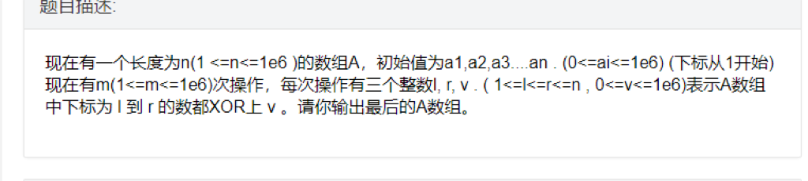

程序设计挑战竞赛上156页说了枚举组合和子集的几种方法，我觉得挺好的，收藏一下

都是利用二进制数的模型来进行枚举子集或者组合

下面枚举集合都是在二进制位上进行枚举。

##枚举k个数的子集

```cpp
void EunmSet(int k)//用k个二进制位数枚举k个状态
{
   
    for(int i=0;i<1<<k;++i)
    ```


## 背包问题之退背包


退背包就是从可选物品中删除其中一个物品，问满足所取总价值为 $j j$ 的方案数。

像普通背包一样，退背包先普通dp以下，然后退去所选物品。

对于**01背包**，假设$d p [ i ] ​ dp[i]​$为未退背包前满足所取总价值为 $i ​ i​$ 的方案数。$d p ′ [ i ] ​ dp'[i]​$ 为退去第$x ​ x​$个物品后满足所取总价值为$i ​ i​$的方案数，那么 dp方程为


+ 当$i < w [ x ] ​ i<w[x]​$


## codeforces 1207F. Remainder Problem(平方启发)


#### 题目链接：[传送门](https://codeforces.com/contest/1207/problem/F)


#### 题意：


现在有一个大小为500000的数组，初始每个元素都为0，索引从1开始，现有两个操作：

1 x y–代表将索引为x的元素值加y

2 x y–代表求数组中所有索引满足**取余x等于y**的的元素值和。

#### 思路：


对于每个查询如果采用暴力的方式话时间复杂度为$O(N/x)$，其中N为数组大小。这对x较大的时候可以使用这种方法。

对于 $x$ 较小时，假设 $x\le K$，那么查询有$K^2$种，假如我们维护每组查询的结果，那么对于每次1操作，我们需要$O(K)$维护较小的$x\le K$的查询。

我们让$K$取$sqrt(N)$，那么总的时间复杂度为$O(N*sqrt(N))$

**代码**：

```cpp
#include<bits/stdc++.h>
#define mset(a,b) memset(a,b,sizeof(a))
using namespace std;
typedef long long ll;
typedef pair<int,int> P;
int a[750][750],b[500005];//<=720处理,>720暴力
int main()
{
    int q;
    scanf("%d",&q);
    while(q--)
    {
        int cmd,x,y;
        scanf("%d%d%d",&cmd,&x,&y);
        if(cmd==1)
        {
            b[x]+=y;
            for(int i=1;i<=720;++i)
                a[i][x%i]+=y;
        }
        else{
            if(x<=720){
                printf("%d\n",a[x][y]);
            }
            else{
                int ans=0;
                for(int k=0;k*x+y<=500000;++k){
                    ans+=b[k*x+y];
                }
                printf("%d\n",ans);
            }
        }
    }
    return 0;
}

```


最近在做cometoj看题解的时候发现了异或差分这一性质。随性就在本校oj上出了个题，题是离线的，可以O（n）过，如果改成在线的可以用树状数组在O（n*logn） 。

问题链接：[http://acm.nyist.cf/problem/1605](http://acm.nyist.cf/problem/1605)

问题描述





与差分相似，我们构建一个异或差分数组B，那么B[i]=A[i]^A[i-1].，B[1]=A[1]。这样A[i]就可以B[i]的前缀异或得出。

这样有什么用呢？ 当我们将区间[l，r]全异或上v的时候，只有端点出B[l] 和B[r+1]改变了，我们只需将B[l]^=v,B[r+1]^=v即可

所以离线情况下直接O(m)就可以处理出m次操作后的结果

```cpp
#include<bits/stdc++.h>
#define mset(a,b) memset(a,b,sizeof(a))
typedef long long ll;
using namespace std;
const int N=1e6+10;
int A[N],C[N],L[N],R[N],V[N];
int main()
{
//    freopen("big_2.in","r",stdin);
//    freopen("big_2.out","w",stdout);```


## [2012年NOIP全国联赛提高组] 1022: 借教室


##### 题目描述


在大学期间，经常需要租借教室。大到院系举办活动，小到学习小组自习讨论，都需要向学校申请借教室。教室的大小功能不同，借教室人的身份不同，借教室的手续也不一样。 面对海量租借教室的信息，我们自然希望编程解决这个问题。 我们需要处理接下来n天的借教室信息，其中第i天学校有ri个教室可供租借。共有m份订单，每份订单用三个正整数描述，分别为dj, sj, tj，表示某租借者需要从第sj天到第tj天租借教室（包括第sj天和第tj天），每天需要租借dj个教室。 我们假定，租借者对教室的大小、地点没有要求。即对于每份订单，我们只需要每天提供dj个教室，而它们具体是哪些教室，每天是否是相同的教室则不用考虑。 借教室的原则是先到先得，也就是说我们要按照订单的先后顺序依次为每份订单分配教室。如果在分配的过程中遇到一份订单无法完全满足，则需要停止教室的分配，通知当前申请人修改订单。这里的无法满足指从第sj天到第tj天中有至少一天剩余的教室数量不足dj个。 现在我们需要知道，是否会有订单无法完全满足。如果有，需要通知哪一个申请人修改订单。

##### 输入


每组输入数据的第一行包含两个正整数n, m，表示天数和订单的数量。 第二行包含n个正整数，其中第i个数为ri，表示第i天可用于租借的教室数量。 接下来有m行，每行包含三个正整数dj, sj, tj，表示租借的数量，租借开始、结束分别在第几天。 每行相邻的两个数之间均用一个空格隔开。天数与订单均用从1开始的整数编号。

数据规模： 对于10%的数据，有1≤n, m≤10； 对于30%的数据，有1≤n, m≤1000； 对于70%的数据，有1≤n, m≤105； 对于100%的数据，有1≤n, m≤106，0≤ri, dj≤109，1≤sj≤tj≤n。

##### 输出


如果所有订单均可满足，则输出只有一行，包含一个整数0。否则（订单无法完全满足）输出两行，第一行输出一个负整数-1，第二行输出需要修改订单的申请人编号。

下面是对样例数据的解释： 第1份订单满足后，4天剩余的教室数分别为0，3，2，3。第2份订单要求第2天到第4天每天提供3个教室，而第3天剩余的教室数为2，因此无法满足。分配停止，通知第2个申请人修改订单。

##### 样例输入 [Copy](javascript:CopyToClipboard($(’#sampleinput’).text()))


```bash
4 3
2 5 4 3
2 1 3
3 2 4
4 2 4
```


##### 样例输出 [Copy](javascript:CopyToClipboard($(’#sampleoutput’).text()))


```bash
-1
2
```


### 思路：


​ 众所周知这虽然是一个线段树模板题，但线段树会T。（可能常数太大了

​ 我们可以对于每次借教室的操作 $d d$, $l l$ , $r r$，用差分的方法把$[ l , r ] [l,r]$


## Right turn(SCU-4445) (离散化+模拟)


frog is trapped in a maze. The maze is infinitely large and divided into grids. It also consists of nn obstacles, where the ii-th obstacle lies in grid (xi,yi)(xi,yi).

frog is initially in grid (0,0)(0,0), heading grid (1,0)(1,0). She moves according to *The Law of Right Turn*: she keeps moving forward, and turns right encountering a obstacle.

The maze is so large that frog has no chance to escape. Help her find out the number of turns she will make.

### Input


The input consists of multiple tests. For each test:

The first line contains 1 integer n (0≤n≤1000). Each of the following n lines contains 2 integers xi,y(|xi|,|yi|≤109,(xi,yi)≠(0,0) all (xi,yi)are distinct)

### Output


For each test, write 11 integer which denotes the number of turns, or `-1` if she makes infinite turns.

### Sample Input


```bash
    2
    1 0
    0 -1
    1
    0 1
    4
    1 0
    0 1
    0 -1
    -1 0
```


### Sample Output


```bash
    2
    0
    -1
```


### 题意:


​ 一个迷宫有n块石头,一个人从(0,0)出发,一开始是面向右边,如果他遇到石头就要向右转,问这个人要转几次弯,如果会无限次转弯就输出-1

我看网上题解大部分都是二分找点走，而这里采用的是坐标离散化，然后自动转弯走。

### 思路：


​ 离散化上所有石头坐标，这样形成的地图最多为$2*n$ * $2*n$，然后while循环自动转完即可，走到边界离散化的行或列就算走出去了。

代码：

```cpp
#include<bits/stdc++.h>
#define mset(a,b) memset(a,b,sizeof(a))
typedef long long ll;
using namespace std;
int X[1100],Y[1100],sx[1100],sy[1100],XX[2100],YY[2100];
int dir[4][2]={
1,0,
0,-1,
-1,0,
0,1
};
int book[2100][2100][4];
int flies[2100][2100];
void getd(int dr,int &dx,int &dy){
    dx=dir[dr][0];
    dy=dir[dr][1];
}
int main()
{
    //1e9+1 1e9+1
    ios::sync_with_stdio(false);
    cin.tie(0);
    int n;
    while(cin>>n)
    {
        int cnt=0;
        X[0]=Y[0]=XX[0]=YY[0]=0;
        for(int k=-1;k<1;++k)
        {
            XX[cnt]=k;
            YY[cnt]=k;
            cnt++;
        }
        for(int i=1;i<=n;++i){
            cin>>X[i]>>Y[i];
            for(int k=-1;k<1;++k)
            {
                XX[cnt]=X[i]+k;
                YY[cnt]=Y[i]+k;
                cnt++;
            }
        }
        X[n+1]=Y[n+1]=XX[cnt]=YY[cnt]=1e9+10;
        cnt++;
        X[n+2]=Y[n+2]=XX[cnt]=YY[cnt]=-1e9-10;
        cnt++;
        int tx,ty;
        sort(XX,XX+cnt);
        sort(YY,YY+cnt);
        tx=unique(XX,XX+cnt)-XX;
        ty=unique(YY,YY+cnt)-YY;
        for(int i=0;i<n+3;++i){
            sx[i]=lower_bound(XX,XX+tx,X[i])-XX;
            sy[i]=lower_bound(YY,YY+ty,Y[i])-YY;
            if(i>=1&&i<=n){
                flies[sx[i]][sy[i]]=1;
            }
        }
        int lx=sx[n+2],rx=sx[n+1],ly=sy[n+2],ry=sy[n+1];
        int nx=sx[0],ny=sy[0],dr=0,tus=0,flag=0;
        book[nx][ny][dr]=1;
        while(true)
        {
            if(nx<=lx||nx>=rx||ny<=ly||ny>=ry){
                flag=1;
                break;
            }
            int dx,dy;
            getd(dr,dx,dy);
            if(flies[nx+dx][ny+dy]==0){
                nx+=dx;
                ny+=dy;
                book[nx][ny][dr]=1;
                continue;
            }
            if(book[nx][ny][(dr+1)%4]==0)
            {
                dr=(dr+1)%4;
                tus++;
                book[nx][ny][dr]=1;
                continue;
            }
            break;
        }
        if(!flag)
            cout<<-1<<endl;
        else
            cout<<tus<<endl;
            mset(book,0);
            mset(flies,0);
    }
    return 0;
}

```


### UVA10934&&蓝桥杯::测试次数&&鹰蛋问题


​ 以上三种问题都属于一种问题，这里我用鹰蛋问题为例进行分析


参考网址：[http://datagenetics.com/blog/july22012/index.html](http://datagenetics.com/blog/july22012/index.html)

只有这篇完全诠释了我的所有问题。


我这里只讲述动态规划的解决方案。请耐心看完


$f [ e ] [ k ] ​ f[e][k]​$代表有 $e ​ e​$ 鸡蛋 $k ​ k​$ 层楼 找出答案的最小测试次数。


+  假设我这次测试时候在第$1 ​ 1​$到$k ​ k​$的第$i ​ i​$ 层扔鸡蛋。那么分两种情况：


+  **在第$i ​ i​$层鸡蛋没碎**，那么坚韧度在$[ i + 1 , k ] ​ [i+1,k] ​$中,即在$k − i ​ k-i​$ 个连续的层之间，现在我还有$e − 1 ​ e-1​$个鸡蛋，那么问题归结到$f [ e − 1$


杜教BM递推，据说可以输入矩阵，但是我还不太清楚，

初始数据在初始化vector容器时候输入就ok ，输出第n项

```cpp
#include <bits/stdc++.h>

using namespace std;
typedef vector<long long> VI;
typedef long long ll;
const ll mod=1e9+7;
ll powmod(ll a,ll b)
{
    ll res=1;
    a%=mod;
    assert(b>=0);
    for(; b; b>>=1)
    {
        if(b&1)res=res*a%mod;
        a=a*a%mod;
    }
    return res;
}
namespace linear_seq
{
#define rep(i,a,n) for (long long i=a;i<n;i++)
#define pb push_back
#define SZ(x) ((long long)(x).size())
const long long N=10010;
ll res[N],base[N],_c[N],_md[N];

vector<long long> Md;
void mul(ll *a,ll *b,long long k)
{
    rep(i,0,k+k) _c[i]=0;
    rep(i,0,k) if (a[i]) rep(j,0,k)
        _c[i+j]=(_c[i+j]+a[i]*b[j])%mod;
    for (long long i=k+k-1; i>=k; i--) if (_c[i])
            rep(j,0,SZ(Md)) _c[i-k+Md[j]]=(_c[i-k+Md[j]]-_c[i]*_md[Md[j]])%mod;
    rep(i,0,k) a[i]=_c[i];
}
long long solve(ll n,VI a,VI b)
{
    // a 系数 b 初值 b[n+1]=a[0]*b[n]+...
    //        printf("%d\n",SZ(b));
    ll ans=0,pnt=0;
    long long k=SZ(a);
    assert(SZ(a)==SZ(b));
    rep(i,0,k) _md[k-1-i]=-a[i];
    _md[k]=1;
    Md.clear();
    rep(i,0,k) if (_md[i]!=0) Md.push_back(i);
    rep(i,0,k) res[i]=base[i]=0;
    res[0]=1;
    while ((1ll<<pnt)<=n) pnt++;
    for (long long p=pnt; p>=0; p--)
    {
        mul(res,res,k);
        if ((n>>p)&1)
        {
            for (long long i=k-1; i>=0; i--) res[i+1]=res[i];
            res[0]=0;
            rep(j,0,SZ(Md)) res[Md[j]]=(res[Md[j]]-res[k]*_md[Md[j]])%mod;
        }
    }
    rep(i,0,k) ans=(ans+res[i]*b[i])%mod;
    if (ans<0) ans+=mod;
    return ans;
}
VI BM(VI s)
{
    VI C(1,1),B(1,1);
    long long L=0,m=1,b=1;
    rep(n,0,SZ(s))
    {
        ll d=0;
        rep(i,0,L+1) d=(d+(ll)C[i]*s[n-i])%mod;
        if (d==0) ++m;
        else if (2*L<=n)
        {
            VI T=C;
            ll c=mod-d*powmod(b,mod-2)%mod;
            while (SZ(C)<SZ(B)+m) C.pb(0);
            rep(i,0,SZ(B)) C[i+m]=(C[i+m]+c*B[i])%mod;
            L=n+1-L;
            B=T;
            b=d;
            m=1;
        }
        else
        {
            ll c=mod-d*powmod(b,mod-2)%mod;
            while (SZ(C)<SZ(B)+m) C.pb(0);
            rep(i,0,SZ(B)) C[i+m]=(C[i+m]+c*B[i])%mod;
            ++m;
        }
    }
    return C;
}
long long gao(VI a,ll n)
{
    VI c=BM(a);
    c.erase(c.begin());
    rep(i,0,SZ(c)) c[i]=(mod-c[i])%mod;
    return solve(n,c,VI(a.begin(),a.begin()+SZ(c)));
}
};

int main()
{
    long long n;
    while(~scanf("%I64d", &n))
    {
        printf("%I64d\n",linear_seq::gao(VI{1,5,11,36,95,281,781,2245,6336,18061, 51205},n-1));
    }
}


```


### nth_element() O(n)复杂度求第k+1小元素


##### 函数原型


```cpp
void nth_element(_RAIter, _RAIter, _RAIter);
void nth_element(_RAIter, _RAIter, _RAIter, _Compare);
void nth_element(_RandomAccessIterator __first, _RandomAccessIterator __nth,
		_RandomAccessIterator __last)
void nth_element(_RandomAccessIterator __first, _RandomAccessIterator __nth,
		_RandomAccessIterator __last, _Compare __comp)
```


##### 先看官方的声明


```cpp
void nth_element(_RAIter, _RAIter, _RAIter);
```


/*

@brief Sort a sequence just enough to find a particular position

using a predicate for comparison.

@ingroup sorting_algorithms

@param __first An iterator.

@param __nth Another iterator.

@param __last Another iterator.

@param __comp A comparison functor.

@return Nothing.

Rearranges the elements in the range @p [__first,__last) so that @p *__nth is the same element that would have been in that position had the whole sequence been sorted. The elements either side of @p *__nth are not completely sorted, but for any iterator @e i in the range @p [__first,__nth)


## 关于向上取整和向下取整知识整理


向下取整函数$f ( x ) = ⌊ x ⌋ f(x)=\lfloor x\rfloor$ 是单调递增的 ，向上取整函数$f ( x ) = ⌈ x ⌉ f(x)=\lceil x\rceil$也是单调递增的。

对任意整数n，


$$⌈ n 2 ⌉ + ⌊ n 2 ⌋ = n \lceil \frac{n}{2}\rceil+\lfloor \frac{n}{2}\rfloor=n$$


$$⌈ n b ⌉ = ⌊ n + b − 1 b ⌋ ​ \lceil \frac{n}{b}\rceil=\lfloor \frac{n+b-1}{b}\rfloor​$$


对任意 **实数**$x ≥ 0 x\ge0$和**整数**$a , b > 0 a,b>0$


$$⌈ ⌈ x / a ⌉ b ⌉ = ⌈ x a b ⌉ ​ \lceil \frac{\lceil x/a\rceil}{b}\rceil=\lceil \frac{x}{ab} \rceil​$$


