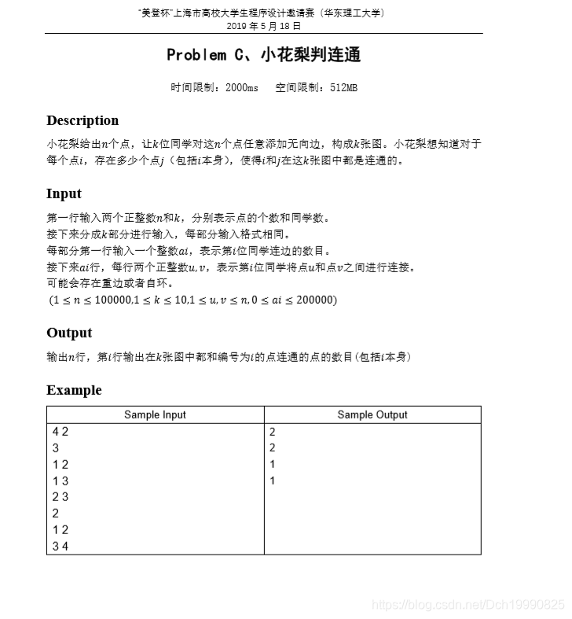

题目

 

Now and then you play the following game with your friend. Your friend writes down a sequence consisting of zeroes and ones. You choose a continuous subsequence (for example the subsequence from the third to the fifth digit inclusively) and ask him, whether this subsequence contains even or odd number of ones. Your friend answers your question and you can ask him about another subsequence and so on. Your task is to guess the entire sequence of numbers. You suspect some of your friend's answers may not be correct and you want to convict him of falsehood. Thus you have decided to write a program to help you in this matter. The program will receive a series of your questions together with the answers you have received from your friend. The aim of this program is to find the first answer which is provably wrong, i.e. that there exists a sequence satisfying answers to all the previous questions, but no such sequence satisfies this answer.

Input

The first line of input contains one number, which is the length of the sequence of zeroes and ones. This length is less or equal to 1000000000. In the second line, there is one positive integer which is the number of questions asked and answers to them. The number of questions and answers is less or equal to 5000. The remaining lines specify questions and answers. Each line contains one question and the answer to this question: two integers (the position of the first and last digit in the chosen subsequence) and one word which is either `even' or `odd' (the answer, i.e. the parity of the number of ones in the chosen subsequence, where `even' means an even number of ones and `odd' means an odd number).

Output

There is only one line in output containing one integer X. Number X says that there exists a sequence of zeroes and ones satisfying first X parity conditions, but there exists none satisfying X+1 conditions. If there exists a sequence of zeroes and ones satisfying all the given conditions, then number X should be the number of all the questions asked.

Sample Input

```
10
5
1 2 even
3 4 odd
5 6 even
1 6 even
7 10 odd```


Sample Output

```
3```


 

 

 

 问你那个问题与前面的有冲突， %99是并查集 

题意：长度为n的字符串，给你k个问题，每个问题数据为  x, y ，vn，分别表示其字串的**开始位置**，**结束位置**，**该字符串内1的个数是偶数还是奇数**。

问你在提出k个问题的过程中，有几个是正确的，（假设第k+1能推翻前面的，则正确的为k个）

 

 

参考博客：[http://blog.csdn.net/hi_just_do_it/article/details/52002836](http://blog.csdn.net/hi_just_do_it/article/details/52002836/)（看我的不如看他的ヽ(*。>Д<)o゜，这篇是留给自己看的）

题中N 是10亿，所以直接用编号作为数组的下标显然是不合适的，题中问题最多有5000个，即是最多有5000*2个不重复的数。

所以我们可以把题目中所有出现过的数离散化，假设每个数离散化后都对应一个“编号”那么将出现过的数放进数组排序，数组的下标与数组内的值一一对应，也就是将数离散化了，

**怎么查找该数离散化后的编号呢，二分查找，时间复杂度0 log2（n）**

然后开始带权并查集的过程 ，这道带权并查集的过程跟前面题           How Many Answers Are Wrong  差不多，这里就不详细说了。

代码

 

```cpp
#include<stdio.h>
#include<string>
#include<string.h>
#include<math.h>
#include<algorithm>
#include<stdlib.h>
#define N 10000
#include<map>
using namespace std;
map<int,int>mmp;//表示一个数有没有出现过
int father[N+10],rela[N+10],num[N+10],ll,rr;//分别表示查找区域的左右端点
struct node {
    int l,r,vn;//分别是问题的左端点 ，右端点，奇偶性
}ques[N];
int _find(int x)
{
    int team;
    if(x==father[x])
        return x;
    team=father[x];
    father[x]=_find(father[x]);//压缩路径
    rela[x]=(rela[x]+rela[team])%2;
    return father[x];
}
int _seach(int x)
{
    int mid;
    int l,r;
    l=ll;r=rr;
    mid=(l+r)/2;
    while(l<r)
    {
      if(x>num[mid])
          l=mid+1;
      else
          r=mid;
      mid=(l+r)/2;
    }
    return l;
}
int  _judge(int a,int b,int relax)//对a  b进行操作
{
    int root1,root2;
    root1=_find(a);
    root2=_find(b);
    if(root1==root2)
    {
        if(((rela[a]-rela[b]+2)%2)!=relax)
            return 0;//假的
        else
            return 1;
    }
    if(root1<root2)
    {
        father[root1]=root2;
        rela[root1]=(relax+rela[b]-rela[a]+2)%2;
    }
    else
    {
        father[root2]=root1;
        rela[root2]=(rela[a]-relax-rela[b]+2)%2;
    }
    return 1;
}
int main()
{
    int n,k,cnt,ans,flag=1,a,b,relax;
    char vn[20];
    cnt=ans=0;;
    scanf("%d%d",&n,&k);
    for(int i=0;i<k;i++)
    {
        scanf("%d %d %s",&ques[i].l,&ques[i].r,vn);
        ques[i].l--;
        if(vn[0]=='e')
            ques[i].vn=0;
        else
            ques[i].vn=1;
        if(!mmp[ques[i].l])
        {
            mmp[ques[i].l]=1;
            num[cnt++]=ques[i].l;
        }
        if(!mmp[ques[i].r])
        {
            mmp[ques[i].r]=1;
            num[cnt++]=ques[i].r;
        }
    }
    sort(num,num+cnt);//将不重复的的离散化的数储存起来并且排序  //离散化 标号对应的值为实际值
//    printf("cnt=%d\n",cnt);
//    for(int i=0;i<cnt;i++)
//        printf("num[%d]=%d\n",i,num[i]);
    ll=0;rr=cnt-1;
    for(int i=0;i<cnt;i++) //更新树
        father[i]=i;
    for(int i=0;i<k;i++)//判断答案的时候
    {
        a=_seach(ques[i].l);
        b=_seach(ques[i].r);
        relax=ques[i].vn;
        flag=_judge(a,b,relax);
        ans=i;
        if(!flag)
        {
            printf("%d\n",i);break;
        }

    }
    if(flag)
        printf("%d\n",k);
}```


 

 

 

 

 


### 网络流之 - 匹配、边覆盖、独立集、顶点覆盖


以下摘抄：[https://blog.sengxian.com/algorithms/networkflow-variants](https://blog.sengxian.com/algorithms/networkflow-variants)


Published on 2015-12-01

在图论中，有以下几个概念，它们之间的关系往往容易弄混淆，这里稍稍证明一下。 先放出概念 - 来自日本人的书。

### 概念


+ 匹配 : 在 $G$中两两没有公共端点的边集合 $M \subseteq E$+ 边覆盖：在 G*G* 中的任意顶点都至少是 F*F* 中某条边的端点的 边集合 $F \subseteq E​$ （边覆盖所有点）+ 独立集：在 G*G* 中两两互不相连的顶点集合 $S \subseteq V​$+ 顶点覆盖：在 G*G* 中的任意边都有至少一个端点属于 S*S* 的顶点集合 $S \subseteq V$ （顶点覆盖所有边）


与之对应的，有最大匹配$ M_{max}​$，最小边覆盖 $F_{min}​$，最大独立集 $S_{max}​$、最小顶点覆盖 $S_{min}​$ 的概念，不过这个应该很好理解。

### 关系


它们之间是满足一些关系的。（废话

#### 最大匹配与最小边覆盖


对于任意无孤立点的图而言

$\vert M_{max} \vert + \vert F_{min} \vert = \vert V \vert​$

用中文描述就是「最大匹配数 + 最小边覆盖数 = 顶点数」

#### 最大独立集与最小顶点覆盖


对于任意图（无所谓联通）而言

$\vert S_{max} \vert + \vert S_{min} \vert = \vert V \vert$

用中文描述就是「最大独立集数 + 最小顶点覆盖数 = 顶点数」。与之前的不同，这里的集合都是针对顶点的集合。

### 求解


借助这些关系，对于有最大匹配与最小边覆盖，最大独立集与最小顶点覆盖，求解出一个就可以求解出另一个。 对于最大匹配问题，二分图可以转化为网络流，一般图则一般用开花树（Edmonds）算法解决。 而对于最大独立集和最小顶点覆盖，却无法高效求解，他们是NP困难的。不过，对于二分图而言：

$\vert M_{max} \vert = \vert S_{min}\vert$

中文描述就是「最大匹配数 = 最小顶点覆盖数」。





思路： 1.对于每个图用并查集对每个联通块染色 2.k次染色可以的得出每个点(1~n)的染色序列 3.如果i j两个点联通那么他们的染色序列相同,所以map所有染色序列即可

这里对序列排序使用的是自定义字典序排序，需要往map第三个参数传入一个类函数模板(不能是函数指针)

```cpp
/*
思路：
1.对于每个图用并查集对每个联通块染色
2.k次染色可以的得出每个点(1~n)的染色序列
3.如果i j两个点联通那么他们的染色序列相同,所以map所有染色序列即可

*/
#include<bits/stdc++.h>
#define mset(a,b) memset(a,b,sizeof(a))
using namespace std;
typedef long long ll;
int father[100005];
int n,k;
void init()
{
    for(int i=1; i<=n; ++i) father[i]=i;
}
int Find(int x)
{
    if(x==father[x]) return x;
    return father[x]=Find(father[x]);
}
class cmp{
    public:
    bool operator()(vector<int> aa,vector<int> bb)
    {
        for(int i=0; i<k; ++i)
            if(aa[i]!=bb[i]) return aa[i]<bb[i];
        return false;//相等时候一定要返回false,想一下两个数之间判断是否相等的原理就知道了
    }
};
vector<int> seq[100005];
map< vector<int>,int,cmp> mmp;
int main()
{
    ios::sync_with_stdio(false);
    cin.tie(0);
    cin>>n>>k;
    for(int pp=0; pp<k; ++pp)
    {
        int m;
        cin>>m;
        init();
        for(int i=1; i<=m; ++i)
        {
            int u,v,fu,fv;
            cin>>u>>v;
            fu=Find(u);
            fv=Find(v);
            father[fu]=fv;
        }
        for(int i=1; i<=n; ++i)
        {
            int bb=Find(i);
            seq[i].push_back(bb);
        }
    }
    for(int i=1;i<=n;++i)
         mmp[seq[i]]+=1;

    for(int i=1;i<=n;++i)
        cout<<mmp[seq[i]]<<endl;
    return 0;
}```


 

