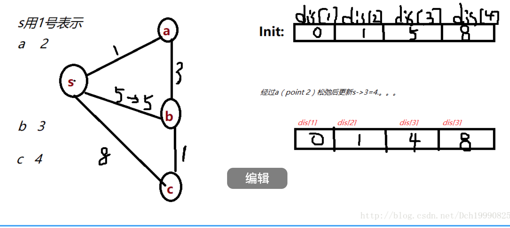
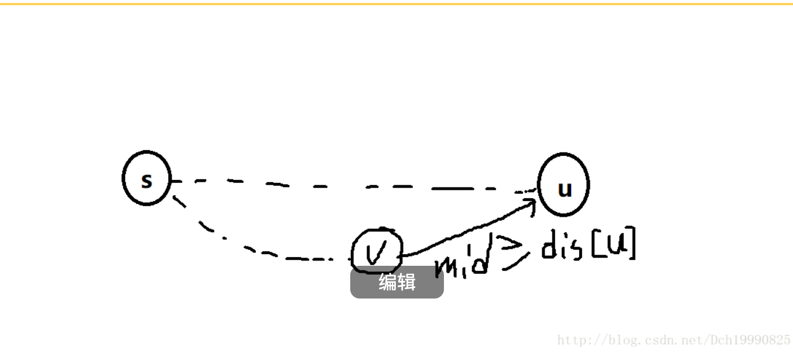

​
此博文不具体给出其算法的代码，只对其中算法进行分并且给予证明
此博文不具体给出其算法的代码，只对其中算法进行分并且给予证明

PS：这些算法我不用证明都是它是正确的（上世纪的数学家看着这些都不用证明，为啥，很简单的），但是我坚持重新证明一遍实际是为了加深印象，并且理解其中的道理和思想，这样在以后的运用中才能灵活运用，当然证明这些算法也


## 算法一：Floyd 算法
也是传说中的只用五行就可以解决的多源最短路径问题

采用邻接矩阵来储存图，时间复杂度为O（n^3），能解决含正权，负权的最短路径，不能解决含有负环的最短路径（负环也没有最短路径）

```cpp
for(k=1;k<=n;k++)
    for(i=1;i<=n;i++)
        for(j=1;j<=n;j++)
            if(e[i][j]>e[i][k]+e[k][j])
                 e[i][j]=e[i][k]+e[k][j];
```
当k=1时进行一个嵌套的for循环求出来的是任意两点之间只允许经过点1的最短路径，这个都可以理解吧。

(￣▽￣)"

当k=2时，经过一个if else的判断最终求出来的是任意两个顶点之间只允许经过1 2号顶点的最短路径。

这时候可能有人说在进行 if      else 之后判断的是i->j通过2号顶点路径后路径能否缩小，那么如果i->j还能通过1号顶点再次缩小路径，那还能体现出来吗？

好的下面咱们来证明

假设咱们判断过之后i->j之间通过2号顶点可以缩小路径，此时i与j的路径为i->2->j，假设还可以通过1号顶点缩小路径（也就是上面所说的情况）

此时1号顶点肯定在i->j之间，也就是i->2或2->j之间 ，而咱们在第一次for循环之后的意义上面已经说过了，即任意两点可以经过1号顶点后更新的最短路径，那么回过来即i->2之间或者2->j之间若可以经过1号顶点在缩短路径，那么铁定在第一次循环后就已经在i->2或2->j之间添加1号顶点了，所以上面的担心是多余的(●'◡'●)

当k=2的循环结束后，得到的意义便是任意两个顶点只允许经过1 2号顶点的最短路径

当k=n时  循环结束后便是任意两点之间允许经过1~n个顶点后的最短路径，（如果有疑问，那么再按着刚刚在2号顶点的证明过程比较一下）

## 算法二：dijkstra算法 （求单源最短路径，只允许正权）

这个是比较常用的算法，其常用的储存图的方式有邻接矩阵，邻接表两种。采用邻接矩阵的时间复杂度为O（n^2）

在此用邻接矩阵来举例子

先说一下算法原理，初始化就不说了吧（任意两点之间之间路径为INF，自己与自己的路径为0）随后输入图。

用一个dis[]数组记录源点到其他点的直接路径。假设源点号为S，并且用数组book[]来表示s->其他点的最短路径是否确定，确定的点令其值为1（book[s]=1）。

然后从dis[]数组找s->v最小的值，假设为这个顶点为u，那么s->u的最短路径肯定就确定了。为啥 ？因为s->u若再经过其他点所成的路径一定比s->u的路径的大。

已经确定s->u是最短路径后，松弛u点到其他点的路径,令book[u]=1。（这点是关键）

所以算法分三个步骤

1.从最短路径 dis[] 中，在所有未确定最短路的顶点，找到最小值对应的顶点 u，令其为确定的最短路径，令 book[u]=1;（证明下面在说）

2.从u点松弛：遍历 u 可到达的所有边，去更新最短路

3.重复以上1. 2点直至所有点的最短路径确定。


----
*证明*：

用归纳法证明这一过程中，找到的最短路是最短的

1. 初始：起始顶点 source 是最短的，dis[source] 是 0
2. 假设：当找到 了 k 个顶点的最短路，这些最短路是正确的，并且后续所有顶点最短路都 >= 他们。现在进行对最短路顶点进行松弛，
3. 进行证明：对已经找到的最短路的顶点进行松弛后，找到第 k +1 最小距离的顶点，就是下一个最短路的顶点。

现在证明当 k 成立时候，k +1 成立：证明方法用反证法，如下内容：
```
假设第 k+1 个顶点时 b，那么当前 dis[b] 一定是最短路！

反证法：如果不是最短路，那么要想找 s->b 的更小路径至少中转至一个顶点v，且 s->v 的距离满足 dis[v] < dis[b]（不然路径会更大），

这个时候就出现矛盾了：在未确定最短路的顶点中，存在一个顶点 v 的距离比 顶点 b 更小。

所以不可能存在这么一个顶点 v，也就是 dis[b] 一定是最短路！

证毕

```


下面是一个流程


看这个图

第一次  找出s->a最小，那么令此时s->a的路径为最短路径，令book[2]=1，（这个都没疑问吧）...... 然后松弛a->b得到mid=dis[a]+map[a][b]<dis[b]   且松弛之后s->b的路径变小了

第二次，再次按步骤1找出最小的为dis[b]，此时的dis[b]为s->b的最短路径。为啥？假设此时dis[b]的值不是s->b的最短路径，那么要想找s->b的更小路径至少中转至一个顶点v，且s->v的距离满足dis[v]<dis[b]（不然路径会更大），然后经v中转至b，但是因为dsi[v]<dis[b]表明v已经确定为最小路径了，前面咱们说过，确定为最短路径的点一定要经过此点到其他顶点的松弛，所以你找的所有的s->b的路径一定>=dis[b]，

也就是下面这个原理



u为此时经过步骤1确定的点，假设s->u的距离不是最短路径，即存在另一条路径s->v->u（你也可以假设s->v之间还有许多点，但是我们要确保v->u是直接的，即不经过任何一个中转点）使得路径长度mid<dis[u]，

又因为假设的路径中v是在s->u之间，所以v的最短路径已经确定且v经过松弛，即v到任何点的都经过松弛（包括点u），所以此时我们找的mid是一定>=dis[u]的，即假设不成立。               

代码：

附上dijkstr算法

```cpp
/*
dijkstr 算法
二步：
1.初始化
2.每次找出dis最小值则为确定对短路
注意：minn=INF 或者找到答案这一提前跳出
*/
#include<cstdio>
#include<algorithm>
#include<cstring>
#include<cmath>
#include<string>
#include<iostream>
#include<cstdlib>
#define N 1010
#define INF 0x3f3f3f3f
#define MOD 1000000007
typedef long long LL;
using namespace std;
int book[N],dis[N],map[N][N];
void dijkstr(int n)
{
    int t=n,minn,u,to;
    memset(book,0,sizeof(book));
    for(int i=1;i<=n;i++)
        dis[i]=INF;
    dis[1]=0;
    while(t--)
    {
        minn=INF;
        for(int i=1;i<=n;i++)
        {
            if(!book[i]&&dis[i]<minn)
            {
                u=i;
                minn=dis[i];
            }
        }
        book[u]=1;
        for(int i=1;i<=n;i++)//松弛
        {
            if(!book[i])
                {
                    to=dis[u]+map[u][i];
                    if(to<dis[i])
                        dis[i]=to;
                }
        }
    }
}
int main()
{
    //cin map 就OK
}
```

有时间再补充另两个算法的证明

## 附上SPFA代码
```cpp
/*
SPFA
三步
1.初始信息 将初始点加入队列
2.每次从队列的第一个点进行松弛，可以更新另一个顶点 V 的最短路的话，则将 v 其加入队列（已经加入队列则不需要再次加入）
2.队列为空结束
*/

#include<cstdio>
#include<algorithm>
#include<cstring>
#include<cmath>
#include<string>
#include<iostream>
#include<cstdlib>
#include<queue>
#define N 1010
#define INF 0x3f3f3f3f
#define WC 1e-6
typedef long long LL;
using namespace std;
int book[N],dis[N],map[N][N];//存信息
queue<int>mmp;
void SPFA(int n)//n得出范围  输入map就OK
{
    int to;
    memset(book,0,sizeof(book));
    for(int i=1;i<=n;i++)
        dis[i]=INF;
    dis[1]=0;
    while(!mmp.empty())
        mmp.pop();
    mmp.push(1);
    while(!mmp.empty())
    {
        int u=mmp.front();//出队伍
        mmp.pop();
        book[u]=0;
        for(int i=1;i<=n;i++)//松弛
        {
            to=dis[u]+map[u][i];
            if(to<dis[i])
            {
                dis[i]=to;
                if(!book[i])
                {
                    mmp.push(i);
                    book[i]=1;
                }
            }
        }
    }
}
int main()
{
    //cin map
}

```

## 附上bellman算法

```cpp
/*
bellman算法   可以判断负环
1.初始化dis （struct）edge
2.遍历所有边
2.更新成功则进行下一次
*/
#include<cstdio>
#include<algorithm>
#include<cstring>
#include<cmath>
#include<string>
#include<iostream>
#include<cstdlib>
#define N 4010
#define INF 0x3f3f3f3f
#define WC 1e-6
typedef long long LL;
using namespace std;
int dis[N];
struct node{
int u,v,w;
}e[N];
void bellman(int n,int cnt)
{
    int to,t,flag;
    for(int i=2;i<=n;i++)
        dis[i]=INF;
    dis[1]=0;
    t=n-1;
    while(t--)
    {
        flag=0;
        for(int i=0;i<cnt;i++)
        {
            to=dis[e[i].u]+e[i].w;
            if(to<dis[e[i].v])
            {
                dis[e[i].v]=to;
                flag=1;
            }
        }
        if(!flag)
            break;
    }
//    if(flag)//最后一次用于判断负环
}
int main()
{
   //cin edge
}
```

​如何判断负环？如果循环 > N-1 次，那么就有负环

如果遍历了 k 次，说明某条最短路径上至少有 k 个边！！

因为对于 N 个节点的最短路，最短路上的路径节点数量最多 N 个（包含 source 和 target），那么最多有 N-1 条边。如果超过了 N-1 次，就是有负环

