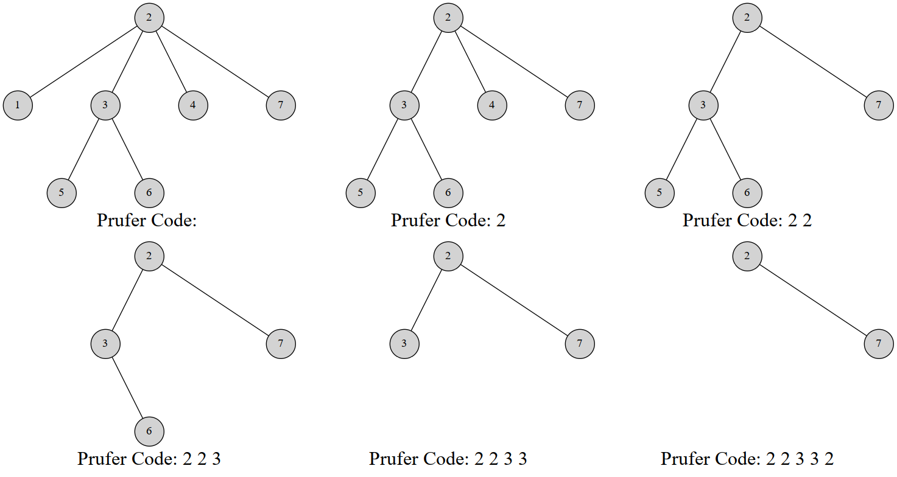

# Prufer序列（无根树与序列的互相转化及其性质）
> 学习来自：https://oi-wiki.org/graph/prufer/

## Prüfer 序列
引入
Prüfer 序列可以将一个带标号 n 个结点的树用 [1,n] 中的 n-2 个整数表示。你也可以把它理解为完全图的生成树与数列之间的双射。常用组合计数问题中。

Heinz Prüfer 于 1918 年发明这个序列来证明 凯莱公式。

## 对树建立 Prüfer 序列
Prüfer 是这样建立的：每次选择一个编号最小的叶结点并删掉它，然后在序列中记录下它连接到的那个结点。重复 n-2 次后就只剩下两个结点，算法结束。

显然使用堆可以做到 O(n\log n) 的复杂度

实现

```c++
// 代码摘自原文，结点是从 0 标号的
vector<vector<int>> adj;

vector<int> pruefer_code() {
  int n = adj.size();
  set<int> leafs;
  vector<int> degree(n);
  vector<bool> killed(n, false);
  for (int i = 0; i < n; i++) {
    degree[i] = adj[i].size();
    if (degree[i] == 1) leafs.insert(i);
  }

  vector<int> code(n - 2);
  for (int i = 0; i < n - 2; i++) {
    int leaf = *leafs.begin();
    leafs.erase(leafs.begin());
    killed[leaf] = true;
    int v;
    for (int u : adj[leaf])
      if (!killed[u]) v = u;
    code[i] = v;
    if (--degree[v] == 1) leafs.insert(v);
  }
  return code;
}
```

例如，这是一棵 7 个结点的树的 Prüfer 序列构建过程：


当然，也有一个线性的构造算法。

1. 维护 du[u]， 代表 u 的度数
    - 初始化：通过遍历一遍得到

2. 维护一个指针 p。初始时 p 指向编号最小的度数为 1 的叶结点

每次我们删除 p 指针指向的节点 v 节点时，检查对应的边（v,u）中的 u 节点度数是否变为 1 ，如果变为 1，则进行如下检查
-  1.1 如果 u < p, 另 pp = u, 然后立刻删除 pp，继续 1.1 阶段（直至 u > p，进入 1.2）
- 1.2 否则 u > p，则设置 du[u] = 1， 然后逐渐增大 p，直至知道 du(*p) = 1 的节点

因为 p 只会增大，不会递减，并且 每个节点只会删除一次, 时间复杂度是 O(n)

详细解释继续看 blog

## Prüfer 序列的性质
1. 在构造完 Prüfer 序列后原树中会剩下两个结点，其中一个一定是编号最大的点 n。
2. 每个结点在序列中出现的次数是其度数减 1。（没有出现的就是叶结点）

## 用 Prüfer 序列重建树
重建树的方法是类似的。根据 Prüfer 序列的性质，我们可以得到原树上每个点的度数。然后你也可以得到编号最小的叶结点，而这个结点一定与 Prüfer 序列的第一个数连接。然后我们同时删掉这两个结点的度数。

讲到这里也许你已经知道该怎么做了。每次我们选择一个度数为 1 的最小的结点编号，与当前枚举到的 Prüfer 序列的点连接，然后同时减掉两个点的度。到最后我们剩下两个度数为 1 的点，其中一个是结点 n。就把它们建立连接。使用堆维护这个过程，在减度数的过程中如果发现度数减到 1 就把这个结点添加到堆中，这样做的复杂度是 O(n\log n) 的。

实现
```c++
// 原文摘代码
vector<pair<int, int>> pruefer_decode(vector<int> const& code) {
  int n = code.size() + 2;
  vector<int> degree(n, 1);
  for (int i : code) degree[i]++;

  set<int> leaves;
  for (int i = 0; i < n; i++)
    if (degree[i] == 1) leaves.insert(i);

  vector<pair<int, int>> edges;
  for (int v : code) {
    int leaf = *leaves.begin();
    leaves.erase(leaves.begin());

    edges.emplace_back(leaf, v);
    if (--degree[v] == 1) leaves.insert(v);
  }
  edges.emplace_back(*leaves.begin(), n - 1);
  return edges;
}

```

## Cayley 公式 (Cayley's formula)
完全图 $ K_n $  有 $ n^{n-2} $ 棵生成树。

怎么证明？方法很多，但是用 Prüfer 序列证是很简单的。任意一个长度为 n-2 的值域 [1,n] 的整数序列都可以通过 Prüfer 序列双射对应一个生成树，于是方案数就是 $n^{n-2}$。

图连通方案数
Prüfer 序列可能比你想得还强大。它能创造比 凯莱公式 更通用的公式。比如以下问题：

一个 n 个点 m 条边的带标号无向图有 k 个连通块。我们希望添加 k-1 条边使得整个图连通。求方案数。


```cpp
#include<bits/stdc++.h>
#define mset(a,b) memset(a,b,sizeof(a))
using namespace std;
const int N=1e5+10;
vector<int> prufer;
vector<int> g[N];
int du[N];
/*
输入:顶点个数n和树g[]
输出:prufer序列
*/
void TreeToPrufer(int n,vector<int> g[])//g[]中存储的是无向边,共有n个顶点
{
   
    set<int> leaf;
    mset(du,0);
    prufer.clear();
    for(int u=1;u<=n;++u)
        for(int v:g[u]) du[v]++;
    for(int i=1;i<=n;++i) if(du[i]==1) leaf.insert(i);
    while(prufer.size()!=n-2)
    {
   
        int u=*leaf.begin();
        du[u]=0;
        leaf.erase(leaf.begin());
        for(int v:g[u])
        {
   
            if(!du[v]) continue;
            prufer.push_back(v);
            du[v]--;
            if(du[v]==1) leaf.insert(v);
        }
    }
    printf("following is prufer sequence of tree:\n");
    for(int```


