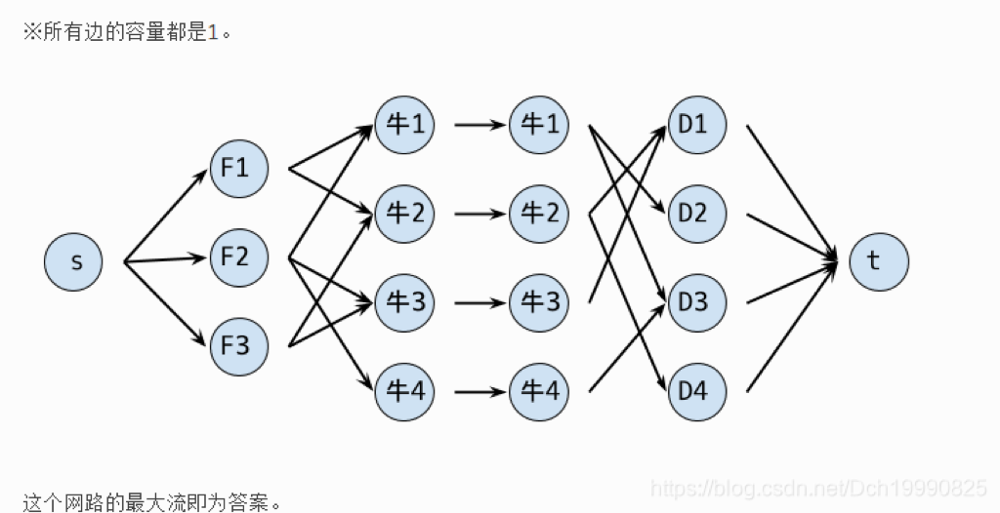

 

###  题意：


      有f 个食物和 d个饮料，现在有n头牛，每头牛有喜欢的食物和饮料。每头牛只吃自己喜欢的饮料和食物，且食物和饮料各吃一个才算满足，问最多能满足多少个牛？

### 分析：


     这是挑战书上的例题，花式建图，下面的图中，f是食物，d是饮料。

      令s到f的权值为1，d到t的权值为1，牛1到牛2的权值为1，喜欢的食物到牛，权值为1，牛到喜欢的饮料权值为1，求最大流即可





 以上图片来自[https://amoshyc.github.io/ojsolution-build/poj/p3281.html](https://amoshyc.github.io/ojsolution-build/poj/p3281.html).

 

代码：

```cpp
#include<vector>
#include<queue>
#include<cstdio>
#include<cstring>
#define mset(a,b)   memset(a,b,sizeof(a))
using namespace std;
const int maxn=1100;
const int inf=0x3f3f3f3f;
class EK
{
public:
    vector<int> adja[maxn];
    int cap[maxn][maxn];
    int dis[maxn],pre[maxn],tot;
    void init(int n)
    {
        for(int i=0; i<n; ++i)
            adja[i].clear();
        mset(cap,0);
        tot=n;
    }
    void addEdge(int s,int t,int f)
    {
        cap[s][t]=f;
        cap[t][s]=0;
        adja[s].push_back(t);
        adja[t].push_back(s);
    }
    void bfs(int s,int t)//广搜一条增广路径
    {
        mset(dis,-1);
        queue<int>mmp;
        mmp.push(s);
        dis[s]=s;
        while(!mmp.empty())
        {
            int u=mmp.front();
            mmp.pop();
            for(int i=0; i<adja[u].size(); ++i)
            {
                int v=adja[u][i];
                if(dis[v]==-1&&cap[u][v]>0)
                {
                    dis[v]=dis[u]+1;
                    pre[v]=u;
                    mmp.push(v);
                }
            }
        }
    }
    int maxFlow(int s,int t)
    {
        int flow=0;
        for(;;)
        {
            bfs(s,t);
            if(dis[t]==-1)
                return flow;
            int last=t,minn=inf;
            while(last!=pre[last])
            {
                minn=min(minn,cap[pre[last]][last]);
                last=pre[last];
            }
            last=t;
            while(last!=pre[last])
            {
                cap[pre[last]][last]-=minn;
                cap[last][pre[last]]+=minn;
                last=pre[last];
            }
            flow+=minn;
        }
    }
};
int main()
{
    int N, F,D;
    scanf("%d %d %d",&N,&F,&D);
    EK kit;
    kit.init(2*N+F+D+2);// s=0   t=2*N+F+D+1
    for(int i=1; i<=N; ++i) // i ->N+i
    {
        kit.addEdge(i,i+N,1);
        int ftot,dtot,val;
        scanf("%d %d",&ftot,&dtot);
        for(int j=1; j<=ftot; ++j) //2*N+j
        {
            scanf("%d",&val);
            kit.addEdge(2*N+val,i,1);
        }
        for(int j=1; j<=dtot; ++j) //2*N+F+j
        {
            scanf("%d",&val);
            kit.addEdge(N+i,2*N+F+val,1);
        }
    }
    for(int i=1; i<=F; ++i) kit.addEdge(0,2*N+i,1);
    for(int i=1; i<=D; ++i) kit.addEdge(2*N+F+i,2*N+F+D+1,1);
    printf("%d\n",kit.maxFlow(0,2*N+F+D+1));

    return 0;
}
```


 

