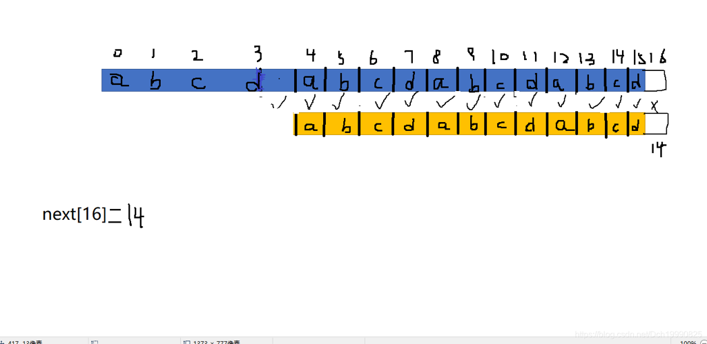

### Count the string


 [HDU - 3336 ](https://vjudge.net/problem/15623/origin)

It is well known that AekdyCoin is good at string problems as well as number theory problems. When given a string s, we can write down all the non-empty prefixes of this string. For example:  s: "abab"  The prefixes are: "a", "ab", "aba", "abab"  For each prefix, we can count the times it matches in s. So we can see that prefix "a" matches twice, "ab" matches twice too, "aba" matches once, and "abab" matches once. Now you are asked to calculate the sum of the match times for all the prefixes. For "abab", it is 2 + 2 + 1 + 1 = 6.  The answer may be very large, so output the answer mod 10007. 

**Input**

The first line is a single integer T, indicating the number of test cases.  For each case, the first line is an integer n (1 <= n <= 200000), which is the length of string s. A line follows giving the string s. The characters in the strings are all lower-case letters. 

**Output**

For each case, output only one number: the sum of the match times for all the prefixes of s mod 10007.

**Sample Input**

```
1
4
abab```


**Sample Output**

```
6```


**题意：**

在一个字符串中找到每个前缀在字符串的出现次数，求所有前缀出现次数之和。

**思路：**

next数组的意义就是**该字符串后缀的最大匹配个数**  (匹配的为该字符串的前缀,且这个匹配不能为本身)

第i个字符结尾的后缀的最大匹配全部遍历一边，就可找出每个以第i个字符结尾的前缀字符串，然后遍历每个i即可找出以所有字符结尾的前缀出现次数

 

如果还不懂，请看最后.

```cpp
#include<stdio.h>
#include<cstring>
#include<cstdlib>
#include<string>
#include<algorithm>
using namespace std;
typedef long long ll;
const int maxn=2e5+7;
const int MOD=1e4+7;
int net[maxn],res[maxn];
char str[maxn];
void get_next(char *p,int *net)
{
    int lp=strlen(p);
    int j=0,k=-1;
    net[0]=-1;
    while(j<lp)
    {
        if(k==-1||p[j]==p[k])
        {
            net[++j]=++k;
        }
        else
            k=net[k];
    }
}
int Solve(char *s)
{
    int ls=strlen(s);
    get_next(s,net);
    int k;
    int ans=ls;
    for(int i=ls;i;--i)
    {
        k=net[i];
        while(k>0)
        {
            ans=(ans+1)%MOD;
            k=net[k];
        }
    }
    return ans;
}
int main()
{
    int t,n;
    scanf("%d",&t);
    while(t--)
    {
        scanf("%d",&n);
        scanf("%s",str);
        printf("%d\n",Solve(str));
    }
}
```


 

根据求next数组的过程即可理解next数组的意思

next[j]=k,代表如果匹配下标为j 的字符串失配时应该与下标为k处开始匹配，即以j-1结尾长度为k（后缀） 与 0开头长度为k（前缀）的字串相等，且此时k是这个满足条件中最大的!

画个图





 

 

next[16]=14既代表文本串与该模式串下标为16的失配时应该从下标14开始继续匹配，同时也代表前16个字符串的最大匹配后缀为14（前14个字符是16个字符的后缀） 

一直遍历k=net[k]就可以得到该模式串的所有匹配后缀的个数直至k=0结束

