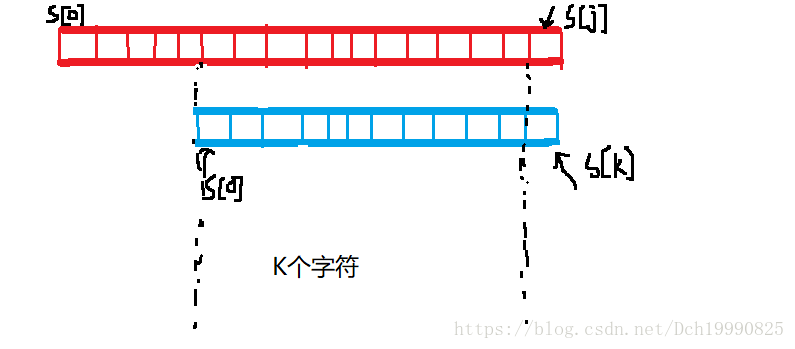
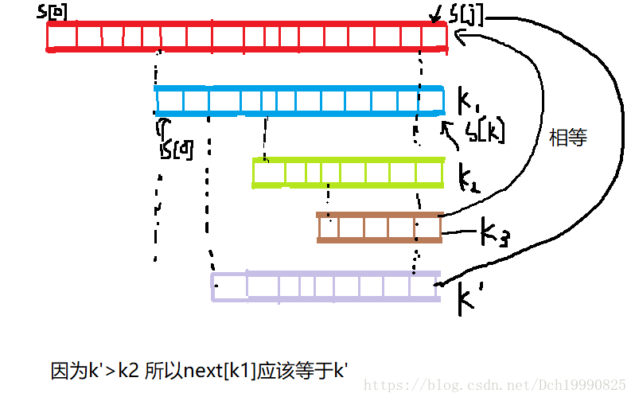

 

Clairewd is a member of FBI. After several years concealing in BUPT, she intercepted some important messages and she was preparing for sending it to ykwd. They had agreed that each letter of these messages would be transfered to another one according to a conversion table.  Unfortunately, GFW(someone's name, not what you just think about) has detected their action. He also got their conversion table by some unknown methods before. Clairewd was so clever and vigilant that when she realized that somebody was monitoring their action, she just stopped transmitting messages.  But GFW knows that Clairewd would always firstly send the ciphertext and then plaintext(Note that they won't overlap each other). But he doesn't know how to separate the text because he has no idea about the whole message. However, he thinks that recovering the shortest possible text is not a hard task for you.  Now GFW will give you the intercepted text and the conversion table. You should help him work out this problem. 

**Input**

The first line contains only one integer T, which is the number of test cases.  Each test case contains two lines. The first line of each test case is the conversion table S. S[i] is the ith latin letter's cryptographic letter. The second line is the intercepted text which has n letters that you should recover. It is possible that the text is complete. 

***Hint***

Range of test data:  T<= 100 ;  n<= 100000; 

**Output**

For each test case, output one line contains the shorest possible complete text.

**Sample Input**

```
2
abcdefghijklmnopqrstuvwxyz
abcdab
qwertyuiopasdfghjklzxcvbnm
qwertabcde```


**Sample Output**

```
abcdabcd
qwertabcde```


**题意：**

首先t组输入

第一行给你26个字符,即字符串S1， 表示字符的加密方式，即a~z中的第i个字符加密后变为为S1[i]

第二行一个截取的字符串，这个字符串的前部分是情报的密文，后面是情报明文的**一部分**（因为发送情报的人发现自己被侦察了就不发了），

让你求这个最短的完整信息

 

**重点：**

密文的长度一定满足temp>=(len+1)/2  这样才符合题意 ，

将该信息**解密后的前缀**与**解密后的后缀最大匹配  **表示最长的可能明文，注意这个最长的可能明文长度不能超过len-temp

问题就改成了两个字符串求前缀后缀最大匹配（扩展kmp）

 

```cpp
#include<stdio.h>
#include<cstring>
#include<cstdlib>
#include<string>
#include<algorithm>
using namespace std;
const int maxn=2e5+7;
typedef long long ll;
const int MOD=1e5+7;
int code[100];//将密文转化为明文
char convert(char c)
{
    return code[c-'a']+'a';
}
char infostr[maxn];
char codestr[maxn];
int net[maxn];//存放info的next数组
int maxpp[maxn];//最长后缀匹配前缀数组
void get_nextval(char *s,int* net)
{
    int ls=strlen(s);
    int j=0,k=-1;
    net[0]=-1;
    while(j<ls)
    {
        if(k==-1||s[j]==s[k])
            net[++j]=net[++k];
        else
            k=net[k];
    }
}
int exkmp(char *s,char *p,int *net)
{
    int ls=strlen(s);
    int temp=(ls+1)/2;//代表最大结尾的匹配不能超过
    get_nextval(p,net);
    int i=temp,k=0;
    /*
    重点:  文本串的第temp+1个字符与模式串的第1个字符开始匹配 因为前temp字符肯定是密文,不能让
    前缀与密文匹配到 ,这样匹配得到的前缀才肯定全都是密文的
    扩展kmp:  计算此串的最大匹配前缀时，利用上一个串的最大匹配前缀
    */
    while(i<ls)
    {
        if(k==-1||s[i]==p[k])//第i+1个字符与第k+1个字符是否相等
        {
             ++i;
             ++k;//代表第i+1个字符的最大匹配为k+1个
             maxpp[i]=k;
        }
        else
            k=net[k];
    }
    return maxpp[ls];
}
int main()
{
    int t,ans;
    char bm[30];
    scanf("%d",&t);
    while(t--)
    {
        scanf("%s",bm);
        for(int i=0;i<26;++i)
            code[bm[i]-'a']=i;
        scanf("%s",infostr);
        int len=strlen(infostr);
        for(int i=0;i<len;++i)
            codestr[i]=convert(infostr[i]);
        ans=exkmp(infostr,codestr,net);
        printf("%s",infostr);
        for(int i=ans;i<len-ans;++i)
            printf("%c",convert(infostr[i]));
        printf("\n");
    }
}
```


 


 

 

Homer: Marge, I just figured out a way to discover some of the talents we weren’t aware we had.  Marge: Yeah, what is it?  Homer: Take me for example. I want to find out if I have a talent in politics, OK?  Marge: OK.  Homer: So I take some politician’s name, say Clinton, and try to find the length of the longest prefix  in Clinton’s name that is a suffix in my name. That’s how close I am to being a politician like Clinton  Marge: Why on earth choose the longest prefix that is a suffix???  Homer: Well, our talents are deeply hidden within ourselves, Marge.  Marge: So how close are you?  Homer: 0!  Marge: I’m not surprised.  Homer: But you know, you must have some real math talent hidden deep in you.  Marge: How come?  Homer: Riemann and Marjorie gives 3!!!  Marge: Who the heck is Riemann?  Homer: Never mind.  Write a program that, when given strings s1 and s2, finds the longest prefix of s1 that is a suffix of s2.

**Input**

Input consists of two lines. The first line contains s1 and the second line contains s2. You may assume all letters are in lowercase.

**Output**

Output consists of a single line that contains the longest string that is a prefix of s1 and a suffix of s2, followed by the length of that prefix. If the longest such string is the empty string, then the output should be 0.  The lengths of s1 and s2 will be at most 50000.

**Sample Input**

```
clinton
homer
riemann
marjorie```


**Sample Output**

```
0
rie 3```


**题意：**

给你两个字符串，让你求一个字符串 这个字符串满足是第二个字符串的后缀，且是第一个字符串的前缀，找出满足情况的最长的字符串

**思路：**

1.可以将两个字符串连接起来 用next数组的意义来做，找出最后下标的最大匹配即可

2.利用kmp的意义，如果第二个字符串的前j个字符的最大匹配为k,那么即为j-1的字符串的最大匹配且第j个字符与匹配的第k个字符相等即可.

```cpp
//第二种方法
#include<stdio.h>
#include<cstring>
#include<cstdlib>
#include<string>
#include<algorithm>
using namespace std;
const int maxn=5e4+7;
int net[maxn],res[maxn];
char p[maxn],str[maxn];
void get_next(char *p,int *net)
{
    int lp=strlen(p);
    int j=0,k=-1;
    net[0]=-1;
    net[++j]=++k;
    while(j<lp)
    {
        if(k==-1||p[j]==p[k])
        {
            net[++j]=++k;
        }
        else
            k=net[k];
    }
}
void Solve(char *p,char *str)//指针str的后缀是其p的前缀
{
    int i=0,k=0;
    get_next(p,net);
    int ls=strlen(str);
    // res[j]=k代表str前j个字符的最大匹配个数为k(字符串s的前k个)
    while(i<ls)
    {
        if(k==-1||str[i]==p[k])//i k表示 正在匹配的字符
        {
            ++i;
            ++k;
            res[i]=k;
        }
        else
            k=net[k];
    }
    int ans=res[ls];
    if(!ans)
        printf("0\n");
    else
    {
        p[ans]='\0';
        printf("%s %d\n",p,ans);
    }
}
int main()
{
    while(~scanf("%s %s",p,str))
    {
        Solve(p,str);
    }
}
```


 

 

 


### Count the string


 [HDU - 3336 ](https://vjudge.net/problem/15623/origin)

It is well known that AekdyCoin is good at string problems as well as number theory problems. When given a string s, we can write down all the non-empty prefixes of this string. For example:  s: "abab"  The prefixes are: "a", "ab", "aba", "abab"  For each prefix, we can count the times it matches in s. So we can see that prefix "a" matches twice, "ab" matches twice too, "aba" matches once, and "abab" matches once. Now you are asked to calculate the sum of the match times for all the prefixes. For "abab", it is 2 + 2 + 1 + 1 = 6.  The answer may be very large, so output the answer mod 10007. 

**Input**

The first line is a single integer T, indicating the number of test cases.  For each case, the first line is an integer n (1 <= n <= 200000), which is the length of string s. A line follows giving the string s. The characters in the strings are all lower-case letters. 

**Output**

For each case, output only one number: the sum of the match times for all the prefixes of s mod 10007.

**Sample Input**

```
1
4
abab```


**Sample Output**

```
6```


**题意：**

在一个字符串中找到每个前缀在字符串的出现次数，求所有前缀出现次数之和。

**思路：**

next数组的意义就是**该字符串后缀的最大匹配个数**  (匹配的为该字符串的前缀,且这个匹配不能为本身)

第i个字符结尾的后缀的最大匹配全部遍历一边，就可找出每个以第i个字符结尾的前缀字符串，然后遍历每个i即可找出以所有字符结尾的前缀出现次数

 

如果还不懂，请看最后.

```cpp
#include<stdio.h>
#include<cstring>
#include<cstdlib>
#include<string>
#include<algorithm>
using namespace std;
typedef long long ll;
const int maxn=2e5+7;
const int MOD=1e4+7;
int net[maxn],res[maxn];
char str[maxn];
void get_next(char *p,int *net)
{
    int lp=strlen(p);
    int j=0,k=-1;
    net[0]=-1;
    while(j<lp)
    {
        if(k==-1||p[j]==p[k])
        {
            net[++j]=++k;
        }
        else
            k=net[k];
    }
}
int Solve(char *s)
{
    int ls=strlen(s);
    get_next(s,net);
    int k;
    int ans=ls;
    for(int i=ls;i;--i)
    {
        k=net[i];
        while(k>0)
        {
            ans=(ans+1)%MOD;
            k=net[k];
        }
    }
    return ans;
}
int main()
{
    int t,n;
    scanf("%d",&t);
    while(t--)
    {
        scanf("%d",&n);
        scanf("%s",str);
        printf("%d\n",Solve(str));
    }
}
```


 

根据求next数组的过程即可理解next数组的意思

next[j]=k,代表如果匹配下标为j 的字符串失配时应该与下标为k处开始匹配，即以j-1结尾长度为k（后缀） 与 0开头长度为k（前缀）的字串相等，且此时k是这个满足条件中最大的!

画个图


 

 

next[16]=14既代表文本串与该模式串下标为16的失配时应该从下标14开始继续匹配，同时也代表前16个字符串的最大匹配后缀为14（前14个字符是16个字符的后缀） 

一直遍历k=net[k]就可以得到该模式串的所有匹配后缀的个数直至k=0结束


题目链接[http://poj.org/problem?id=2752](http://poj.org/problem?id=2752)

题意：

给你一个字符串str  找到一个字符串集合S  ，集合内的字符串都为str的前缀和后缀

 

 

思路：

如果这个字符串s在这个集合的话，那么s肯定是字符串str的一个匹配(⊙﹏⊙)能理解我意思吧

 

So KMP模板

```cpp
#include<stdio.h>
#include<string.h>
#include<stdlib.h>
#include<math.h>
#include<algorithm>
#define INF 0x3f3f3f3f
using namespace std;
const int maxn=1010000;
int ans[maxn],net[maxn];
char str[maxn];
void GetNextval(char *str,int *net)
{
    net[0]=-1;
    int j=0,k=-1,len;
    len=strlen(str);
    while(j<len)
    {
        if(k==-1||str[j]==str[k])
            net[++j]=++k;
        else
            k=net[k];
    }
}
int main()
{
    int top;
    while(~scanf("%s",str))
    {
        int len=strlen(str);
        top=0;
        int k=len;
        GetNextval(str,net);
        while(k)
        {
            ans[top++]=k;
            k=net[k];
        }
        for(int i=top-1;~i;--i)
            printf("%d ",ans[i]);
        printf("\n");
    }
}
```


 


For each prefix of a given string S with N characters (each character has an ASCII code between 97 and 126, inclusive), we want to know whether the prefix is a periodic string. That is, for each i (2 <= i <= N) we want to know the largest K > 1 (if there is one) such that the prefix of S with length i can be written as A K , that is A concatenated K times, for some string A. Of course, we also want to know the period K. 

Input

The input file consists of several test cases. Each test case consists of two lines. The first one contains N (2 <= N <= 1 000 000) – the size of the string S. The second line contains the string S. The input file ends with a line, having the number zero on it. 

Output

For each test case, output “Test case #” and the consecutive test case number on a single line; then, for each prefix with length i that has a period K > 1, output the prefix size i and the period K separated by a single space; the prefix sizes must be in increasing order. Print a blank line after each test case. 

Sample Input

```
3
aaa
12
aabaabaabaab
0```


Sample Output

```
Test case #1
2 2
3 3

Test case #2
2 2
6 2
9 3
12 4```


 

 

题意：

给你一个长度为n的字符串  让你分别计算下标为0长度为1........n的字符串的周期字符串的出现次数k  

如果k大于1  输出长度i 和周期字符串的次数k

KMP扩展

**原理：**

**设T[i]为前i个字符串最小周期为T[i]  eg：aabaab   T[1]=1 ,T[2]=1,T[3]=3**

**设next[i]为前i个字符最多匹配前next[i]个字符（不包括自身  这里的next函数与KMP中函数意思有些更改  这里的next[i]等效于书上的nextval[i+1]-1）  eg:aabaab next[1]=0  next[2]=1  next[3]=0  next[4]=1 next[5]=2 next[6]=3**

**用语言来表达就是 **

**         如果i是个周期字符串必定有 I-next[i]=T[next[i]]   其周期T[i]=T[next[i]]**

**         并且如果i-next[i]=****T[next[i]]**** 那么  i必定是个周期字符周期为T[i]=****T[next[i]]**

**数学逻辑表达**

**if ** i-next[i]=T[next[i]]        命题A 

    **then**   i有不为自身的周期 即T[i]=T[next[i]]   命题B          //逻辑表达式 A->B;

**if  ** i有不为自身的周期  

     **then**    i-next[i]=T[next[i]]                                               //逻辑表达式B->A

(得出A==B)

第二个的逆否命题即为

if      i-next[i]!=T[next[i]]

     then I的周期为自身             //^A->^B

代码：

```cpp
#include<stdio.h>
#include<iostream>
#include<stdlib.h>
#include<string.h>
using namespace std;
const int maxn=1001000;
int net[maxn];//net[j] 下标为j的失配后 匹配到下标net[j]  即前j个字符串最大匹配为net[j]个
int T[maxn];//T[i]代表最小周期为T[i]
void Get_nextval(int *net,char *str)//这是求i以及i之前的最大匹配数目
{
    int len=strlen(str);
    net[0]=-1;
    int j=0,k=-1;
    while(j<len)//j为字符串的下标
    {
        if(k==-1||str[j]==str[k])
            net[++j]=++k;
        else
            k=net[k];
    }
}
int main()
{
    char str[maxn];
    int cas=0;
    int len;
    while(scanf("%d",&len)&&len)
    {
        scanf("%s",str);
        Get_nextval(net,str);
        printf("Test case #%d\n",++cas);
        T[0]=0;
        T[1]=1;
        int k;
        for(int i=2;i<=len;i++)
        {
            k=net[i];
            if(i-k==T[k])
            {
                 T[i]=T[k];
                 cout<<i<<" "<<i/T[i]<<endl;
            }
            else
                  T[i]=i;
        }
        cout<<endl;
    }
}```


 

 


## [SCU - 4438 ](https://vjudge.net/problem/184140/origin)(KMP)


## Censor


frog is now a editor to censor so-called sensitive words (敏感词).

She has a long text pp. Her job is relatively simple – just to find the first occurence of sensitive word ww and remove it.

frog repeats over and over again. Help her do the tedious work.

### Input


The input consists of multiple tests. For each test:

The first line contains 11 string ww. The second line contains 11 string pp.

(1≤length of w,p≤5⋅1061≤length of w,p≤5⋅106, w,pw,p consists of only lowercase letter)

### Output


For each test, write 11 string which denotes the censored text.

### Sample Input


```bash
    abc
    aaabcbc
    b
    bbb
    abc
    ab
```


### Sample Output


```bash
    a
    
    ab
```


### 题意：


​ 一个模板串tt，一个文本串ss，我们从文本穿ss中删除模板串tt，重复这一过程，直至文本串中不包含模板串 。输出最后的文本串。

### 思路：


​ 前置知识：KMP


$i i$ 指针指文本串将要匹配的位置，j 指针指模式串将要匹配的位置


​ kmp用来文本串与模板串匹配，如果匹配成功怎么办？$i i$指针回退？不，我们可以维护另一个数组，作为匹配过程中的数组；每次文本串的 $i i$ 指针往后移动时，就将新的字符加入一个像栈一样的数组；如果当前是完全匹配模板串$t t tt$


先放get_nextval（）函数的代码

```cpp
void get_nextval(const char str[],int *net)
{
    net[0]=-1;
    int j=0,k=-1,len;
    len=strlen(str);
    while(j<len)
    {
        if(k==-1||str[j]==str[k])
            net[++j]=++k;
        else
            k=net[k];
    }
}//在这个函数内数组下标是0开始的 ```


在这个函数内数组下标是0开始的 

**首先你要明白next数组的含义**

**next[j]的意思就是在下标j之前的字符串上  得出该字符串大的最大匹配数**

就像这样



 要求k最大即匹配数最多(两条黑线内的对应相等)(图不好先凑合一下 有时间找大牛给补下图)

 

好的 现在咱们开始分析get_next函数

next[0]=-1（代表没有最大匹配 应该将i指针右移动）

假设next[j]=k成立  且0<=k<j (k！=j保证最大匹配数不为自己本身)

1.如果str[j]==str[k]的话str[j+1]=k+1

          因为如果还存在str[j+1]>k+1的话即 str[j]>k  这与假设不成立    所以 str[j+1]=k+1

2.如果str[j]!=str[k]的话 

          那就一直找k=next[k]直至 str[j]=str[k]  然后令str[j+1]=k+1


也许很多人对第二个条件不太明白，那么下面咱们来证明第二个条件的正确性，

**刚开始我一直有一个疑问 为什么next[j+1]的值一定会通过这个方法找出来呢  万一存在一个更长的字符串与之匹配呢**





好的  现在来看一下图  ， 假设我们通过第二个条件找到答案是k3即str[j]==str[k3] ，  但存在一个k'没有通过第二个条件找到（且k'>k3 要求k'更长）使得 str[0]......str[k']==str[j-k']......str[j]（前k'+1个字符相等） 即next[j+1]=k'+1   

**此时k'>k3  且k'没有被第二个条件所找到**

因为k3<k'<j    那么 k'的长度一定在找到的k之间

**假设在k'的长度在k1和k2之间 且k2<k'<k1,那么k1判断之后发现str[j]!=str[k1]，下一步k2=next[k1]， 但是因为k2<k'<k1,即k2并不是k1的最大匹配， k'的匹配比k2更大 next[k1]的值应该是k';**

与假设next[k1]==k2矛盾 


故不存在一个没有找到过的k'   使得k'>k3且 str[0]......str[k']==str[j-k']......str[j]str[j]==str[k']

所以next[j+1]的值肯定能从第二个条件找到。

 

get_nextval（）函数还有一点可能有人有疑问，为什么当k=-1时 也执行next[++j]=++k

因为当k==-1时 必定有过一次k=0且str[j]!=str[0]   即没有   以0为下标的字串 与  j之前的字符串 匹配 返回-1 此时因该让next[j+1]=0

 

数学归纳法

初始条件:next[0]=-1 符合题意  

假设当n<=j    时候next[j]符合题意 

又因为当n=j+1 时 由next[j+1]也符合题意

所以算法正确

 

```cpp
/*
字符串kmp
*/
#include<stdio.h>
#include<string.h>
#include<iostream>
#include<algorithm>
using namespace std;
const int maxn=1010;
void get_nextval(const char str[],int *net)
{
    net[0]=-1;
    int j=0,k=-1,len;
    len=strlen(str);
    while(j<len)
    {
        if(k==-1||str[j]==str[k])
            net[++j]=++k;
        else
            k=net[k];
    }
}
int kmp(const char ss[],const char tt[])//参数传两个主川和模式串  返回值-1或者在主串中匹配的位置
{
    int *net=new int[maxn];
    int ls,lt,i=0,j=0;
    ls=strlen(ss);
    lt=strlen(tt);
    get_nextval(tt,net);
    while(i<ls&&j<lt&&(ls-i)>=(lt-j))
    {
        while(j!=-1&&ss[i]!=tt[j])
        {
            j=net[j];
        }
        i++;
        j++;
    }
    delete []net;
    if(j>=lt)
        return (i-j+1);
    return -1;
}
int main()
{
    char ss[maxn],tt[maxn];
    while(~scanf("%s %s",ss,tt))
    {
        int ans=kmp(ss,tt);
        if(ans==-1)
            cout<<"未匹配"<<endl;
        else
        {
            cout<<"从主串的第 "<<ans<<" 个存在匹配"<<endl;
        }
    }
}```


 


### 前述：


之前写过扩展kmp的题，但记忆不太深刻又忘记了，自己的模板上也没解释，那么这里就写一下吧，弥补之前的懒惰。

初学者不建议看。


### 自我对扩展KMP的理解：     


        自我觉得扩展KMP与mannacher算法都差不多，都是利用之前已经计算过的地方，去获取一个已经计算过的长度，然后再暴力计算未计算的长度。而kmp与扩展kmp有很大的不同

EXkmp:s[i...k+i-1]与s[0...k-1]相等的最大的k  (普通kmp是以i为后缀的相同的最长前缀,而扩展kmp是i为前缀的最长前缀)

###  例题


洛谷例题：[P5410 【模板】扩展 KMP](https://www.luogu.org/problem/P5410)

代码：

```cpp
#include<bits/stdc++.h>
using namespace std;
const int maxn=1e6+10;
char a[maxn],b[maxn];
int exb[maxn],exkmp[maxn];
/*
EXkmp:s[i...k+i-1]与s[0...k-1]相等的最大的k  (普通kmp是以i为后缀的相同的最长前缀,而扩展kmp是i为前缀的最长前缀)
exb[i]:b[i...k+i-1]与b[0...k-1]相等的最大的k
exkmp[i]:a[i..k+i-1]与b[0..k-1]相同的最大的k
*/
void pre_kmp(char s[],int ls,int next[])//预处理字符串b的kmp
{
    int id,maxr;//最长扩展的i和延申的位置maxr
    next[0]=ls;
    id=-1,maxr=-1;
    for(int i=1;i<ls;++i)
    {
        int qs;//next[i]的值
        if(maxr-i+1<=0)//不在可以扩展的范围,那就自己先为0
            qs=0;
        else
            qs=min(maxr-i+1,next[i-id]);//可扩展,取min以防出边界
        while(i+qs<ls&&s[i+qs]==s[qs]) ++qs;//暴力扩展未知的
        next[i]=qs;
        if(qs+i-1>maxr){
            maxr=qs+i-1;
            id=i;
        }
    }
}
void EXkmp(char a[],int la,char b[],int lb,int next[],int exkmp[])
{
    pre_kmp(b,lb,next);
    int id=-1,maxr=-1;
    for(int i=0;i<la;++i){
        int qs;
        if(maxr-i+1<=0) qs=0;
        else qs=min(maxr-i+1,next[i-id]);
        while(i+qs<la && qs<lb && a[i+qs]==b[qs]) ++qs;
        exkmp[i]=qs;
        if(qs+i-1>maxr){
            maxr=qs+i-1;
            id=i;
        }
    }
}
int main()
{
    ios::sync_with_stdio(false);cin.tie(0);
    cin>>a>>b;
    int lb=strlen(b);
    int la=strlen(a);
    EXkmp(a,la,b,lb,exb,exkmp);
//    pre_kmp(b,lb,exb);
    for(int i=0;i<lb;++i)
        cout<<exb[i]<<" ";
    cout<<endl;
    for(int i=0;i<la;++i)
        cout<<exkmp[i]<<" ";
    cout<<endl;
    return 0;
}```


hdu 6629：[string matching](http://acm.hdu.edu.cn/showproblem.php?pid=6629)

代码：

```cpp
#include<bits/stdc++.h>
using namespace std;
const int maxn=1e6+10;
typedef long long ll;
char s[maxn];
ll exs[maxn];
void pre_kmp(char s[],ll ls,ll next[])//预处理字符串b的kmp
{
    ll id,maxr;//最长扩展的i和延申的位置maxr
    next[0]=ls;
    id=-1,maxr=-1;
    for(ll i=1; i<ls; ++i)
    {
        ll qs;//next[i]的值
        if(maxr-i+1<=0)//不在可以重用数据的范围
            qs=0;
        else
            qs=min(maxr-i+1,next[i-id]);//可扩展,取min以防出边界
        while(i+qs<ls&&s[i+qs]==s[qs]) ++qs;
        next[i]=qs;
        if(qs+i-1>maxr)
        {
            maxr=qs+i-1;
            id=i;
        }
    }
}
int main()
{
    ios::sync_with_stdio(false);
    cin.tie(0);
    int t;
    cin>>t;
    while(t--)
    {
        cin>>s;
        ll ans=0;
        ll ls=strlen(s);
        pre_kmp(s,ls,exs);
        for(ll i=1; i<ls; ++i)
        {
            if(i+exs[i]==ls)
                ans+=exs[i];
            else
                ans+=exs[i]+1;
        }
        cout<<ans<<endl;
    }

    return 0;
}
```


 

