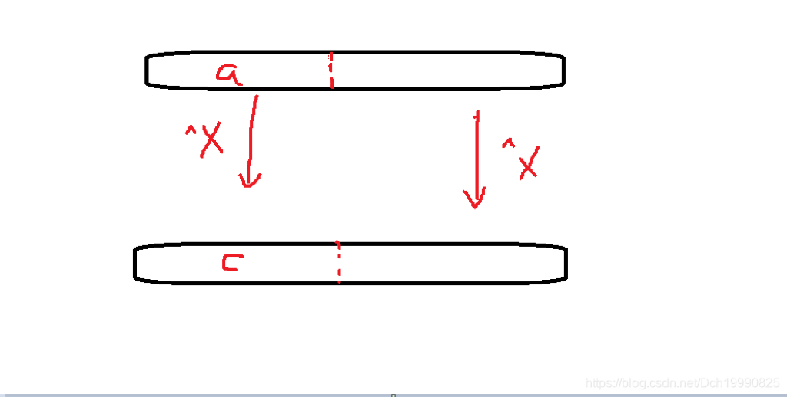

### 问题描述


对于分支数为$w w$的字典树(前缀树)，插入$n n$个字符串，每个字符串长度最大$m m$，那么字典树节点数组需要开多大合适？（使用静态开辟空间，排除vector等动态开辟空间的方法）

### 结论


令$k = ⌊ l o g w n ⌋ k=\lfloor log_{w}n \rfloor$，那么数组大小$t o t l e = w ( w k − 1 ) / ( w − 1 ) + ( m − k ) ∗ n ≤ w ∗ ( n − 1 ) w − 1 + ( m − k ) ∗ n totle=w(w^k-1)/(w-1)+(m-k)*n \le \frac {w*(n-1)}{w-1}+(m-k)*n$


 根据现在做的题而言，字典树对以下几个问题比较方便

1.查询字符串的信息（出现次数，前缀出现次数）

2.在一堆数中求异或最大值**或者**哪个数与此数异或最大。（多次求）

字典树在查询插入等操作的次数都为字符的长度，所以用起来很省时间  。

**操作：**

0.初始化字典树

1.插入[删除]

2.查询

 

字典树的每个节点可以代表一条根到该节点的路径。

```cpp
/*
字典树
操作：
1.插入
3.查找
*/
#include<cstdio>
#include<iostream>
#include<string.h>
using namespace std;
const int MAXN=10010;//单词的个数
const int ALPH=26;//字母表个数
typedef struct TireNode{
    TireNode* next[ALPH];
    int count;//表示该节点对应单词的个数
    TireNode()
    {
        count=0;
        for(int i=0;i<ALPH;++i)
            next[i]=NULL;
    };
} Node;
Node node[MAXN];
int top=0;
Node* root;
Node* CreatNode()
{
    Node* np=&node[top++];
    return np;
}
void InsertNode(Node* root,char *s)//字符串的根  字符串
{
    int len=strlen(s);
    Node *newp;
    newp=root;
    for(int i=0;i<len;++i)
    {
        if(newp->next[s[i]-'a']==NULL)
        {
            newp->next[s[i]-'a']=CreatNode();
        }
        newp=newp->next[s[i]-'a'];
    }
    newp->count+=1;
}
Node* searchNode(Node* root,char* s)//返回节点对应的地址
{
    int len=strlen(s);
    Node* newp;
    newp=root;
    for(int i=0;i<len;++i)
    {
        newp=newp->next[s[i]-'a'];
        if(!newp)
            return NULL;
    }
    return newp;
}
int main()
{
    top=0;
    root=&node[top++];
    int m;
    char s[30];
    scanf("%d",&m);
    while(m--)
    {
        scanf("%s",s);
        InsertNode(root,s);
    }
    int n;
    scanf("%d",&n);
    while(n--)
    {
        scanf("%s",s);
        Node* midp;
        midp=searchNode(root,s);
        if(midp==NULL)
            cout<<0<<endl;
        else
         cout<<midp->count<<endl;
    }
}
```


每个节点有有一个指针数组，指向字母对应的下一个节点。若对应节点不存在，则p=null。

字典树模板二

```cpp
#include<iostream>
#include<string.h>
#include<string>
#include<stdio.h>
#include<cstdlib>
#include<algorithm>
#include<vector>
using namespace std;
const int maxn=500100;
struct Node
{
    int net[26];
    Node()
    {
        clear();
    }
    void clear()
    {
        memset(net,-1,sizeof(net));
    }
}node[maxn];
int top;
int hash_letter(char c)
{
    return c-'a';
}
void clear_tree(int &top)//清空树
{
    for(int i=0;i<=top;++i)
        node[i].clear();
    top=0;
}
void insert_node(char *s)//插入字符串
{
    int now=0;
    while(*s)//根据当前节点和字符选择该字符对应的节点
    {
        if(node[now].net[hash_letter(*s)]==-1)
        {
            node[now].net[hash_letter(*s)]=++top;
        }
        now=node[now].net[hash_letter(*s++)];
    }
}
int main()
{
    int n;
    char str[100];
    int maxlen;
    while(~scanf("%d",&n))
    {
        clear_tree(top);//初始化
        maxlen=-1;
        for(int i=0;i<n;++i)
        {
            scanf("%s",str);
            insert_node(str);
            maxlen=max(maxlen,(int)strlen(str));
        }
        printf("%d\n",2*top-maxlen+n);
    }
}
```


 


求异或最大值

 

因为最近再刷字典树，所以直接想到一个树形方法(ˉ▽ˉ；)...

**1.把每个数字的二进制表达式当作一个字符串插入字典树中**

**2.**

    (1).从顶节点开始，和要求的数val的最大位数开始(第32位开始)

    (2).根据当前节点now，和当前位数k，找出下一节点（如果有与该位不同的边走则走那条边，否则走与此位相同的边），并赋给           now  

    (3).让k--，并找出当前位数的比特值

    (4).返回(2) ，直至k=0退出

**3.记下路径**

**4.求出异或最大值就OK**

 

代码：

```cpp
#include<stdio.h>
#include<iostream>
#include<string.h>
#include<string>
using namespace std;
const int maxn=5000000;
typedef struct Tire_Node
{
//    int cnt;
    int net[2];
    Tire_Node()
    {
//        cnt=0;
        for(int i=0; i<2; ++i)
            net[i]=-1;
    }
    void clear()
    {
//        cnt=0;
        for(int i=0; i<2; ++i)
            net[i]=-1;
    }
} node;
node nodearr[maxn];
int nodetop;
int ans[50];
int Get_bit(int n,int k)
{
    if(n&(1<<(k-1)))
        return 1;
    return 0;   
}
void Become_bit(int &val,int k,int bit)
{
    if(bit)
        val=val|(1<<(k-1));
    else
        val=val&(~(1<<(k-1)));
}
void insert_node(int n)
{
   int flag;
   int now=0;
   for(int i=32;i;--i)
   {
       flag=Get_bit(n,i);
       if(nodearr[now].net[flag]==-1)
       {
           nodearr[now].net[flag]=++nodetop;
       }
       now=nodearr[now].net[flag];
   }
}
void clear_node(int num)
{
    for(int i=0;i<=num;++i)
        nodearr[i].clear();
}
int bfs(int now,int b_val,int k)// 在now节点下面 根据自己的位数v_bal，找到第k位
{
    if(~nodearr[now].net[b_val?0:1])
    {
        ans[k]=b_val?0:1;
        return nodearr[now].net[b_val?0:1];
    }
    else
    {
       ans[k]=b_val;
       return nodearr[now].net[b_val];
    }
}
void Slove(int val)//求字典树中与val 异或最大的值
{
    int now=0;
    for(int i=32;i>=1;--i)
        now=bfs(now,Get_bit(val,i),i);
}
int main()
{
    int t,n,m,val,times=0,res;
    scanf("%d",&t);
    while(t--)
    {
        nodetop=0;
        scanf("%d %d",&n,&m);
        for(int i=0;i<n;++i)
        {
             scanf("%d",&val);
             insert_node(val);
        }
        printf("Case #%d:\n",++times);
        while(m--)
        {
            scanf("%d",&val);
            Slove(val);
            for(int i=1;i<=32;++i)
                Become_bit(res,i,ans[i]);
            printf("%d\n",res);
        }
        clear_node(nodetop);
    }
}
```


 


**题目：** The contest is beginning! While preparing the contest, iSea wanted to print the teams’ names separately on a single paper. Unfortunately, what iSea could find was only an ancient printer: so ancient that you can’t believe it, it only had three kinds of operations:

● ‘a’-‘z’: twenty-six letters you can type ● ‘Del’: delete the last letter if it exists ● ‘Print’: print the word you have typed in the printer

The printer was empty in the beginning, iSea must use the three operations to print all the teams’ name, not necessarily in the order in the input. Each time, he can type letters at the end of printer, or delete the last letter, or print the current word. After printing, the letters are stilling in the printer, you may delete some letters to print the next one, but you needn’t delete the last word’s letters. iSea wanted to minimize the total number of operations, help him, please. Input There are several test cases in the input.

Each test case begin with one integer N (1 ≤ N ≤ 10000), indicating the number of team names. Then N strings follow, each string only contains lowercases, not empty, and its length is no more than 50.

The input terminates by end of file marker. Output For each test case, output one integer, indicating minimum number of operations. **Sample Input** 2 freeradiant freeopen Sample Output 21

**Hint** The sample’s operation is: f-r-e-e-o-p-e-n-Print-Del-Del-Del-Del-r-a-d-i-a-n-t-Print

**题意：** 我有一台古老的打印机，这个打印机只能支持三个操作 1.在缓存区最后面加入一个小写字母 2.将缓存区的字符全部打印到一张卡片上 3.将缓存区最后面字符删除 现在我想打印一些单词，问最少要操作几次才能将打印出所有的单词卡片 **输入：** 多组输入，每组输入一个n，代表下面有n个单词 接着n行每一行有一个单词吗，单词长度最多不超过50 **输出：** 输出把所有的单词卡片打印出来最少的操作数，打印顺序与输入顺序无关。

注意，打印该单词时，要求现在缓存区内都为该单词。

这道题思考了好长时间,各种麻烦操作都想了出来。 最后看了博客…

大概就是这样的思路，先将所有单词建立一个字典树，采用前序遍历树的方法就可以将所有单词全部打印出来，而且操作最少。 字典树的每个节点都是一个字母，那么每个字母都有一个添加和删除的操作，这样就可以把所有单词全部打印，又因为最后一个单词不用删除。 所以总的操作次数=**字典树节点的个数*2**+**单词个数**（要打印出来）—**maxlen**(输入单词的集合)

所以代码思路： 1.将所有单词建立一个字典树，并记下节点个数 2.同时找到单词中的最长单词的长度 3.Get到答案

```bash
#include<iostream>
#include<string.h>
#include<string>
#include<stdio.h>
#include<cstdlib>
#include<algorithm>
#include<vector>
using namespace std;
const int maxn=500100;
struct Node
{
    int net[26];
    Node()
    {
        clear();
    }
    void clear()
    {
        memset(net,-1,sizeof(net));
    }
}node[maxn];
int top;
int hash_letter(char c)
{
    return c-'a';
}
void clear_tree(int &top)//清空树
{
    for(int i=0;i<=top;++i)
        node[i].clear();
    top=0;
}
void inser_node(char *s)//插入字符串
{
    int now=0;
    while(*s)
    {
        if(node[now].net[hash_letter(*s)]==-1)
        {
            node[now].net[hash_letter(*s)]=++top;
        }
        now=node[now].net[hash_letter(*s++)];
    }
}
int main()
{
    int n;
    char str[100];
    int maxlen;
    while(~scanf("%d",&n))
    {
        clear_tree(top);//初始化
        maxlen=-1;
        for(int i=0;i<n;++i)
        {
            scanf("%s",str);
            inser_node(str);
            maxlen=max(maxlen,(int)strlen(str));
        }
        printf("%d\n",2*top-maxlen+n);
    }
}
```


### [G - Vitya and Strange Lesson](https://cn.vjudge.net/problem/CodeForces-842D)


[CodeForces - 842D ](https://cn.vjudge.net/problem/1046355/origin) src="https://cn.vjudge.net/problem/description/89614?1540820430000" width="100%" height="900px" scrolling="no"> 

题意：给你一个数组，让数组里面的值都异或一下x，并构成一个新的数组，求这个数组的mex

mex的含义：不在数组中的最小正整数。

思路：

异或的交换律

1.首先我们知道，异或x之后得到的数组将其再异或y值得到的数组，其实就是原数组异或（x^y）的结果。所以这里我们没有必要将原数组进行变化。

异或的唯一性即 a^b=c 如果b，c确定则a就确定

2.我们将原数组中不存在的数入树。那么对于每一个查询temp，其实就相当于我们在树上找一个值，使得这个值亦或temp最小。（如果此处不懂，请看最后面）

3.找出异或最小值即可

**那么这个数的范围怎么确定呢？**题中所有数据的范围都在0~3e5之间，即二进制第25位之前的全为0，

所以数组中的数与x异或后的数也都满足第二进制第25位之前的全为0，那么所求的mex的二进制的第25位之前也全为0，a^b=c b c满足这样，所以a的进制的第25位之前也全为0，

即要求原数组中不存在的数的范围最下为2^25即可(这样的1~25位的的二进制所有情况全部枚举，答案肯定是与其中一个异或)

```
#include<iostream>
#include<string.h>
#include<string>
#include<stdio.h>
#include<cstdlib>
#include<algorithm>
#include<vector>
using namespace std;
const int maxn=10000010;
const int maxval=524288;
int ans[40];
int book[maxval];
struct Node{
    int net[2];
    Node()
    {
        clear();
    }
    void clear()
    {
      net[0]=net[1]=-1;
    }
}node[maxn];
int top;
void clear_tree(int &top)//清空树
{
    for(int i=0;i<=top;++i)
        node[i].clear();
    top=0;
}
int Getbit(int &val,int k)//val的第k位是多少
{
    if(val&(1<<(k-1)))
        return 1;
    return 0;
}
void Becomebit(int &val,int k,int BitVal)//将val的第k位变为BitVal
{
    if(BitVal)
        val=val|(1<<(k-1));
    else
        val=val&(~(1<<(k-1)));
}
void insert_node(int &val)//将val的二进制位从高到低插入进字典树内
{
    int now=0;
    for(int i=32;i;--i)
    {
        if(node[now].net[Getbit(val,i)]==-1)
            node[now].net[Getbit(val,i)]=++top;
        now=node[now].net[Getbit(val,i)];
    }
}
int dfs(int now,int bit,int k)//根据当前节点和位数返回下一个节点  并且记下选的位数
{
    if(~node[now].net[bit])
    {
        ans[k]=bit;
        return node[now].net[bit];
    }
    ans[k]=bit?0:1;
    return node[now].net[bit?0:1];
}
int Solve(int &val)//x的值不能改变
{
    int now=0;
    for(int i=32;i;--i)
    {
      now=dfs(now,Getbit(val,i),i);//this?
    }
    int res;
    for(int i=32;i;--i)
      Becomebit(res,i,ans[i]);
    return res;
}
int main()
{
    int x,n,m;
    scanf("%d %d",&n,&m);
    memset(book,0,sizeof(book));
    for(int i=0;i<n;++i)
    {
        int mid;
        scanf("%d",&mid);
        book[mid]=1;
    }
    x=0;
    for(int i=0;i<=maxval;++i)
        if(!book[i])
           insert_node(i);//this?
    while(m--)
    {
        int mid;
        scanf("%d",&mid);
        x^=mid;
        printf("%d\n",x^Solve(x));
    }
}

```


参考博客 [https://blog.csdn.net/mengxiang000000/article/details/77718605](https://blog.csdn.net/mengxiang000000/article/details/77718605)

为什么与**原数组异或x后的数组的mex**是**不在原数组中的数与x异或的最小值**？

假设现在数组a与x异或得到数组c 那么因为异或的唯一性，不在数组c的值构成的集合**即为**不在数组a的值与x异或构成的集合，（因为在数组a的值与x异或一定在数组c中） 



Given a list of phone numbers, determine if it is consistent in the sense that no number is the prefix of another. Let's say the phone catalogue listed these numbers:


+ Emergency 911
+ Alice 97 625 999
+ Bob 91 12 54 26


In this case, it's not possible to call Bob, because the central would direct your call to the emergency line as soon as you had dialled the first three digits of Bob's phone number. So this list would not be consistent.

Input

The first line of input gives a single integer, 1 ≤ *t* ≤ 40, the number of test cases. Each test case starts with *n*, the number of phone numbers, on a separate line, 1 ≤ *n* ≤ 10000. Then follows *n* lines with one unique phone number on each line. A phone number is a sequence of at most ten digits.

Output

For each test case, output "YES" if the list is consistent, or "NO" otherwise.

Sample Input
2
3


 

A hat’s word is a word in the dictionary that is the concatenation of exactly two other words in the dictionary.  You are to find all the hat’s words in a dictionary. 

**Input**

Standard input consists of a number of lowercase words, one per line, in alphabetical order. There will be no more than 50,000 words.  Only one case. 

**Output**

Your output should contain all the hat’s words, one per line, in alphabetical order.

**Sample Input**
a
ahat
hat
hatword
hziee
word

**Sample Output**
ahat
hatword


题意:

给你一堆单词，让你输出其中的hat's单词(由两个单词拼接成)

简单字典树

将所有单词插入字典树后，对于每个单词枚举其字串，若左右两字串都出现的话是一个hat's 输出即可

注意

1.不要用构造函数清空节点，不要用构造函数清空节点，不要用构造函数清空节点！会内存超限（手动清空）

2.查找单词时注意判断单词该节点是否为一个单词

 

```cpp
#include<iostream>
#include<string.h>
#include<string>
#include<stdio.h>
#include<cstdlib>
#include<algorithm>
#include<vector>
using namespace std;
const int maxn=500000+20;
struct Node
{
    int cnt;
    int net[26];
    void clear()
    {
        cnt=0;
        memset(net,-1,sizeof(net));
    }
} node[maxn];//每个节点都代表一个路径
int top;
void clear_tree()
{
    node[0].clear();
    top=0;
}
int hash_letter(char c)
{
    return c-'a';
}
void insert_node(char *str)
{
    int now=0;
    while(*str)
    {
        int i=hash_letter(*str);
        if(node[now].net[i]==-1)
        {
            node[top+1].clear();
            node[now].net[i]=++top;
        }
        now=node[now].net[i];
        ++str;
    }
    node[now].cnt=1;
}
int search_node(char *str)//查看是否有这个单词
{
    //根据str返回前缀结束指针
    int now=0;
    while(*str)//根据当前节点和字符选择该字符对应的节点
    {
        now=node[now].net[hash_letter(*str)];
        if(now==-1)
            return 0;
        ++str;
    }
    if(node[now].cnt)
        return 1;
    return 0;
}
char words[50100][100];
int main()
{
    int n=0;
    clear_tree();
    top=0;
    while(~scanf("%s",words[n]))
        insert_node(words[n++]);
    for(int i=0;i<n;++i)
    {
        char w1[100];
        for(char *p=words[i]+1;*p;++p)//枚举字串
        {
            strcpy(w1,words[i]);
            w1[p-words[i]]='\0';
            if(search_node(w1)&&search_node(p))
            {
                 printf("%s\n",words[i]);
                 break;
            }
        }
    }
}```


 

