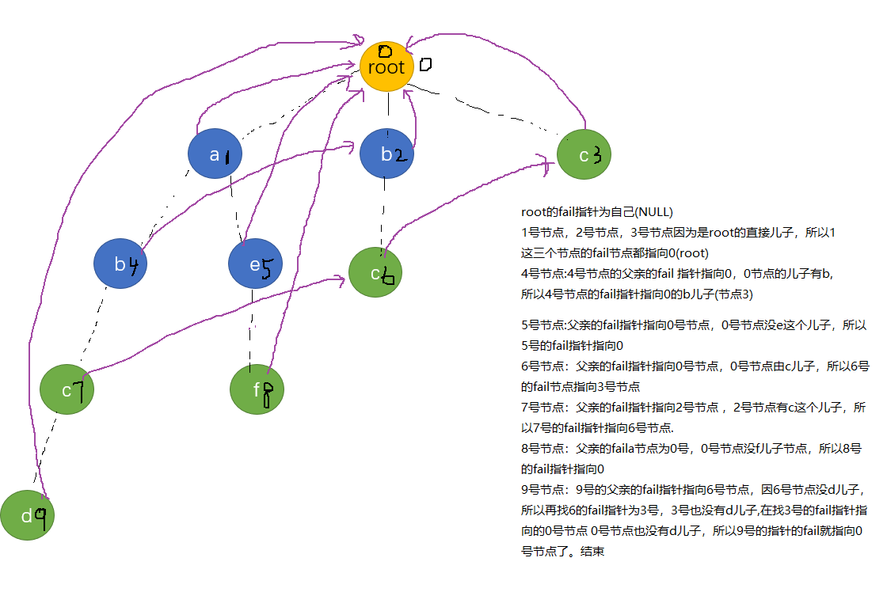

It's well known that DNA Sequence is a sequence only contains A, C, T and G, and it's very useful to analyze a segment of DNA Sequence，For example, if a animal's DNA sequence contains segment ATC then it may mean that the animal may have a genetic disease. Until now scientists have found several those segments, the problem is how many kinds of DNA sequences of a species don't contain those segments.  Suppose that DNA sequences of a species is a sequence that consist of A, C, T and G，and the length of sequences is a given integer n. 

**Input**

First line contains two integer m (0 <= m <= 10), n (1 <= n <=2000000000). Here, m is the number of genetic disease segment, and n is the length of sequences.  Next m lines each line contain a DNA genetic disease segment, and length of these segments is not larger than 10. 

**Output**

An integer, the number of DNA sequences, mod 100000.

Sample Input

```
4 3
AT
AC
AG
AA
```


**Sample Output**

```
36```


 

困扰我一天的题┭┮﹏┭┮

**题意：**

给你m个序列，每个序列都是一种病毒（反正就是不能有就行了）， 问长度为n的字符串中有多少种不含病毒。

**思路：**

能有啥思路，瞎搞呗

看作有限状态机，每种字符串都有一个状态（一会解释什么状态），每个状态都有A T C G个方向，从而走向不同的状态。含有病毒的状态是不能走的。

**这里的状态是指什么状态？**

每个字符串有一个状态，状态就是与病毒串的匹配程度。

此时我盗一个图**（**参考博客[https://blog.csdn.net/morgan_xww/article/details/7834801](https://blog.csdn.net/morgan_xww/article/details/7834801)**）**

 

这是病毒串 （ACG      C）建立的tire树，每个节点代表一个状态 (红色有向边表示fail指针，蓝色有向边代表状态之间的转移)


0的话就代表此时的字符串没有跟任何病毒串有一点匹配（该字符串后缀跟病毒的前缀匹配程度 ）

比如  T ，G，T T,  TG, AG ，AT等等

从O节点的状态可以有A T C G的走向 。走A进入状态1，代表与病毒串的匹配程度为状态1；走T进入状态0，代表跟任何病毒序列没有一毛钱关系，走C进入状态4代表病毒串匹配程度为状态4（这个状态是有病毒的），走G进入状态0.

解释下状态2的转移过程

如果一个串处于状态2，那么走A进入状态1，（与病毒串的最大匹配只能为状态1），走T进入状态0，走C进入状态4，走G进入状态0

 

用矩阵dp[i][j]代表走一步从i状态到j状态有多少方法。

那么就得到一个矩阵

2 1 0 0 1

2 1 1 0 0

1 1 0 1 1

2 1 0 0 1

2 1 0 0 1

那么走n步的结果就是求从0状态走n步能到到所有的状态数的方法和就是答案。即j矩阵dp的n次方（快速幂求）

**需要注意的是：**

1.含有病毒串的节点全都要标记成成病毒串

2.不能从含有病毒串的状态走，也不能走含有病毒串的节点（用病毒的继承，和fail指针找后缀就可做到）

**坑点：**

1.矩阵开long long

2.n用long long

 

每种字符串只能由一种状态

AC在状态2

ACG在状态3

ACC在状态4

**所以 步骤**

1.构建字典树

2.建造fail指针,标记病毒节点

3.求状态转移矩阵

4.矩阵快速幂求长度为n不含病毒串的种类数目

```cpp
#include<cstdio>
#include<algorithm>
#include<stack>
#include<queue>
#include<cstring>
#include<string>
#include<iostream>
using namespace std;
typedef long long ll;
const int maxn=100+7;
const int branch=4;
const ll mod=100000;
const int inf=0x3f3f3f3f;
ll Dp_Matrix[maxn][maxn];
struct Node
{
    int cnt;
    int fail;
    int net[branch];
    void clear()
    {
        cnt=0;
        fail=0;
        for(int i=0; i<branch; ++i)
            net[i]=0;
    }
};
class AcTree
{
public:
    Node *node;
    int top;
    AcTree()
    {
        node=new Node[maxn];
        top=0;
        node[0].clear();
    }
    void init()
    {
        top=0;
        node[0].clear();
    }
    int hash_letter(char c)
    {
        switch(c)
        {
        case 'A':
            return 0;
        case 'T':
            return 1;
        case 'C':
            return 2;
        case 'G':
            return 3;
        }
    }
    void insert(char *p)
    {
        int now=0;
        while(*p)
        {
            int i=hash_letter(*p);
            if(!node[now].net[i])
            {
                node[now].net[i]=++top;
                node[top].clear();
            }
            now=node[now].net[i];
            ++p;
        }
        node[now].cnt=1;
    }
    void Bulid_fail()
    {
        queue<int> mmp;
        int now=0,to;
        for(int i=0; i<branch; ++i)
        {
            if(node[0].net[i])
                mmp.push(node[0].net[i]);
        }
        while(!mmp.empty())
        {
            now=mmp.front();
            mmp.pop();
            //为这个 儿子建造fail指针
            if(node[node[now].fail].cnt)//fail含有病毒
                node[now].cnt=1;
            for(int i=0; i<branch; ++i)
            {
                if(node[now].net[i])
                {
                    if(node[now].cnt)//病毒继承
                        node[node[now].net[i]].cnt=1;
                    to=node[now].fail;//为这个 儿子建造fail指针
                    while(to>0&&node[to].net[i]==0)
                        to=node[to].fail;
                    if(node[to].net[i])
                        to=node[to].net[i];
                    node[node[now].net[i]].fail=to;
                    mmp.push(node[now].net[i]);
                }
            }
        }
    }
    void Bulid_Matrix()
    {
        int now, to;
        memset(Dp_Matrix,0ll,sizeof(Dp_Matrix));
        for(int i=0; i<=top; ++i)
        {
            for(int j=0; j<branch; ++j)
            {
//                if(!node[i].net&&!node[node[i].net[j]].cnt)
//                    Dp_Matrix[i][node[i].net[j]]++;
                to=i;
                while(to>0&&node[to].net[j]==0)
                    to=node[to].fail;
                if(node[to].net[j])
                    to=node[to].net[j];
                if(!node[i].cnt &&!node[to].cnt)
                    Dp_Matrix[i][to]++;
            }
        }
    }
    ~AcTree()
    {
        delete []node;
    }
};
void matix_mult(ll a[maxn][maxn],ll b[maxn][maxn],int n)//结果存到a 上
{
    ll ans[maxn][maxn];
    for(int i=0; i<n; ++i)
    {
        for(int j=0; j<n; ++j)
        {
            ans[i][j]=0ll;
            for(int k=0; k<n; ++k)
            {
                ans[i][j]=(ans[i][j]+a[i][k]*b[k][j])%mod;
            }
        }
    }
    for(int i=0; i<n; ++i)
    {
        for(int j=0; j<n; ++j)
        {
            a[i][j]=ans[i][j];
        }
    }
}
void quick_matrixpow(ll a[maxn][maxn],long long b,int top)//结果存到a 上
{
    ll ans[maxn][maxn];
    memset(ans,0ll,sizeof(ans));
    for(int i=0; i<top; ++i)
        ans[i][i]=1ll;
    while(b)
    {
        if(b&1)
        {
            matix_mult(ans,a,top);
        }
        matix_mult(a,a,top);
        b/=2;
    }
    for(int i=0; i<maxn; ++i)
    {
        for(int j=0; j<maxn; ++j)
        {
            a[i][j]=ans[i][j];
        }
    }
}
int main()
{
    AcTree dch;
    int top;
    int m,ans;
    long long n;
    char str[15];//记录病毒序列
    while(~scanf("%d %lld",&m,&n))
    {
        dch.init();
        for(int i=0; i<m; ++i)
        {
            scanf("%s",str);
            dch.insert(str);
        }
        dch.Bulid_fail();
        dch.Bulid_Matrix();
        top=dch.top;
        quick_matrixpow(Dp_Matrix,n,top+1);
        ans=0;
        for(int i=0; i<=top; ++i)
        {
            ans=(ans+Dp_Matrix[0][i])%mod;
        }
        printf("%d\n",ans);

    }
    return 0;
}
```


 


One day, Nobita found that his computer is extremely slow. After several hours' work, he finally found that it was a virus that made his poor computer slow and the virus was activated by a misoperation of opening an attachment of an email.

Nobita did use an outstanding anti-virus software, however, for some strange reason, this software did not check email attachments. Now Nobita decide to detect viruses in emails by himself.

To detect an virus, a virus sample (several binary bytes) is needed. If these binary bytes can be found in the email attachment (binary data), then the attachment contains the virus.

Note that attachments (binary data) in emails are usually encoded in base64. To encode a binary stream in base64, first write the binary stream into bits. Then take 6 bits from the stream in turn, encode these 6 bits into a base64 character according the following table:

That is, translate every 3 bytes into 4 base64 characters. If the original binary stream contains 3k + 1 bytes, where k is an integer, fill last bits using zero when encoding and append '==' as padding. If the original binary stream contains 3k + 2 bytes, fill last bits using zero when encoding and append '=' as padding. No padding is needed when the original binary stream contains 3k bytes.

 
**Value**012345678910111213141516171819202122232425262728293031**Encoding**ABCDEFGHIJKLMNOPQRSTUVWXYZabcdef**Value**3233343536373839404142434445464748495051525354555657585960616263**Encoding**ghijklmnopqrstuvwxyz0123456789+/

 

For example, to encode 'hello' into base64, first write 'hello' as binary bits, that is: 01101000 01100101 01101100 01101100 01101111 Then, take 6 bits in turn and fill last bits as zero as padding (zero padding bits are marked in bold): 011010 000110 010101 101100 011011 000110 1111**00** They are 26 6 21 44 27 6 60 in decimal. Look up the table above and use corresponding characters: aGVsbG8 Since original binary data contains 1 * 3 + 2 bytes, padding is needed, append '=' and 'hello' is finally encoded in base64: aGVsbG8=

Section 5.2 of RFC 1521 describes how to encode a binary stream in base64 much more detailedly:

[Click here to see Section 5.2 of RFC 1521 if you have interest](http://acm.zju.edu.cn/onlinejudge/showProblem.do?problemCode=3430)

Here is a piece of ANSI C code that can encode binary data in base64. It contains a function, *encode (infile, outfile)*, to encode binary file *infile* in base64 and output result to *outfile*.

[Click here to see the reference C code if you have interest](http://acm.zju.edu.cn/onlinejudge/showProblem.do?problemCode=3430)

**Input**

Input contains multiple cases (about 15, of which most are small ones). The first line of each case contains an integer N (0 <= N <= 512). In the next N distinct lines, each line contains a sample of a kind of virus, which is not empty, has not more than 64 bytes in binary and is encoded in base64. Then, the next line contains an integer M (1 <= M <= 128). In the following M lines, each line contains the content of a file to be detected, which is not empty, has no more than 2048 bytes in binary and is encoded in base64.

There is a blank line after each case.

**Output**

For each case, output M lines. The ith line contains the number of kinds of virus detected in the ith file.

Output a blank line after each case.

**Sample Input**

```
3
YmFzZTY0
dmlydXM=
dDog
1
dGVzdDogdmlydXMu

1
QA==
2
QA==
ICAgICAgICA=
```


**Sample Output**

```
2

1
0

```


**Hint**

In the first sample case, there are three virus samples: base64, virus and t: , the data to be checked is test: virus., which contains the second and the third, two virus samples.

 

 

**思路：**

**1.**将病毒字符串反编码为原来字符串

2.AC自动机，判断文本串中出现多少个模式串

 

**注意：**

**1.**Segmentation Fault    段错误，节点字符开512*64，（因为最多原来的字符串最多有64个字节，也就是深度最多为64）

2.反编码后的字符串用unsignde char 或者int 来存储，因为反编码后的字符串值为0~255之间,（不要问我为什么字符串ASSIC的值还有负的）,每个节点的branch开256个，

 

AC代码：

```cpp
#include<cstdio>
#include<algorithm>
#include<stack>
#include<queue>
#include<cstring>
#include<string>
#include<iostream>
using namespace std;
const int maxn=5e4+7;
const int branch=   ;
int get_charcode(char c)
{
    if(c>='A'&&c<='Z')
        return c-'A';
    else if(c>='a'&&c<='z')
        return c-'a'+26;
    else if(c>='0'&&c<='9')
        return c-'0'+52;
    else if(c=='+')
        return 62;
    else
        return 63;
}
void put_bit(unsigned char &val,int k,int bit)//右边到左边的bit位  1~8 只限
{
    if(bit)
        val|=(1<<(k-1));
    else
        val&=(~(1<<(k-1)));
}
int get_bit(unsigned char &val,int k)//地位到高位的第 k 个位
{
    if(val&(1<<(k-1)))
        return 1;
    return 0;
}
int convertion(char *p,int *str)//将p反编码转化为 str 和cnt
{
    string coding="";
    int lp=strlen(p);
    for(int i=0; i<lp; ++i)
    {
        if(p[i]!='=')
        {
            unsigned char val=(unsigned char)get_charcode(p[i]);
            for(int i=6; i>=1; --i)
            {
                if(get_bit(val,i))
                    coding+='1';
                else
                    coding+='0';
            }
        }
    }

    int top=0;
    while(top< coding.length()/8)
    {
        unsigned char val;
        for(int i=8; i>=1; --i)
        {
            if(coding[top*8+8-i]=='1')
                put_bit(val,i,1);
            else
                put_bit(val,i,0);
        }
        str[top++]=(int)val;
    }
    return top;
}
struct Node
{
    int  fail;
    int  cnt;
    int  is_calu;//是否被该标号计算过
    int net[branch];
    void clear()
    {
        is_calu=-1;
        memset(net,0,sizeof(net));
        fail=0;
        cnt=0;
    }
};
class AcTree
{
private:
    Node* node;
    int top;
public:
    AcTree()
    {
        node=new Node[maxn];
        top=0;
        node[0].clear();
    }
    void init()
    {
        node[0].clear();
        top=0;
    }
    int hash_letter(int c)
    {
        return (int)c;
    }
    void insert(int *p,int total)
    {
        int now=0;
        for(int j=0; j<total; ++j)
        {
            int i=hash_letter(p[j]);
            if(!node[now].net[i])
            {
                node[now].net[i]=++top;
                node[top].clear();
            }
            now=node[now].net[i];
        }
        node[now].cnt=1;
    }
    void bulid_fail()
    {
        queue<int> mmp;
        /*
        建造fail指针   父节点的下面的fail指针全部求出来 然后加入队列
        */
        int now,to;
        for(int i=0; i<branch; ++i)
        {
            if(node[0].net[i])
                mmp.push(node[0].net[i]);
        }
        while(!mmp.empty())
        {
            now=mmp.front();
            mmp.pop();
            for(int i=0; i<branch; ++i)
            {
                if(node[now].net[i])
                {
                    to=node[now].fail;
                    while(to>0&&node[to].net[i]==0)//遍历以这个最大前缀(fail指针)后是否有这个字符
                    {
                        to=node[to].fail;
                    }
                    if(node[to].net[i])
                    {
                        to=node[to].net[i];
                    }
                    node[node[now].net[i]].fail=to;
                    mmp.push(node[now].net[i]);
                }
            }
        }
    }
    int find_tx(int* tx,int flag,int total)
    {
        /*
         查找tx在字典树中出现了多少个字串
        */
        int now=0,to;
        int ans=0;
        for(int j=0; j<total; ++j)
        {
            int i=hash_letter(tx[j]);
            to=now;
            while(to>0&&node[to].net[i]==0)//出错!!!!!!!!!!!!!!!!!!!!!!!!!!!!!
            {
                to=node[to].fail;
             }
            if(node[to].net[i])
                to=node[to].net[i];
            now=to;//找到下一个匹配的节点
            while(to>0&&node[to].is_calu!=flag)//遍历所有以*tx为结尾的的字串的个数
            {
                ans+=node[to].cnt;
                node[to].is_calu=flag;
                to=node[to].fail;
            }
        }
        return ans;
    }
    ~AcTree()
    {
        delete []node;
    }
};
void Print_ASSIC(int *p,int total)
{
    for(int i=0;i<total;++i)
        printf("%d ",p[i]);
    puts("");
}
char viru[1000];
int str[1000];
int main()
{
    AcTree dch;
    int n,m,ans;
    int total;
    while(~scanf("%d",&n))
    {
        dch.init();
        for(int i=0; i<n; ++i)
        {
            scanf("%s",viru);
            total=convertion(viru,str);
//            Print_ASSIC(str,total);
            dch.insert(str,total);
        }
        dch.bulid_fail();
        scanf("%d",&m);
        for(int i=1; i<=m; ++i)
        {
            scanf("%s",viru);
            total=convertion(viru,str);
//            Print_ASSIC(str,total);
            ans=dch.find_tx(str,i,total);
            printf("%d\n",ans);
        }
        printf("\n");
    }
    return 0;
}
```


 


什么是AC自动机？

​ AC自动机并不是自动AC机(●’◡’●)，**Aho–Corasick算法**是由Alfred V. Aho和Margaret J.Corasick 发明的字符串搜索算法.
他能做什么？

​ 在文本串上匹配多模式串，常用的用于计算文本串上出现了多少个模式串。
他是怎么做的？

​ 与KMP算法相似，用fail指针指向失配时的下一个匹配位置。不同的是KMP只适用于单模式串，AC自动机可以匹配多个模式串. AC自动机的基础知识有字典树，KMP（希望把KMP真正理解懂再来搞这个东西）
fail指针是怎么做的？

​ 在KMP算法中next指针（fail指针）实际是找出该字串的最长后缀匹配，在AC自动机中每个节点的fail指针指向该节点对应字符串的最长后缀节点（这个节点不能为本身，意思与Kmp的next指针相似）

下面是一些单词 ，对这些单词创建字典树

abc bc abcd aef c[

](https://i.loli.net/2018/11/15/5bed0ec1aefde.png)

接下里就创建fail指针,首先fail的意义跟Kmp算法中next的意义相同，都指向该字串的最长后缀。
怎么创建fail指针呢？

首先按照fail指针的意义，**root的所有直接儿子的fail指针都指向root,** Why？ 因为root直接儿子的节点代表的字符长度都为1，且字符不重复，又因为fail指针的意义为指向最长后缀字符串的节点（非本身），所以这一步也就合情合理了吧。

接下来，对于每个节点，要找该节点的fail指针（最长匹配）怎么找呢？

是不找是**这个节点的父亲的fail**所代表节点**的儿子有没有这个字符？，如果没有，再找它爸爸的fail的fail的儿子有没有这个字符，（这句话可能有点绕,结合kmp的意思理解一下）直至找到匹配的节点或者根节点。


我们习惯上用用队列作为工具来计算fail指针

```cpp
    void bulid_fail()
    {
        int now=0;
        int to;
        /*
        保证队列里的fail指针全部OK
        从队列中取一个 把其下面的fail指针OK 并且加入队列
        */
        queue<int> mmp;
        for(int i=0;i<26;++i)//将根节点的所有儿子加入队列
        {
            if(node[0].next[i]!=-1)
                mmp.push(node[0].next[i]);
        }
        while(!mmp.empty())//
        {
            now=mmp.front();
            mmp.pop();
            for(int i=0;i<26;++i)//将此节点的儿子的 fail指针计算出来并加入队列
            {
                if(node[now].next[i]!=-1)
                {
                    mmp.push(node[now].next[i]);
                    /*   计算now的 第i个儿子的fail指针   */
                    to=node[now].fail;
                    while(to>0&&node[to].next[i]==-1)
                        to=node[to].fail;
                    /* 直至根节点 或者fail的父节点*/
                    if(node[to].next[i]!=-1)//否则没有最大匹配  即为空
                        node[node[now].next[i]].fail=node[to].next[i];
                }
            }
        }

    }
```


fail指针建好之后 就是文本串在AC自动机上的匹配了

```cpp
 int Find_words(char *tx)
    {
        int ans=0;
        int now=0;//当前最大匹配下标
        int to,i;
        while(*tx)
        {
            i=hash_letter(*tx);
            //没有下面的匹配，则找跟此字符的最大匹配
            while(now>0&&node[now].next[i]==-1)
                    now=node[now].fail;
            if(node[now].next[i]!=-1)
                now=node[now].next[i];
            /* 开始计算以now为后缀的单词出现数*/
            to=now;
            while(to&&node[to].cnt!=-1)/*精髓之处，匹配过后设为-1代表该后缀对应所有的字符串都匹配过了，避免后来重复匹配已经匹配过的单词*/
            {
                ans+=node[to].cnt;
                node[to].cnt=-1;//标记该单词已经加过了  就算这个单词没出现 标记为-1代表这个字符串的后缀节点全扫描过了
                to=node[to].fail;
            }
            ++tx;
        }
        return ans;
    }
```


AC自动机模板题

hdu2222http://acm.hdu.edu.cn/showproblem.php?pid=2222

模板代码

```cpp
#include<stdio.h>
#include<string.h>
#include<algorithm>
#include<math.h>
#include<queue>
using namespace std;
const int maxn=5e5+7;
struct AcTireNode
{
    int next[26];
    int fail,cnt;//要保证fail指针不能为自己
    void clear()
    {
        memset(next,-1,sizeof(next));
        fail=cnt=0;//初始化
    }
};
class AcTire{
    /*
AC 自动机
1.输入模式串 构建字典树
2.构建fail指针
3.匹配文本串
4.初始化树
*/
    public:
        AcTireNode *node;
        int top;//使用了多少个节点
    AcTire()
    {
        top=0;
        node=new AcTireNode[maxn];
        node[0].clear();
    }
    inline int hash_letter(char c)
    {
        return c-'a';
    }
    void insert(char *p)
    {
        int now=0;
        while(*p)
        {
            if(node[now].next[hash_letter(*p)]==-1)
            {
                node[now].next[hash_letter(*p)]=++top;
                node[top].clear();//初始化该节点的信息
            }
                
            now=node[now].next[hash_letter(*p)];
            ++p;
        }
        node[now].cnt++;
    }
    void bulid_fail()
    {
        int now=0;
        int to;
        /*
        保证队列里的fail指针全部OK
        从队列中取一个 把其下面的fail指针OK 并且加入队列
        */
        queue<int> mmp;
        for(int i=0;i<26;++i)//将根节点的所有儿子加入队列
        {
            if(node[0].next[i]!=-1)
                mmp.push(node[0].next[i]);
        }
        while(!mmp.empty())//
        {
            now=mmp.front();
            mmp.pop();
            for(int i=0;i<26;++i)//将此节点的儿子的 fail指针计算出来并加入队列
            {
                if(node[now].next[i]!=-1)
                {
                    mmp.push(node[now].next[i]);
                    /*   计算now的 第i个儿子的fail指针   */
                    to=node[now].fail;
                    while(to>0&&node[to].next[i]==-1)
                        to=node[to].fail;
                    /* 直至根节点 或者fail的父节点*/
                    if(node[to].next[i]!=-1)//否则没有最大匹配  即为空
                        node[node[now].next[i]].fail=node[to].next[i];
                }
            }
        }

    }
    int Find_words(char *tx)
    {
        int ans=0;
        int now=0;//当前最大匹配下标
        int to,i;
        while(*tx)
        {
            i=hash_letter(*tx);
            //没有下面的匹配，则找跟此字符的最大匹配
            while(now>0&&node[now].next[i]==-1)
                    now=node[now].fail;
            if(node[now].next[i]!=-1)
                now=node[now].next[i];
            /* 开始计算以now为后缀的单词出现数*/
            to=now;
            while(to&&node[to].cnt!=-1)/*精髓之处，匹配过后设为-1代表该后缀对应所有的字符串都匹配过了，避免后来重复匹配已经匹配过的单词*/
            {
                ans+=node[to].cnt;
                node[to].cnt=-1;//标记该单词已经加过了  就算这个单词没出现 标记为-1代表这个字符串的后缀节点全扫描过了
                to=node[to].fail;
            }
            ++tx;
        }
        return ans;
    }
    void clear()
    {
        node[0].clear();
        top=0;
    }
    ~AcTire()
    {
        delete []node;
    }

};
char tx[1000007],words[55];
int main()
{
    AcTire dch;
    int t;
    int n;

    scanf("%d",&t);
    while(t--)
    {
        dch.clear();
        scanf("%d",&n);
        for(int i=0;i<n;++i)
        {
            scanf("%s",words);
            dch.insert(words);
        }
        dch.bulid_fail();
        scanf("%s",tx);
        printf("%d\n",dch.Find_words(tx));
    }
}
```


 

小t非常感谢大家帮忙解决了他的上一个问题。然而病毒侵袭持续中。在小t的不懈努力下，他发现了网路中的“万恶之源”。这是一个庞大的病毒网站，他有着好多好多的病毒，但是这个网站包含的病毒很奇怪，这些病毒的特征码很短，而且只包含“英文大写字符”。当然小t好想好想为民除害，但是小t从来不打没有准备的战争。知己知彼，百战不殆，小t首先要做的是知道这个病毒网站特征：包含多少不同的病毒，每种病毒出现了多少次。大家能再帮帮他吗？

**Input**

第一行，一个整数N（1<=N<=1000），表示病毒特征码的个数。  接下来N行，每行表示一个病毒特征码，特征码字符串长度在1—50之间，并且只包含“英文大写字符”。任意两个病毒特征码，不会完全相同。  在这之后一行，表示“万恶之源”网站源码，源码字符串长度在2000000之内。字符串中字符都是ASCII码可见字符（不包括回车）。 

**Output**

按以下格式每行一个，输出每个病毒出现次数。未出现的病毒不需要输出。  病毒特征码: 出现次数  冒号后有一个空格，按病毒特征码的输入顺序进行输出。 

**Sample Input**

```
3
AA
BB
CC
ooxxCC%dAAAoen....END```


**Sample Output**

```
AA: 2
CC: 1

        
  ```


**Hint**

```
Hit：
题目描述中没有被提及的所有情况都应该进行考虑。比如两个病毒特征码可能有相互包含或者有重叠的特征码段。
计数策略也可一定程度上从Sample中推测。

        
 AC自动机模板题```


只有一个文本串进行匹配，题目要求记录文本串中**出现多少个**病毒特征码（注意不是多少种），那么在遍历后缀时

不用做标记，直接遍历到底即可。

```cpp
#include<stdio.h>
#include<string.h>
#include<algorithm>
#include<math.h>
#include<queue>
#include<iostream>
using namespace std;
const int maxn=5e4+7;
const int branch=27;
queue<int> mmp;
int val[1010];//存放病毒特征码出现的次数
class AcTireNode
{
public:
    int next[branch];
    int id,flag;//0为初始值  num记录该病毒编号   flag记录该节点被flag编号的文本遍历了
    int fail;
    void clear()
    {
        fail=0;
        for(int i=0; i<branch; ++i)
            next[i]=-1;
        id=flag=0;
    }
};
class AcTire
{
private:
    AcTireNode *node;
    int top;
public:
    AcTire()
    {
        node=new AcTireNode[maxn];
        node[0].clear();
        top=0;
    }
    int hash_letter(char c)
    {
        if(c>='A'&&c<='Z')
         return c-'A';
        return 26;
    }
    void insert(char *s,int num)
    {
        int now=0;
        while(*s)
        {
            int i=hash_letter(*s);
            if(node[now].next[i]==-1)
            {
                node[now].next[i]=++top;
                node[top].clear();
            }
            now=node[now].next[i];
            ++s;
        }
        node[now].id=num;
    }
    void Bulid_fail()//作用实现：找到每个节点所代表字符串的最大匹配
    {
        int now,to;
        for(int i=0; i<branch; ++i)
        {
            if(node[0].next[i]!=-1)
                mmp.push(node[0].next[i]);
        }
        while(!mmp.empty())
        {
            now=mmp.front();
            mmp.pop();
            for(int i=0; i<branch; ++i)
            {
                if(node[now].next[i]!=-1)
                {
                    mmp.push(node[now].next[i]);
                    to=node[now].fail;
                    while(to>0&&node[to].next[i]==-1)
                        to=node[to].fail;
                    if(node[to].next[i]!=-1)
                        to=node[to].next[i];
                    node[node[now].next[i]].fail=to;
                }
            }
        }
    }
    void Find_tx(char *tx)//计算文本串中所有病毒特征码出现的次数
    {
        int now=0;
        int to;
        while(*tx)
        {
            int i=hash_letter(*tx);
            while(now>0&&node[now].next[i]==-1)
                now=node[now].fail;
            if(node[now].next[i]!=-1)//有匹配的后缀
            {
                now=node[now].next[i];
                to=now;//开始找所有后缀匹配
                while(to>0)//这个节点 曾经是否被这个字符串 遍历过
                {
                    if(node[to].id)
                        val[node[to].id]++;
                    to=node[to].fail;
                }
            }
            ++tx;
        }
    }
    void init()
    {
        top=0;
        node[0].clear();
    }
    ~AcTire()
    {
        delete []node;
    }
};
char tx[2001000],str[1010][60];
int main()
{
    AcTire dch;
    int n;
    while(~scanf("%d",&n))
    {
        dch.init();
        for(int i=1; i<=n; ++i)
        {
            scanf("%s",str[i]);
            dch.insert(str[i],i);
        }
        dch.Bulid_fail();
        scanf("%s",tx);
        memset(val,0,sizeof(val));
        dch.Find_tx(tx);
        for(int i=1;i<=n;++i)
        {
            if(val[i])
                printf("%s: %d\n",str[i],val[i]);
        }
    }
    return 0;
}```


 


当太阳的光辉逐渐被月亮遮蔽，世界失去了光明，大地迎来最黑暗的时刻。。。。在这样的时刻，人们却异常兴奋——我们能在有生之年看到500年一遇的世界奇观，那是多么幸福的事儿啊~~  但网路上总有那么些网站，开始借着民众的好奇心，打着介绍日食的旗号，大肆传播病毒。小t不幸成为受害者之一。小t如此生气，他决定要把世界上所有带病毒的网站都找出来。当然，谁都知道这是不可能的。小t却执意要完成这不能的任务，他说：“子子孙孙无穷匮也！”（愚公后继有人了）。  万事开头难，小t收集了好多病毒的特征码，又收集了一批诡异网站的源码，他想知道这些网站中哪些是有病毒的，又是带了怎样的病毒呢？顺便还想知道他到底收集了多少带病毒的网站。这时候他却不知道何从下手了。所以想请大家帮帮忙。小t又是个急性子哦，所以解决问题越快越好哦~~ 

**Input**

第一行，一个整数N（1<=N<=500），表示病毒特征码的个数。  接下来N行，每行表示一个病毒特征码，特征码字符串长度在20—200之间。  每个病毒都有一个编号，依此为1—N。  不同编号的病毒特征码不会相同。  在这之后一行，有一个整数M（1<=M<=1000），表示网站数。  接下来M行，每行表示一个网站源码，源码字符串长度在7000—10000之间。  每个网站都有一个编号，依此为1—M。  以上字符串中字符都是ASCII码可见字符（不包括回车）。 

**Output**

依次按如下格式输出按网站编号从小到大输出，带病毒的网站编号和包含病毒编号，每行一个含毒网站信息。  web 网站编号: 病毒编号 病毒编号 …  冒号后有一个空格，病毒编号按从小到大排列，两个病毒编号之间用一个空格隔开，如果一个网站包含病毒，病毒数不会超过3个。  最后一行输出统计信息，如下格式  total: 带病毒网站数  冒号后有一个空格。 

**Sample Input**

```
3
aaa
bbb
ccc
2
aaabbbccc
bbaacc```


**Sample Output**

```
web 1: 1 2 3
total: 1```


AC自动机模板题，需要注意的是用构造函数初始化节点会内存超限，至今还不清楚内部原因...   如果要初始化的话手动初始化节点即可。

输入的字符是ASSIC中的可见字符，所以next数组开127就行。

```cpp
#include<stdio.h>
#include<string.h>
#include<algorithm>
#include<math.h>
#include<queue>
using namespace std;
const int maxn=1e5+7;
const int branch=129;
queue<int> mmp;
class AcTireNode
{
public:

    int next[branch];
    int id,flag;//0为初始值  id记录该病毒编号 0代表该节点不是病毒   
                //如果该节点(及其后缀)被第k个文本串匹配的话就令flag=k 代表该节点已经被
                //该字符串匹配过了，无需再匹配其后缀
      
    int fail;
    void clear()
    {
        fail=0;
        for(int i=0; i<branch; ++i)
            next[i]=-1;
        id=flag=0;
    }
};
class AcTire
{
private:
    AcTireNode *node;
    int top;
public:
    AcTire()
    {
        node=new AcTireNode[maxn];
        node[0].clear();
        top=0;
    }
    int hash_letter(char c)
    {
        return (int)c;
    }
    void insert(char *s,int num)
    {
        int now=0;
        while(*s)
        {
            int i=hash_letter(*s);
            if(node[now].next[i]==-1)
            {
                node[now].next[i]=++top;
                node[top].clear();
            }
            now=node[now].next[i];
            ++s;
        }
        node[now].id=num;
    }
    void Bulid_fail()
    {
        int now,to;
        for(int i=0; i<branch; ++i)
        {
            if(node[0].next[i]!=-1)
                mmp.push(node[0].next[i]);
        }
        while(!mmp.empty())
        {
            now=mmp.front();
            mmp.pop();
            for(int i=0; i<branch; ++i)
            {
                if(node[now].next[i]!=-1)
                {
                    mmp.push(node[now].next[i]);
                    to=node[now].fail;
                    while(to>0&&node[to].next[i]==-1)
                        to=node[to].fail;
                    if(node[to].next[i]!=-1)
                        to=node[to].next[i];
                    node[node[now].next[i]].fail=to;
                }
            }
        }
    }
    void Find_tx(char *tx,int *val,int &cnt,int num)//返回匹配的病毒个数 以及病毒的编号
    {
        cnt=0;
        int now=0;
        int to;
        while(*tx)
        {
            int i=hash_letter(*tx);
            while(now>0&&node[now].next[i]==-1)
                now=node[now].fail;
            if(node[now].next[i]!=-1)//有匹配的后缀
            {
                now=node[now].next[i];
                to=now;//开始找所有后缀匹配
                while(to>0&&node[to].flag!=num)//这个节点 曾经是否被这个字符串 遍历过
                {
                    if(node[to].id)
                        val[cnt++]=node[to].id;
                    node[to].flag=num;
                    to=node[to].fail;
                }
            }
            ++tx;
        }
    }
    void clear()
    {
        top=0;
        node[0].clear();
    }
    ~AcTire()
    {
        delete []node;
    }
};
char tx[10010],str[210];
int val[20];
int main()
{
    AcTire dch;
    int n,m,cnt,total;
    while(~scanf("%d",&n))
    {
        dch.clear();
        total=0;
        for(int i=1; i<=n; ++i)
        {
            scanf("%s",str);
            dch.insert(str,i);
        }
        dch.Bulid_fail();
        scanf("%d",&m);
        for(int i=1; i<=m; ++i)
        {
            scanf("%s",tx);
            dch.Find_tx(tx,val,cnt,i);
            if(cnt)
            {
                ++total;
                sort(val,val+cnt);
                printf("web %d:",i);
                for(int j=0; j<cnt; ++j)
                    printf(" %d",val[j]);
                printf("\n");
            }
        }
        printf("total: %d\n",total);
    }
    return 0;
}```


 


### [H - Keywords Search](https://cn.vjudge.net/problem/HDU-2222)


 [HDU - 2222 ](https://cn.vjudge.net/problem/16403/origin)

In the modern time, Search engine came into the life of everybody like Google, Baidu, etc.  Wiskey also wants to bring this feature to his image retrieval system.  Every image have a long description, when users type some keywords to find the image, the system will match the keywords with description of image and show the image which the most keywords be matched.  To simplify the problem, giving you a description of image, and some keywords, you should tell me how many keywords will be match. 

**Input**

First line will contain one integer means how many cases will follow by.  Each case will contain two integers N means the number of keywords and N keywords follow. (N <= 10000)  Each keyword will only contains characters 'a'-'z', and the length will be not longer than 50.  The last line is the description, and the length will be not longer than 1000000. 

**Output**

Print how many keywords are contained in the description.

**Sample Input**

```
1
5
she
he
say
shr
her
yasherhs```


**Sample Output**

```
3```


 

AC自动机模板题

```cpp
#include<stdio.h>
#include<string.h>
#include<algorithm>
#include<math.h>
#include<queue>
using namespace std;
const int maxn=5e5+7;
struct AcTireNode
{
    int next[26];
    int fail,cnt;//要保证fail指针不能为自己
    AcTireNode()
    {
        memset(next,-1,sizeof(next));
        fail=cnt=0;//初始化
    }
    void clear()
    {
        memset(next,-1,sizeof(next));
        fail=cnt=0;//初始化
    }
};
class AcTire{
    /*
AC 自动机
1.输入模式串 构建字典树
2.构建fail指针
3.匹配文本串
4.初始化树
*/
    public:
        AcTireNode *node;
        int top;//使用了多少个节点
    AcTire()
    {
        top=0;
        node=new AcTireNode[maxn];
    }
    inline int hash_letter(char c)
    {
        return c-'a';
    }
    void insert(char *p)
    {
        int now=0;
        while(*p)
        {
            if(node[now].next[hash_letter(*p)]==-1)
                node[now].next[hash_letter(*p)]=++top;
            now=node[now].next[hash_letter(*p)];
            ++p;
        }
        node[now].cnt++;
    }
    void bulid_fail()
    {
        int now=0;
        int to;
        /*
        保证队列里的fail指针全部OK
        从队列中取一个 把其下面的fail指针OK 并且加入队列
        */
        queue<int> mmp;
        for(int i=0;i<26;++i)//将根节点的所有儿子加入队列
        {
            if(node[0].next[i]!=-1)
                mmp.push(node[0].next[i]);
        }
        while(!mmp.empty())//
        {
            now=mmp.front();
            mmp.pop();
            for(int i=0;i<26;++i)//将此节点的儿子的 fail指针计算出来并加入队列
            {
                if(node[now].next[i]!=-1)
                {
                    mmp.push(node[now].next[i]);
                    /*   计算now的 第i个儿子的fail指针   */
                    to=node[now].fail;
                    while(to>0&&node[to].next[i]==-1)
                        to=node[to].fail;
                    /* 直至根节点 或者fail的父节点*/
                    if(node[to].next[i]!=-1)//否则没有最大匹配  即为空
                        node[node[now].next[i]].fail=node[to].next[i];
                }
            }
        }

    }
    int Find_words(char *tx)
    {
        int ans=0;
        int now=0;//当前最大匹配下标
        int to,i;
        while(*tx)
        {
            i=hash_letter(*tx);
            //没有下面的匹配，则找跟此字符的最大匹配
            while(now>0&&node[now].next[i]==-1)
                    now=node[now].fail;
            if(node[now].next[i]!=-1)
                now=node[now].next[i];
            /* 开始计算以now为后缀的单词出现数*/
            to=now;
            while(to&&node[to].cnt!=-1)/*精髓之处，匹配过后设为-1代表该后缀对应所有的字符串都匹配过了，避免后来重复匹配已经匹配过的单词*/
            {
                ans+=node[to].cnt;
                node[to].cnt=-1;//标记该单词已经加过了  就算这个单词没出现 标记为-1代表这个字符串的后缀节点全扫描过了
                to=node[to].fail;
            }
            ++tx;
        }
        return ans;
    }
    void clear()
    {
        for(int i=0;i<=top;++i)
            node[i].clear();
        top=0;
    }
    ~AcTire()
    {
        delete []node;
    }

};
char tx[1000007],words[55];
int main()
{
    AcTire dch;
    int t;
    int n;

    scanf("%d",&t);
    while(t--)
    {
        dch.clear();
        scanf("%d",&n);
        for(int i=0;i<n;++i)
        {
            scanf("%s",words);
            dch.insert(words);
        }
        dch.bulid_fail();
        scanf("%s",tx);
        printf("%d\n",dch.Find_words(tx));
    }
}```


 


       吉哥又想出了一个新的完美队形游戏！  　　假设有n个人按顺序站在他的面前，他们的身高分别是h[1], h[2] ... h[n]，吉哥希望从中挑出一些人，让这些人形成一个新的队形，新的队形若满足以下三点要求，则就是新的完美队形：  　　1、挑出的人保持原队形的相对顺序不变，且必须都是在原队形中连续的；  　　2、左右对称，假设有m个人形成新的队形，则第1个人和第m个人身高相同，第2个人和第m-1个人身高相同，依此类推，当然如果m是奇数，中间那个人可以任意；  　　3、从左到中间那个人，身高需保证不下降，如果用H表示新队形的高度，则H[1] <= H[2] <= H[3] .... <= H[mid]。  　　现在吉哥想知道：最多能选出多少人组成新的完美队形呢？

 

 

这道题正确解决方案就是manacher 判断下单调递增即可

```cpp
#include<stdio.h>
#include<iostream>
#include<algorithm>
#include<stdlib.h>
#include<string.h>
using namespace std;
const int maxn=101000;
int  num[maxn];
int nn[maxn<<1];
int Lis[maxn<<1];
int Proprocess(const int* str,int len,int *p)//0 代表＃
{
    int top=0;
    p[top++]=-1;
    for(int i=0;i<len;++i)
    {
        p[top++]=0;
        p[top++]=str[i];
    }
    p[top++]=0;
    p[top]=-2;
    return top;
}
int  Mannacher(const int* str,int len)//经过预处理的字符串
{
    int r;//r为上一个中心对应的半径
    int mid=0;//中心
    memset(Lis,0,sizeof(Lis));
    for(int i=1;i<len;++i)//计算以i为中心的字符串的
    {
        if(i<=mid+r)
        {
            r=min(Lis[2*mid-i],mid-i+r);
        }
        else
            r=0;
        while(str[i+r+1]==str[i-r-1]&&str[i+r+1]<=str[i+r-1])//相等的情况下 保持递增
             r++;
        Lis[i]=r;
        mid=i;
    }
    int ans=-1;
    for(int i=1;i<len;++i)
        ans=ans>Lis[i]?ans:Lis[i];
    return ans;

}
int main()
{
    int t,n;
    scanf("%d",&t);
    while(t--)
    {
       scanf("%d",&n);
       for(int i=0;i<n;i++)
            scanf("%d",num+i);
       n=Proprocess(num,n,nn);
       int ans=Mannacher(nn,n);
       cout<<ans<<endl;
    }
}```


 

但是这道题我一次做的时候做错了  当时也想了一个o（n）的方法,  直接让下一个判断的中心为上一个回文串的右

边缘+1。因为疏忽上一个回文串可能全相等的情况 所以错了

放一个数据

1

12 50 50 50 50 50 50 50 50 50 50 50 50

 

错误代码（给自己提个醒）

```cpp
#include<stdio.h>
#include<iostream>
#include<algorithm>
#include<stdlib.h>
#include<string.h>
using namespace std;
const int maxn=101000;
int  num[maxn];
int nn[maxn<<1];
int Lis[maxn<<1];
int Proprocess(const int* str,int len,int *p)//0 代表＃
{
    int top=0;
    p[top++]=-1;
    for(int i=0;i<len;++i)
    {
        p[top++]=0;
        p[top++]=str[i];
    }
    p[top++]=0;
    p[top]=-2;
//    for(int i=0;i<=top;++i)
//        cout<<p[i]<<" ";
//    cout<<endl;
    return top;
}
int  Mannacher(const int* str,int len)//经过预处理的字符串
{
    int mid,r,maxx;
    mid=0,r=0;
    memset(Lis,0,sizeof(Lis));
    for(int i=1;i<len;)//计算以i为中心的字符串的
    {
        maxx=str[i]?str[i]:300;//作为首先最大字符
        r=0;
        while(str[i+r+1]==str[i-r-1])
        {
             if(str[i+r+1])
             {
                 if(str[i+r+1]>maxx)//不符合
                    break;
                maxx=str[i+r+1];//符合 并且更换最大值
             }
             r++;
        }
        Lis[i]=r;
        mid=i;
        if(r)
           i=mid+r;
        else
            i=mid+r+1;//需要从0处开始
    }
    int ans=-1;
    for(int i=1;i<len;++i)
        ans=ans>Lis[i]?ans:Lis[i];
    return ans;

}
int main()
{
    int t,n;
    scanf("%d",&t);
    while(t--)
    {
       scanf("%d",&n);
       for(int i=0;i<n;i++)
            scanf("%d",num+i);
       n=Proprocess(num,n,nn);
       int ans=Mannacher(nn,n);
       cout<<ans<<endl;
    }
}```


 


先放下代码：

时间2018-4-9-19-58

 

```cpp
#include<cstdio>
#include<iostream>
#include<cstring>
#include<string>
#include<cmath>
#include<algorithm>
#include<cstdlib>
#define N 2010000
#define INF 0x3f3f3f3f
#define MOD 10000
using namespace std;
char s[N],t[N];
int p[N];
void Preprocess(char* s)
{
    int s_len,cnt=0;
    s_len=strlen(s);
    t[cnt++]='$';
    for(int i=0; i<s_len; i++)
    {
        t[cnt++]='#';
        t[cnt++]=s[i];
    }//对s的处理变为t
    t[cnt++]='#';
    t[cnt++]='\0';
}
int manacher(char* t)
{
    int t_len,C,R,ans;
    t_len=strlen(t);
    p[0]=0,C=0,R=0;
    for(int i=1; i<t_len-1; i++) //求没一点为中心的最长回文串的半径
    {
        if(i<R)//利用回文特性
        {
            int j=2*C-i;
            p[i]=min(p[j],R-i);
            while(t[i+p[i]+1]==t[i-p[i]-1])
                    p[i]++;
            if(p[i]+i>=R)
            {
                C=i;
                R=p[i]+i;
            }
        }
        else//不能利用回文的特性
        {

            p[i]=0;
            while(t[i+p[i]+1]==t[i-p[i]-1])
                p[i]++;
            C=i;
            R=i+p[i];
        }
    }
    ans=-1;
    for(int i=1; i<t_len-1; i++)
    {
        ans=ans>p[i]?ans:p[i];
    }
    return ans;
}
int main()
{
    int k=0;
    while(~scanf("%s",s))
    {
        if(!strcmp(s,"END"))
        {
            return 0;
        }
        Preprocess(s);
        printf("Case %d: %d\n",++k,manacher(t));
    }
    return 0;
}```


 

