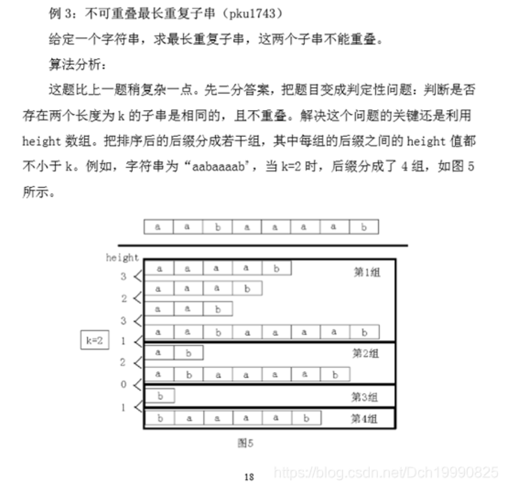
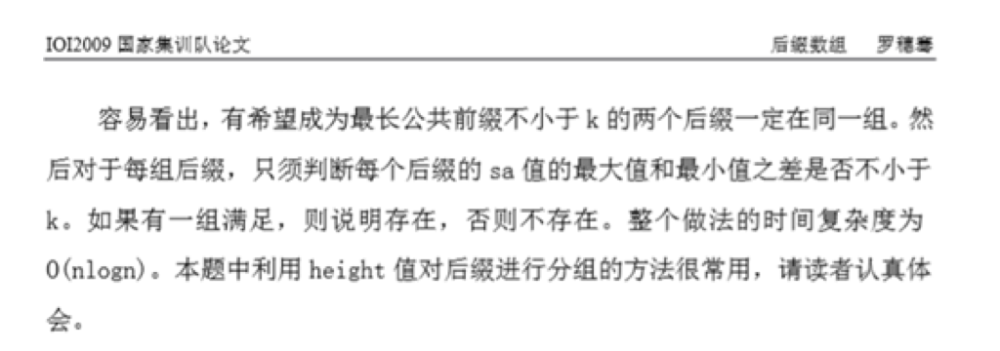
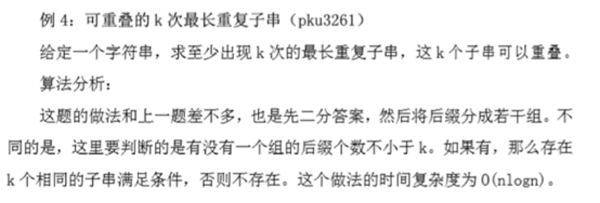
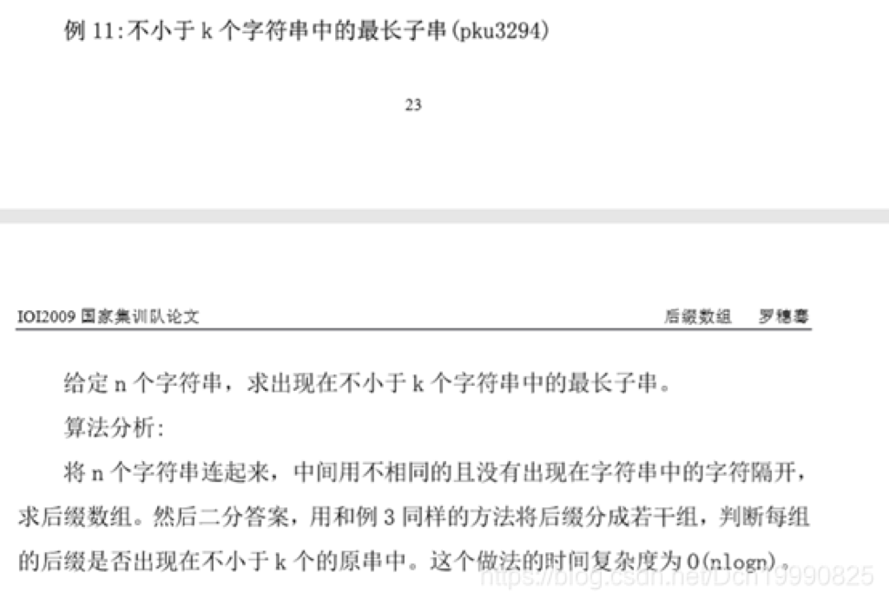
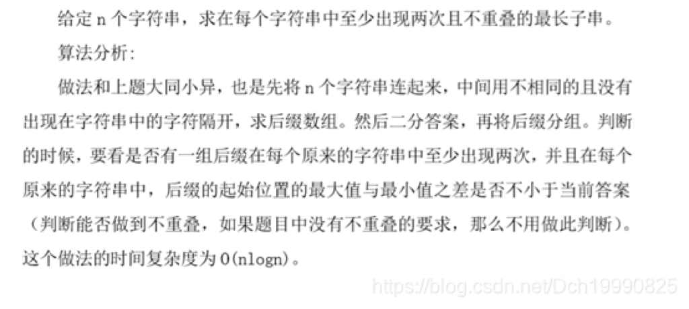
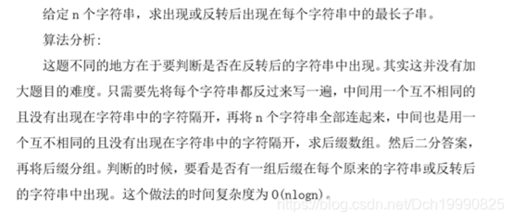

### 后缀数组


后缀排序后的序列(信息：sa[],height[],rank[])有诸多性质，要灵活应用，并且一定要记得，**一个字符串的子串就是某个后缀的前缀，那么子串之间的关系在后缀数组上非常明显**！

后缀数组经典问题

##### 1.求两后缀的最长公共前缀——LCP(a,b)。


LCP(a,b)定义为后缀a与后缀b的最长相同前缀的长度，设$x = rank\left\lbrack a \right\rbrack,y = rank\left\lbrack b \right\rbrack$，$rank\lbrack i\rbrack$ 即后缀$i$ 在后缀数组中的排名。不访假设$x < y​$，那么 

$$\text{LCP}\left( a,b \right) = min(height\lbrack x + 1\rbrack,height\lbrack x + 2\rbrack\ldots,height\lbrack y\rbrack)$$


##### 2.比较一个字符串的两个子串的大小关系


假设需要比较的是$A = S\left\lbrack a\ldots b \right\rbrack$和$B = S\lbrack c\ldots d\rbrack$的大小关系。

若$\text{LCP}\left( a,c \right) \geq \min\left( \left| A \right|,\left| B \right| \right)$ ,$A < B \Leftarrow \Rightarrow \left| A \right| < |B|$

否则$A < B \Leftarrow \Rightarrow rank\left\lbrack a \right\rbrack < rank\lbrack b\rbrack$

##### 3.不同子串的数目


子串就是后缀的前缀，所以可以枚举每个后缀，计算前缀总数，再减掉重复，“前缀总数”其实就是子串个数，为 $\frac{n*(n+1)}{2}​$。

如果按后缀排序的顺序枚举后缀，每次新增的子串就是除了与上一个后缀的 LCP 剩下的前缀。这些前缀一定是新增的，否则会破坏$LCP(sa[i],sa[j])=min\{height[i+1...j]\}$的性质。只有这些前缀是新增的，因为 LCP 部分在枚举上一个前缀时计算过了。

所以答案为： $\frac{n*(n + 1)}{2} - \sum_{i = 2}^{n}{height[i]}$

##### 4.求在字符串中至少出现k次的最长子串的长度


即height[]中相邻k-1个的最小值的最大值。

答案为：$max\{ v\ |v = \min\left( \text{height}\left\lbrack i \right\rbrack,height\left\lbrack i + k - 2 \right\rbrack \right),i \in \left\lbrack 2,n + 2 - k \right\rbrack\}$。

可以使用RMQ 做到O(nlogn)预处理，O(1)查询。

##### 5.查询一个字符串在文本串的出现次数。


假设文本串为S，查询串为T，那么我们可以在串S的后缀数组上二分出字典序大于等于串T的最小排名（注意此时的二分只考虑前|T|个长度），然后二分字典序大于串T的最小排名，出现次数即这两个位置相减的值。

#### 6. 求两个字符串的最长相同子串 Poj2774


很容易想出答案是这两个字符串后缀中的最长相同前缀的长度。 我们假设这两个字符串分别为S1，S2，令S=S1+’#’+S2。 接下来求出S的后缀数组，因为对于S2（S1）的某个后缀t2，另一个串S1(S2)与它相同的最长子串一定是S的后缀数组中离后缀t2的最近的两侧的某个后缀串t1的lcp的值。(t1,t2分别是S1,S2的后缀串) 所以我们考虑这样做，从左到右依此遍历后缀数组，维护下S1后缀串的最近的出现过的排名位置p1，S2后缀串最近的出现过的排名位置p2，每遇到一个S1（S2）的后缀串，就求上个另一个后缀串与自己的最长前缀长度即min⁡{height[p+1],…height[i]} 更新答案即可。 注：区间min可以使用RMQ预处理，总体时间复杂度O((n+m)log(n+m))

#### 7. 某字符串最长重复子串问题


一个字符串t是S的重复子串当且仅当t在S中至少出现了两次(出现位置不同)

+ **求字符串可重叠最长重复子串的长度** 即height[]数组的最大值 注：DA算法时间复杂度O(nlogn),DC3时间复杂度O(n)+ **不可重叠最长重复子串的长度** 这里不可重叠是指要求字符串t在字符串S中至少两次出现的区间无重叠。 对于这个问题可改为判定性问题，我们可以二分t的长度，对于每个长度lt，我们可以将height数组分组，即在height[i]<lt的位置分开，这样每个区间的任意两个后缀串的相同前缀长度都>=lt,那么只要某个区间的sa[]的最大值和sa[]最小值相差只要>=lt即这个长度可以。（这里可以扩展一下，要求出现的重复子串相隔间距至少一定位置也可以） 注：二分O(logn)，judge O(n)，总体时间复杂度为O(nlogn) 这个二分+分组的技巧会经常常见。 *下面有关图片取自—2009年论文集之后缀数组——罗穗骞* 

 

+ **可重叠的k次最长重复子串（pku3261）** 



#### 8. 多字符串之间的关系问题


对于多个字符串，我们常常把这些字符串用特殊字符（比如char(1),char(2)等等，反正只要不出现在字符集里且连接所使用的字符不同即可）连接起来，然后在后缀数组上进行一些操作即可。这么做的作用是对于每个后缀串分隔符处的典序比较肯定出排名结果，这样分隔符处以及之后字符对于这个后缀串就不起作用了 注：通常也使用二分长度+分组的技巧，具体请看下面多字符串的关系

+ **给定 n 个字符串，求出现在不小于 k 个字符串中的最长子串。** 如果k=1的话就直接输出最长即可。 否则我们将这些字符串用特殊且不相等的字符连接起来，求他们的后缀数组，接下来二分满足要求的子串的长度（改成判定性问题），对于每个长度w，我们将height[]<w处分隔开从而将height[]数组分组，我们只需判断这些组内是否有k个不同字符串的后缀即可（因为每组后缀的最长相同前缀长度>=w，容易看出答案一定也在某个组中，所以该算法正确）。 注：时间复杂度O(nlogn) *下面有关图片取自—2009年论文集之后缀数组——罗穗骞* 

+ **每个字符串至少出现两次且不重叠的最长子串(spoj220)** *下面有关图片取自—2009年论文集之后缀数组——罗穗骞* 

+ **出现或反转后出现在每个字符串中的最长子串(PKU3294** *下面有关图片取自—2009年论文集后缀数组——罗穗骞* 



这篇文章大部分参考：https://wenku.baidu.com/view/ed1be61e10a6f524ccbf85fd.html###


##### DA算法


时间复杂度O(nlogn)，空间复杂度O(n)

后缀数组DA算法：

```cpp
//子串与子串的关系可以转化为两后缀的前缀的关系,所以后缀数组在字符串方面有很大用处
/*
注: 排名从1开始,后缀下标从1开始.

名词解释:下面后缀i代指原串下标i开始的后缀,排名指字典序从小到大的排名.
s[] :原串数组,下标从1开始,要在下标n+1处有一最小字符,比如'\0'.
n   :字符串长度.
sa[]:sa[i]代表排名为i的后缀下标为sa[i]
rank[]: 后缀i的排名为rank[i]
height[]: height[i]代表排名i与排名i-1后缀的最长相同前缀的长度.
空间复杂度O(n),时间复杂度O(nlogn)
*/
const int N=1e5+10;
int t1[N],t2[N],c1[N];//辅助数组
void SA(char *s,int n,int sa[],int rank[],int height[])//基数排序的版本中
{
    int m=128;//桶的大小,会在下面循环中变化,第一关键词r的最大值,初始时是字符的最大值,之后都<=n
    int *sb=t1,*r=t2,*c=c1;//辅助数组,分别为:基数排序所用的第二2,rak',cnt数组
    //用基数排序求出长度为1的sa[]和rank[],如果字符最大值较大,第一轮可以采用sort
    for(int i=0; i<=m; ++i) c[i]=0;
    for(int i=1; i<=n; ++i) c[r[i]=s[i]]++;
    for(int i=1; i<=m; ++i) c[i]+=c[i-1];
    for(int i=n; i>=1; --i) sa[c[s[i]]--]=i;

    for(int k=1,p ; k < n; k<<=1 ) //p是一个计数器，现在还没用。
    {
        //sb[i]:第二关键词排名为i的位置为sb[i]
        p=0;
        for(int i=n-k+1; i<=n; ++i) sb[++p]=i;
        for(int i=1; i<=n; ++i) if(sa[i]>k) sb[++p]=sa[i]-k;
        //基数排序求出2k长度的sa数组
        for(int i=0; i<=m; ++i) c[i]=0;
        for(int i=1; i<=n; ++i) c[r[i]]++;
        for(int i=1; i<=m; ++i) c[i]+=c[i-1];
        for(int i=n; i>=1; --i) sa[ c[r[sb[i]]]-- ]=sb[i];
        std::swap(r,sb);
        //现在要利用上轮的r和这轮的sa求这轮的r
        r[sa[1]]=p=1;
        for(int i=2,a,b; i<=n; ++i)
        {
            a=sa[i],b=sa[i-1];
            if(sb[a]==sb[b]&&(a+k<=n && b+k<=n&&sb[a+k]==sb[b+k]) ) r[a]=p;
            else r[a]=++p;
        }
        if(p>=n) break;//可以提前退出
        m=p;
    }
    /*计算高度数组*/
    int k=0;
    for(int i=1;i<=n;++i) rank[sa[i]]=i;
    for(int i=1; i<=n; ++i)
    {
        if(k) k--;
        int j=sa[rank[i]-1];
        if(j==0) continue;
        while(s[j+k]==s[i+k]) ++k;
        height[rank[i]]=k;
    }
}
int rank[N],sa[N],height[N];
char s[N];
int RMQ[N],mm[N],best[N][20];//rmq[]=height[]
void initRMQ(int n)
{
    for(int i=1; i<=n; ++i) RMQ[i]=height[i];
    mm[0]=-1;
    for(int i=1; i<=n; ++i) mm[i]=((i&(i-1))==0)?mm[i-1]+1:mm[i-1];
    for(int i=1; i<=n; ++i) best[i][0]=i;
    for(int j=1; j<=mm[n]; ++j)
        for(int i=1; i+(1<<j)-1<=n;++i){
            int a=best[i][j-1];
            int b=best[i+(1<<(j-1))][j-1];
            if(RMQ[a] < RMQ[b]) best[i][j]=a;
            else best[i][j]=b;
        }
}
int askRMQ(int a,int b)
{
    int t;
    t=mm[b-a+1];
    b-=(1<<t)-1;
    a=best[a][t],b=best[b][t];
    if(RMQ[a] < RMQ[b]) return a;
    else return b;
}
int lcp(int a,int b)
{
    a=rank[a],b=rank[b];
    if(a > b) std::swap(a,b);
    return height[askRMQ(a+1,b)];
}
```


如果传入的数组字符最大值太大，第一波可以使用快排（当然离散化也是可以的）

```cpp
const int N=1e6+10;
int t1[N],t2[N],c1[N];//辅助数组
void SA(int *s,int n,int sa[],int rank[],int height[])//基数排序的版本中
{
    int m=n;//桶的大小,会在之后循环变化,<=n
    int *sb=t1,*r=t2,*c=c1;
    /*串最大值较大,第一轮采用sort*/
    for(int i=1; i<=n; ++i) sa[i]=i;
    auto cmp=[&](int x,int y)
    {
        return s[x]<s[y]||(s[x]==s[y]&&x < y);
    };
    std::sort(sa+1,sa+n+1,cmp);
    int p;
    r[sa[1]]=p=1;
    for(int i=2; i<=n; ++i)
    {
        if(s[sa[i-1]]==s[sa[i]]) r[sa[i]]=p;
        else r[sa[i]]=++p;
    }
	
    for(int k=1,p ; k < n; k<<=1 ) //p是一个计数器，现在还没用。
    {

        p=0;
        for(int i=n-k+1; i<=n; ++i) sb[++p]=i;
        for(int i=1; i<=n; ++i) if(sa[i]>k) sb[++p]=sa[i]-k;

        for(int i=0; i<=m; ++i) c[i]=0;
        for(int i=1; i<=n; ++i) c[r[i]]++;
        for(int i=1; i<=m; ++i) c[i]+=c[i-1];
        for(int i=n; i>=1; --i) sa[ c[r[sb[i]]]-- ]=sb[i];
        std::swap(r,sb);

        r[sa[1]]=p=1;
        for(int i=2,a,b; i<=n; ++i)
        {
            a=sa[i],b=sa[i-1];
            if(sb[a]==sb[b]&&(a+k<=n && b+k<=n&&sb[a+k]==sb[b+k]) ) r[a]=p;
            else r[a]=++p;
        }
        if(p>=n) break;//可以提前退出
        m=p;
    }
    /*计算高度数组*/
    int k=0;
    for(int i=1; i<=n; ++i) rank[sa[i]]=i;
    for(int i=1; i<=n; ++i)
    {
        if(k) k--;
        int j=sa[rank[i]-1];
        if(j==0) continue;
        while(s[j+k]==s[i+k]) ++k;
        height[rank[i]]=k;
    }
}
```


