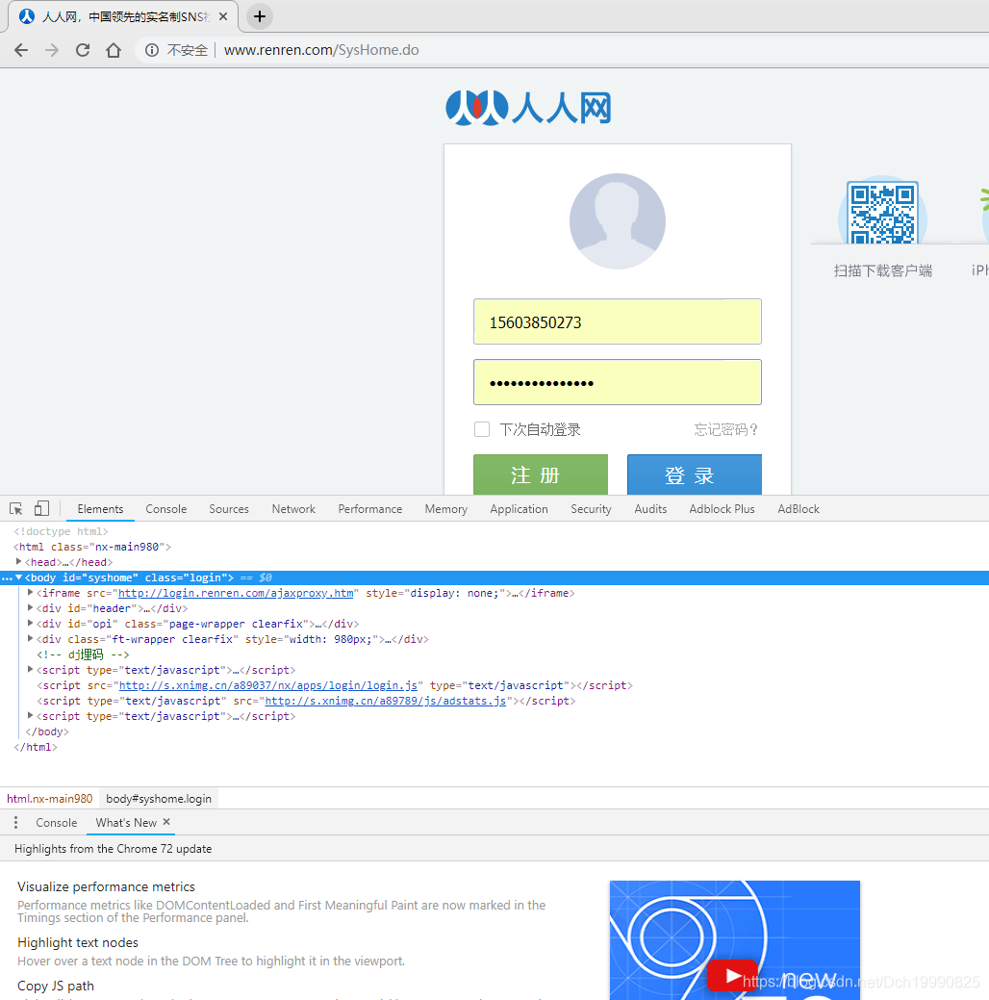
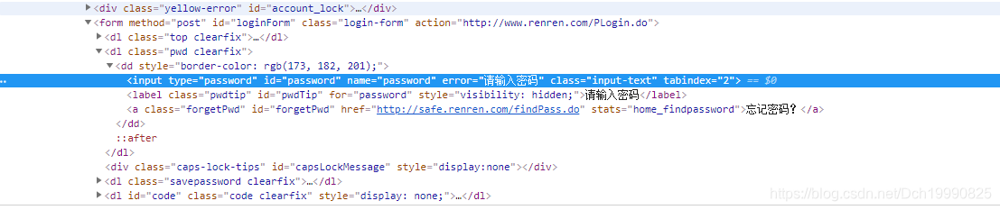

## 使用request模块的session类模拟登陆人人网


因为人人网的登陆不需要验证码，故模拟登陆比较简单。


## 思路


####  1. 使用浏览器打开人人网的登陆页面


####  2. 找出登陆时发送post请求的url地址和请求体格式


####  3. 使用session发送post请求获得cookies后，访问所需页面即可


 

 

 

###  1. 使用浏览器打开人人网的登陆页面





 

###      2. 找出登陆时发送post请求的url地址和请求体格式


 

 

      



密码框的   id="password"  账号框的id="email "  对应的form表单的action="http://www.renren.com/PLogin.do"

所以   当输入账号和密码点击登陆之后，浏览器会把表单信息发送给"http://www.renren.com/PLogin.do"。

**故我们猜测把该url地址作为post发送请求的地址，然后准备好请求头，请求体的内容是一个字典 key'值分别为"password"和"email"**

 

###  3. 使用session发送post请求获得cookies后，访问所需页面即可


我们知道发送请求的**url地址**和**post请求体**的数据之后就可以模拟浏览器发送请求了


 代码：


注：由于隐私问题，下面的login_info的账号密码信息删了，自己使用时候只需填上自己的账号密码即可


```python
import requests
login_info={"email":"你的账号","password":"你的密码"}
headers={"User-Agent": "Mozilla/5.0 (Windows NT 10.0; Win64; x64) AppleWebKit/537.36 (KHTML, like Gecko) Chrome/71.0.3578.98 Safari/537.36"
}

url="http://www.renren.com/PLogin.do"
session=requests.session()
session.post(url,headers=headers,data=login_info)#向登陆程序发送post请求 获得登陆后的cookie
#使用session发送post请求返回的页面
profile_url="http://www.renren.com/969664771/profile"#个人主页url
resp=session.get(profile_url,headers=headers)#人人网的个人主页
ProfileHtml=resp.content.decode()#得到登陆后的个人主页html代码

resp=session.get("http://zhibo.renren.com/car/home#nav=0",headers=headers)#进入登陆后的人人网的直播 商城
ZbHtml=resp.content.decode()#得到登陆后的直播商城的html代码
print(ZbHtml)```


在session发送第一个post请求之后，seesion就会记下登陆信息（cookies）接下来只需访问登陆后的数据即可。(有些数据不容易访问) 


## Python 用selenium模块的webdriver类实现对CSDN博客的自定义排序分类


下面分几个步骤 1.安装Chrome驱动器，需要安装对应浏览器版本的 网址:[https://npm.taobao.org/mirrors/chromedriver](https://npm.taobao.org/mirrors/chromedriver)

2.获得并**保存**登陆后**个人列表**的信息

3.**自己**对**保存的个人列表**进行一个**排序**，并**保存文件**

4.根据保存的文件和当前博客的分类顺序进行模拟点击，完成排序过程。


### 1. 安装Chorme驱动器


​ 这里我查看了自己Chrome浏览器的版本，我在此安装的版本为: 72.0.3626.69/

​ 在程序中用selenium模块的webdriver进行一个Chrome驱动器的实现

​

```python
    login_url = "https://passport.csdn.net/login"
    driver = webdriver.Chrome(executable_path=r'C:\Users\12495\Desktop\chromedriver.exe')
```


### 2.获得登陆后保存的个人列表信息


​ 这里分两个步骤

```bash
>1.登陆到个人分类页面 login函数
>
>2.保存数据 SaveListInfo
```


```python
from selenium import webdriver #selenium的webdriver类的功能
import requests
import time
from lxml import etree
def login(AccountNumbers,Passworld):
    login_url = "https://passport.csdn.net/login"
    driver = webdriver.Chrome(executable_path=r'C:\Users\12495\Desktop\chromedriver.exe')
    # 1.用该浏览器打开页面
    driver.get(login_url)
    time.sleep(1)
    # 2.向对应id的表格发送信息
    driver.find_element_by_xpath('//*[@id="app"]/div/div/div/div[2]/div[2]/ul/li[1]/a').click()
    driver.find_element_by_id("all").send_keys(AccountNumbers)
    driver.find_element_by_id("password-number").send_keys(Passworld)
    driver.find_element_by_xpath(r'//*[@id="app"]/div/div/div/div[2]/div[2]/form/div/div[6]/div/button').click()
    time.sleep(3)
    SortUrl = 'https://mp.csdn.net/category/list'
    driver.get(SortUrl)
    try:
        driver.find_element_by_id("btnStart").click()
    except:
        print("Login Fail！")
        exit(1)
    time.sleep(1)
    return driver

def SaveListInfo(HtmlCode):#保存当前sort的信息保存
    Xpath = r'//li[@ class="d-flex align-items-center"]'
    element=etree.HTML(HtmlCode)
    ElementList=element.xpath(Xpath)
    with open("ListInfo.txt","w",encoding="utf-8") as fp:
        for i in range(len(ElementList)):
            element=ElementList[i]
            element=etree.HTML(etree.tostring(element))
            fp.write("{}  {} {}\n".format(i,element.xpath(r'//input/@value')[0],element.xpath('//@data-id')[0]))
            
if __name__ == '__main__':
    AccountNumbers=input("请输入账号:")
    Password=input("请输入密码:")
    driver=login(AccountNumbers,Password)#第一步 得到一个当前页面的list Chrome 驱动
    SaveListInfo(driver.page_source)#第二步  保存数据
    time.sleep(5)
    driver.quit()
```


### 3.用保存的文件 自定义排序


```bash
在上一步的程序中得到一个ListInfo.txt文件  里面每行是一个分类的：顺序  名称  编号
```


​ 然后自己粘贴复制一轮乱搞，把信息排个序就行，像下面这样 ，（其实只要把id号按规定的排个序就行，名称只是个幌子，为了看清除）

```bash
>35 ------------------------动态规划--... 8057180
>36 【动态规划dp】 7495677
>37 【区间DP】 7671892
>38 状压dp 8633336
>39 数位DP 8597046
>40 期望/概率dp 8642191
>41 ------------------------图论----... 8057155
>42 【最短路径】 7425656
>43 【最小生成树】 7433840
>44 【并查集】 7799073
>45 【欧拉回路】 7732919
```


### 4.开始模拟浏览器进行分类处理


算法实现很简单：


现在对应该所处位置第 i 个 进行模拟点击

1.读取现在第i个分类所处的位置

2.计算位置差，从而点击多少次。


```python
'''
程序需要：
1.登陆页面信息 程序提示输入
2.想要达到的ShoudleList.txt文件 第二步和第三步手动处理后的文件  （只要id号对应即可

'''
from selenium import webdriver #selenium的webdriver类的功能
import requests
import time
from lxml import etree
import os
def GetCookies(driver):#获得此时浏览器的cookies 是字典形式
    CookiesList = driver.get_cookies()
    # print(CookiesList)
    # 6.把cookies的name和value提取出来，作为键值对
    cookies = {}
    for i in CookiesList:
        cookies[i["name"]] = i["value"]
    return cookies
def SaveListInfo(HtmlCode):#保存当前sort的信息保存
    Xpath = r'//li[@ class="d-flex align-items-center"]'
    element=etree.HTML(HtmlCode)
    ElementList=element.xpath(Xpath)
    with open("ListInfo.txt","w",encoding="utf-8") as fp:
        for i in range(len(ElementList)):
            element=ElementList[i]
            element=etree.HTML(etree.tostring(element))
            fp.write("{} {} {}\n".format(i,element.xpath(r'//input/@value')[0],element.xpath('//@data-id')[0]))
def IdToUp(driver,id,times):
    for i in range(times):
        driver.find_element_by_xpath('//li[@ data-id="{}"]/div/button[ @data-type="up"]'.format(id)).click()
        time.sleep(0.5)
def IdToDown(driver,id,times):
    for i in range(times):
        driver.find_element_by_xpath('//li[@ data-id="{}"]/div/button[ @data-type="down"]'.format(id)).click()
        time.sleep(0.5)
def login(AccountNumbers,Passworld):
    login_url = "https://passport.csdn.net/login"
    driver = webdriver.Chrome(executable_path=r'C:\Users\12495\Desktop\chromedriver.exe')
    # 1.用该浏览器打开页面
    driver.get(login_url)
    time.sleep(1)
    # 2.向对应id的表格发送信息
    driver.find_element_by_xpath('//*[@id="app"]/div/div/div/div[2]/div[2]/ul/li[1]/a').click()
    driver.find_element_by_id("all").send_keys(AccountNumbers)
    driver.find_element_by_id("password-number").send_keys(Passworld)
    driver.find_element_by_xpath(r'//*[@id="app"]/div/div/div/div[2]/div[2]/form/div/div[6]/div/button').click()
    time.sleep(20)
    SortUrl = 'https://mp.csdn.net/category/list'
    driver.get(SortUrl)
    try:
        driver.find_element_by_id("btnStart").click()
    except:
        print("Login Fail！")
        exit(1)
    time.sleep(1)
    return driver
def GetCurrentSortMap(HtmlCode):
    Xpath = r'//li[@ class="d-flex align-items-center"]'
    element=etree.HTML(HtmlCode)
    ElementList=element.xpath(Xpath)
    CurrentSortMap={}
    for i in range(len(ElementList)):#把每个element的 id:顺序(从0开始)
        element=ElementList[i]
        element=etree.HTML(etree.tostring(element))
        CurrentSortMap[element.xpath('//@data-id')[0]]=i
    return CurrentSortMap
def Init():
    EndSortList=[]#表示按照顺序排序之后的编号顺序
    with open("ShoudleList.txt","r",encoding="utf-8") as fp:
        while True:
            line=fp.readline()
            if not line:
                break
            EndSortList.append(line.split(" ")[-1][:-1])
    return EndSortList#标号从0开始
if __name__ == '__main__':

    EndSortList = Init() #排序后应该的id顺序
    AccountNumbers=input("请输入账号:")
    Password=input("请输入密码:")
    driver=login(AccountNumbers,Password)#得到一个当前页面的list Chrome 驱动
    for i in range(len(EndSortList)):#从应该的顺序从低到高 依次完成
        NeedSortId=EndSortList[i]
        CurrentSortMap=GetCurrentSortMap(driver.page_source)
        NowNumbers=CurrentSortMap[NeedSortId]
        if(NowNumbers>i):
            IdToUp(driver,NeedSortId,NowNumbers-i)
    SaveListInfo(driver.page_source)
    # IdToUp(driver,"8642191",22)
    time.sleep(5)
    driver.quit()

```


### Python爬虫提取数据无非下面四点


### 1. 要获得怎么样的数据


#### 2. 找到数据来源


#### 3. 模拟浏览器发送请求获得数据


#### 4. 处理数据，保存数据


###  


### 第一步：要获得怎么样的数据


首先明白要提取什么数据，这里我们提取数据的url地址为：[https://m.douban.com/music/newchinese](https://m.douban.com/music/newchinese)


我们要提取里面的标题，歌手，评分，类型，精彩评论

### 第二步：找出数据来源


在这里PC版和手机版信息已经对比过，手机版的信息更易提取


我们打开手机版的页面 


 这里选取的网址是  http://www.doutula.com   目的：爬取其中的图片  并且翻页爬取

首页图片的规则

```
```


所以正则表达式

```python
ImgUrlList=re.findall(r'```


 所以我把正则表达式改为了

```python
  ImgUrlList=re.findall(r'<img.*?src=.*?data-original="(.*?.jpg)"',htmltext)```


 这样就可以获取每个页面的img信息（包括首页）

```python
import requests
import re
#UA卷则  代表请求由谁发出的
def Getimage(htmltext):#根据html代码   返回 图片url列表和图片名称列表
    ImgUrlList=re.findall(r'<img.*?src=.*?data-original="(.*?.jpg)"',htmltext)#获取img链接并且保证后缀为jpg
    ImgNameList=[]
    for url in ImgUrlList:
        url=url.split('/')
        ImgNameList.append(url[-1])
    return ImgUrlList,ImgNameList
def GetNexthtml(htmltext,url):#根据html代码 和总的url求出下一个next链接
    Nexthtml=re.findall(r'<a class="page-link" href="(/article/list/[?]page=\d+)',htmltext)
    print(Nexthtml)
    if len(Nexthtml)==0:
        raise Exception(u"don't next page  in GetNexthtml Fuction!")
    ToUrl=url+Nexthtml[0]
    return ToUrl
def Saveimg(Imgbit,Imgname):#根据二进制文件  和文件名字获取图片
    with open("imgs/{}".format(Imgname),"wb") as fp:
        fp.write(Imgbit)
RequestHeaders={
    "User-Agent":"Mozilla/5.0 (Windows NT 10.0; Win64; x64) AppleWebKit/537.36 (KHTML, like Gecko) Chrome/68.0.3440.106 Safari/537.36"
    ,'Referer': 'http://www.doutula.com/'
}#前导空格不能有  此时是浏览器发出的
url="http://www.doutula.com"
nowurl=url
response = requests.get(nowurl, headers=RequestHeaders)  # 发起一个请求 得到html
if response.status_code!=200:
    raise  Exception(u"url没有访问权限")
ImgUrlList,ImgNameList=Getimage(response.text)#根据htmltext得到 里面url列表 和名字列表
count=len(ImgUrlList)
print(count)
for i in range(count):
    response=requests.get(ImgUrlList[i],headers=RequestHeaders)#图片的响应头的二进制文件在成员变量content里面
    print(ImgUrlList[i],ImgNameList[i])
    Saveimg(response.content,ImgNameList[i])
ToUrl='http://www.doutula.com/article/list/?page='
for i in range(2,1000):#根据nowurl 得到请求
    nowurl="{}{}".format(ToUrl,str(i))
    print("nowurl:",nowurl)
    response = requests.get(nowurl, headers=RequestHeaders)  # 发起一个请求
    if response.status_code!=200:
        continue
    ImgUrlList,ImgNameList=Getimage(response.text)#根据html得到图片列表
    count=len(ImgUrlList)
    print(count)
    for i in range(count):
        response=requests.get(ImgUrlList[i],headers=RequestHeaders)#图片的响应头的二进制文件在成员变量content里面
        print(ImgUrlList[i],ImgNameList[i])
        Saveimg(response.content,ImgNameList[i])```


 


## 思路


### 1. 要获得怎么样的数据


#### 2. 找到数据来源


#### 3. 模拟浏览器发送请求获得数据


#### 4. 处理数据，保存数据


### 第一步：


在这里数据**是豆瓣top250中高于指定分数的电影信息**

**信息有：名称，评分，格言**


### 第二步：


数据在网页html中，这里我使用xpath语法分析htm代码提取数据即可

当然也有其它方法比如：找出页面请求的数据包，抓包分析，找出数据来源


 首页的url=[https://movie.douban.com/top250](https://movie.douban.com/top250)

第二页的url为=[https://movie.douban.com/top250?start=25](https://movie.douban.com/top250?start=25)

故猜测第k页的url只需start为25*(k-1)

所以我们枚举url，提取有效的数据。

### 第三步：


获得网页源码是一般是发送get请求。故


+ 制定请求头
+ 找到url
+ 模拟浏览器发送数据


```python
def GetHelpfulElement(Html,s```


### 因功能改进和CSDN博客对项目的上传不支持，完整版已经移动到github地址：


[https://github.com/LieLieLiekey/Small-supermarket-inventory-management-system](https://github.com/LieLieLiekey/Small-supermarket-inventory-management-system) 欢迎大家访问。

## Py文件分下面几个


+  [supermarketmanage.py](http://supermarketmanage.py) ，负责软件的开始界面和调用其他几个人员界面 
+  [basic.py](http://basic.py) ，负责软件与数据库交流的函数，提供软件与数据库所需的基本查询、修改、删除等功能 
+  [frontdesk.py](http://frontdesk.py) ，售货员的前台界面以及功能 
+  [purchasemanage.py](http://purchasemanage.py) ，进货员的前台界面以及功能 
+  [adminmanage.py](http://adminmanage.py) ，管理员的前台界面以及功能 
+  [generaloperat.py](http://generaloperat.py) ，包含所有员工共有的一些操作函数 
+  [commodity.py](http://commodity.py) ，商品对象的定义 
+  [cashier.py](http://cashier.py) ，售货员对象的定义 
+  [purchaser.py](http://purchaser.py) ，进货员的定义 


注：该代码是sql课程设计，使用python3.7编写前台和后台与数据库交互的部分（from NYIST 计工学院计科专业 17级DCH） ，费时四天，无任何抄袭，都为自己一个一个写的。 sql代码等过了验收再放出来

### [supermarketmanage.py](http://supermarketmanage.py)


```python
import pymssql
from basic import Basic
from frontdesk import FrontDesk
from purchasemanage import PurchaseManage
from adminmanage import AdminManage
import os
def link():
    conn = pymssql.connect(host="127.0.0.1",  # 连接数据库
                           user="sa",
                           password="123",
                           database="supermarket",  # Suppermarket
                           charset="utf8")
    return conn
def meta():
    while True:
        os.system("cls")
        print("------------------------------------------------")
        print("1: 售货员界面")
        print("2: 进货员界面")
        print("3: 管理员界面")
        print("                                     其他数字退出")
        print("------------------------------------------------")
        cmd = input("请输入选项:").strip()
        if cmd=="1":
            front_desk=FrontDesk()
            front_desk.meta()
        elif cmd=="2":
            purchase_manage = PurchaseManage()
            purchase_manage.meta()
        elif cmd=="3":
            admin_manage = AdminManage()
            admin_manage.meta()
        else:
            break
        os.system("pause")

if __name__ == '__main__':
    try:
        conn=link()
        Basic.setConn(conn)
        meta()
    except Exception as e:
        print("出现错误，原因：",e)
```


### [basic.py](http://basic.py)


```python
from cashier import *
from commodity import  *
import datetime
import random
class Basic:
    conn=None
    # def __init__(self,conn):
    #     self.conn=conn
    @classmethod
    def setConn(cls,conn):#ok
        Basic.conn=conn

    @classmethod
    def runQuery(cls,sql):#ok
        with Basic.conn.cursor() as cursor:
            cursor.execute(sql)
            ans=cursor.fetchall()
            return ans

    @classmethod
    def runModify(cls,sql):#ok
        with Basic.conn.cursor() as cursor:
            cursor.execute(sql)
            Basic.conn.commit()
    @classmethod
    def queryOneCommodity(cls, com_num):#==queryOneCommodityView
        '''返回列表,没有则返回空列表'''
        sql="select * from Commodity where commodity_no='{}'".format(com_num)
        # print(sql)
        ans=Basic.runQuery(sql)
        if ans!=[]:
            ans=ans[0]
        return ans

    @classmethod
    def queryAllCommodity(cls):# ==queryAllCommodityView
        '''返回列表'''
        sql = "select * from Commodity"
        return Basic.runQuery(sql)

    @classmethod
    def queryOneCashier(cls,cash_num):
        sql ="select * from Cashier where cashier_no='{}'".format(cash_num)
        res=Basic.runQuery(sql)
        if res!=[]:
            res = res[0]
        return res

    @classmethod
    def queryOnePurchase(cls,pur_num):
        sql ="select * from Purchaser where purchaser_no='{}'".format(pur_num)
        res=Basic.runQuery(sql)
        if res!=[]:
            res = res[0]
        return res
    @classmethod
    def addOneSell(cls,cashier_no,com_no,sell_no,sell_cnt,sell_rmoney):#向支付条目中添加信息
        sql="insert into Sell values('{}','{}','{}',{},{},'{}')".format(cashier_no,com_no,sell_no,sell_cnt,sell_rmoney,Basic.getNowTime())
        Basic.runModify(sql)
    @classmethod
    def addOneCommodity(cls,com_no,com_name,com_type,com_size,com_price,com_mdate,com_edate,com_quantity):
        sql="insert into Commodity values('{}','{}','{}','{}',{},'{}','{}',{})".format(com_no,com_name,com_type,com_size,com_price,com_mdate,com_edate,com_quantity)
        Basic.runModify(sql)

    @classmethod
    def modifyOneCommodity(cls,com_num, com_name, com_type, com_size, com_price, com_mdate, com_edate, com_quantity):
        sql='''update Commodity
        set Commodity__name='{}',commodity__type1='{}',commodity__size='{}',commodity__sprice={},commodity__mdate='{}',commodity__edate='{}',commodity__quantity={}
        where commodity_no='{}'
        '''.format(com_name, com_type, com_size, com_price, com_mdate, com_edate, com_quantity,com_num)
        Basic.runModify(sql)
    @classmethod
    def addOneCommodityCnt(cls,com_num,com_cnt):
        sql = "update Commodity set commodity__quantity=commodity__quantity +{} where commodity_no='{}'".format(com_cnt,com_num)
        Basic.runModify(sql)

    @classmethod
    def addOneCashier(cls,cash_no,cash_name,cash_pwd,cash_sex,cash_age,cash_hourse,cash_salary,cash_phone,cash_entry):
        sql="insert into Cashier values('{}','{}','{}','{}',{},{},{},{},'{}')".format(cash_no,cash_name,cash_pwd,cash_sex,cash_age,cash_hourse,cash_salary,cash_phone,cash_entry)
        Basic.runModify(sql)

    @classmethod
    def modifyOneCashier(cls,cash_no,cash_name,cash_pwd,cash_sex,cash_age,cash_hourse,cash_salary,cash_phone,cash_entry):
        sql='''update Cashier set cashier_name='{}',cashier_pwd='{}',cashier_sex='{}',cashier_age={},cashier_hourse={},cashier_salary={},cashier_phone={},cashier_entrytime='{}' where cashier_no='{}'
'''.format(cash_name,cash_pwd,cash_sex,cash_age,cash_hourse,cash_salary,cash_phone,cash_entry,cash_no)
        Basic.runModify(sql)

    @classmethod
    def addOnePurchaser(cls,pur_no,pur_name,pur_sex,pur_age,pur_salary,pur_phone,pur_entry):
        sql="insert into Purchaser values('{}','{}','{}',{},{},{},'{}')".format(pur_no,pur_name,pur_sex,pur_age,pur_salary,pur_phone,pur_entry)
        Basic.runModify(sql)

    @classmethod
    def modifyOnePurchaser(cls,pur_no, pur_name, pur_sex, pur_age, pur_salary, pur_phone, pur_entry):
        sql='''update Purchaser
        set purchaser_name='{}',purchaser_sex='{}',purchaser_age={},purchaser_salary={},purchaser_phone={},purchaser_entrytime='{}'
        where purchaser_no='{}'
        '''.format(pur_name, pur_sex, pur_age, pur_salary, pur_phone, pur_entry,pur_no)
        Basic.runModify(sql)
    @classmethod
    def delCommodityCnt(cls,com_num,com_cnt):
        '''删除某一个商品的数量 '''
        sql="update Commodity set commodity__quantity=commodity__quantity -{} where commodity_no='{}'".format(com_cnt,com_num)
        Basic.runModify(sql)

    @classmethod
    def delOneCashier(cls,cash_no):
        sql="delete   from  Cashier  where  cashier_no='{}'".format(cash_no)
        Basic.runModify(sql)

    @classmethod
    def delOnePurchase(cls,pur_no):
        sql="delete  from Purchaser where purchaser_no='{}'".format(pur_no)
        Basic.runModify(sql)

    @classmethod
    def delOneCommodity(cls,com_no):
        sql="delete from Commodity  where commodity_no='{}'".format(com_no)
        Basic.runModify(sql)

    @classmethod
    def addOneStock(cls,pur_no,com_no,stock_no,com_price,com_cnt,in_date):
        sql = "insert into Stock values('{}','{}','{}',{},{},'{}')".format(pur_no,com_no,stock_no,com_price,com_cnt,in_date)
        Basic.runModify(sql)

    @classmethod
    def queryAllStock(cls):
        sql="select * from Stock"
        res=Basic.runQuery(sql)
        return res

    @classmethod
    def queryAllCashier(cls):
        sql="select * from Cashier"
        res=Basic.runQuery(sql)
        return res

    @classmethod
    def queryAllPurchaser(cls):
        sql="select * from Purchaser"
        res=Basic.runQuery(sql)
        return res

    @classmethod
    def queryAllSell(cls):
        sql="select * from Sell"
        res=Basic.runQuery(sql)
        return res

    @classmethod
    def getNowTime(cls):
        return datetime.datetime.now().strftime("%Y-%m-%d %H:%M:%S")

    @classmethod
    def getFlowNum(cls):
        res=datetime.datetime.now().strftime("%Y%m%d")+"%06d"%(random.randint```


## pymssql用法


因为CSDN博客设置私密就不会再博客分类内看到，所以这篇文章只能设为公开的了。


conn是连接数据库后的hand

cursor是hand的游标 ，用于提交数据库的查询等信息

连接数据库

```python
    conn=pymssql.connect(host="127.0.0.1", #连接数据库
                         user="sa",
                         password="123",
                         database="stuManage",
                         charset="utf8")
```


执行查询语句并获得结果

```python
sql="select * from course"
cursor.execute(sql)#执行sql语句
rs=cursor.fetchall()#取结果
```


执行其他sql语句

```python
sql=''' drop table dch
        ''' 
cursor.execute(sql)
conn.commit()#提交创建信息
```


捕捉操作

```python
try:
	createTable(cursor)# 创建表dch
	# conn.commit()#提交创建信息
except pymssql.OperationalError as e :#捕捉操作异常
	print(e)
#捕捉所有异常
except Exception as e:
    print(e)
```


用表格打印查询结果

```python
sql="select * from course"
cursor.execute(sql)#执行sql语句
table=from_db_cursor(cursor)#直接使用PrettyTable的成员函数即可
print(table)


#也可以这样
table=PrettyTable(["课程号","课程名称","学号"])
rs=cursor.fetchall()#取结果
for i in rs:
    table.add_row(i)
```


类的静态成员变量和类成员函数

```python
class dch:
    dch_name=""  #这是类属性
	@classmethod
    def query(self):
        print("this class methon")
        
```


获取当前时间

```python
import datetime
print(datetime.datetime.now().strftime("%Y-%m-%d %H:%M:%S"))
#输出：2019-06-02 23:24:22
```


获取两时间之间有多少天

```python
ans=(datetime.datetime(2020,1,13,12,0,0) - datetime.datetime(2019,1,13,12,0,0)).total_seconds()/(24*60*60)
# 输出：365.0
```


