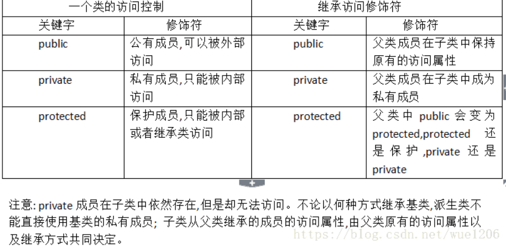

c++类关于类静态成员和方法和类的普通成员和方法的关系以及区别

下面把静态属性(方法)称为类的属性(方法) ，普通属性(方法)称为对象的属性(方法)

### 调用类成员和属性的几种方法

```cpp
/*

调用类成员和属性的几种方法:
    类名::属性或方法名
    对象.属性或对象名
*/
#include<cstdio>
#include<iostream>
using namespace std;
class Cat{
public:
    static int tot;
    static void Comemet(){
    tot=100;
    }
    static void Print(){
    cout<<tot<<endl;
    }
};
int Cat::tot=0;
int main()
{
    Cat::Comemet();
    Cat::Print();
    cout<<Cat::tot<<endl;
    Cat a;
    a.Print();
    a.Comemet();
    cout<<a.tot<<endl;
    return 0 ;
}
```


### 类和对象的方法和属性大的互相调用问题

1. 公有私有保护同样适用类的属性和类的方法（为什么不呢？）
2. 类的属性必须在主函数外进行初始化（必须初始化）
3. 类方法和类属性不能和对象方法和对象属性重名。（会存在二义性的）
4. 对象方法可访问类方法和类属性，类方法不能直接访问对象方法和属性( 只有制定一个对象才可访问对象的方法和属性)


```cpp
/*  一 公有私有保护同样适用类的属性和类的方法 */
#include<cstdio>
#include<iostream>
using namespace std;
class Cat{
private:
    static int tot;
    static void Comemet(){
    tot=100;
    }
};
int Cat::tot=0;/*编译*/
int main()
{
    Cat::Comemet();/*编译失败   不能直接访问私有方法 */
    cout<<Cat::tot<<endl;/*编译失败   不能访问直接直接私有成员 */
}
```


```cpp

/* 二  类的属性必须在主函数外进行初始化 */
#include<cstdio>
#include<iostream>
using namespace std;
class Cat{
private:
    static int tot;
public:
    static void Comemet(){
    tot=100;
    }
};
int Cat::tot=0;
int main()
{
    return 0;
}

```

```cpp
/* 三 类所属内的所有函数和变量都不允许重名(函数重载的函数不重名)*/
#include<cstdio>
#include<iostream>
using namespace std;
class Cat{
private:
    static int tot;
    int tot;//编译失败  与Cat::tot冲突
public:
    static void Comemet(){
    tot=100;
    }
    static void Print(){
    cout<<tot<<endl;
    }
};
int Cat::tot=0;
int main()
{
    return 0;
}

```

```cpp
/*四  为了不产生二义性，所属的对象能访问直接类的内容*/
```

类的继承

派生类和父类不是友元关系。

故父类的私有成员不能被派生类访问

且父类的保护成员可以被派生类访问

且父类的共有成员可以被类外的访问


继承访问符作用如下所示


