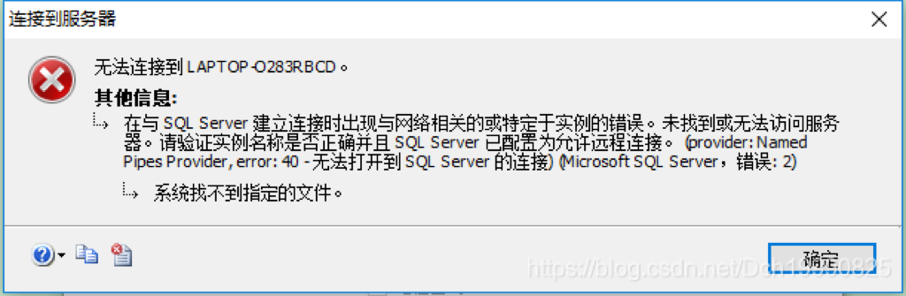
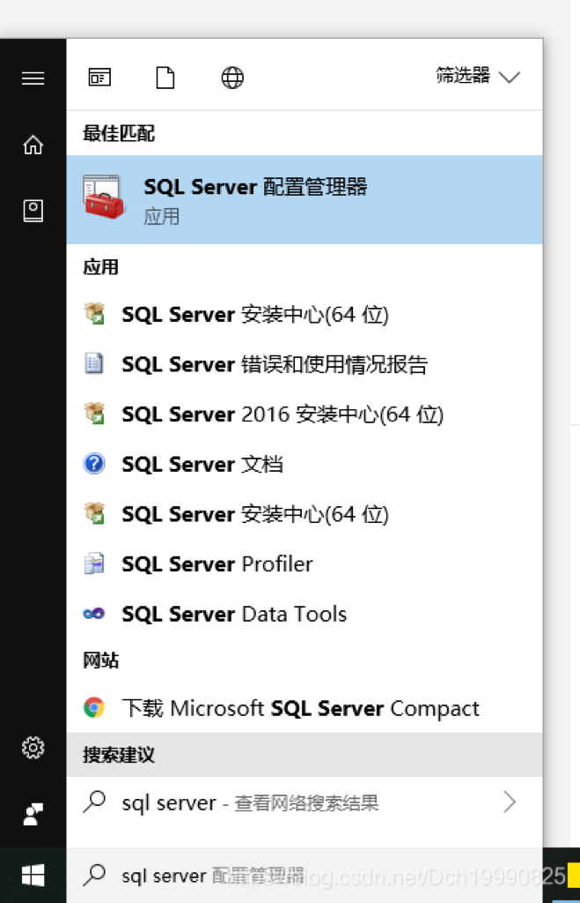
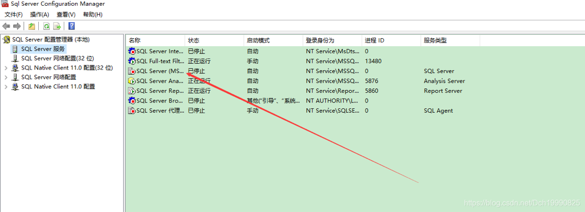
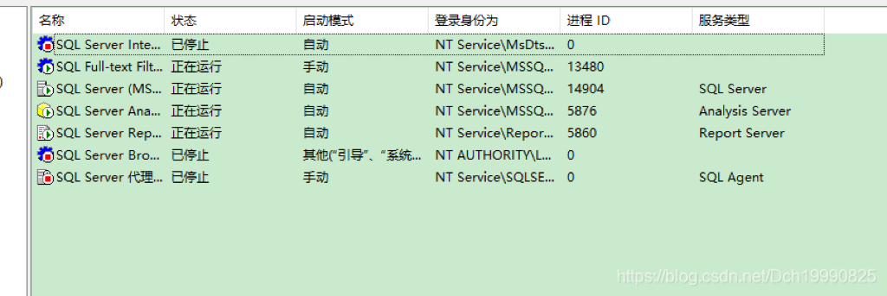

如果你出现了如下情况





那么就很简单了，是因为数据库的一个服务关闭了，手动给开下就好了（我也不知道是怎么关的 

 

## 第一步


打开sql server配置管理器

window10用户直接搜索即可，像这样





 

## 第二步


把其中的sql server(MS...)的服务给启动就行（右键点击启动

## 



 

 

启动完之后就像这样





 

 

问题就已经解决了，只需重新打开sql server连接服务器即可 


### 因功能改进和CSDN博客对项目的上传不支持，完整版已经移动到github地址：


[https://github.com/LieLieLiekey/Small-supermarket-inventory-management-system](https://github.com/LieLieLiekey/Small-supermarket-inventory-management-system) 欢迎大家访问。

## Py文件分下面几个


+  [supermarketmanage.py](http://supermarketmanage.py) ，负责软件的开始界面和调用其他几个人员界面 
+  [basic.py](http://basic.py) ，负责软件与数据库交流的函数，提供软件与数据库所需的基本查询、修改、删除等功能 
+  [frontdesk.py](http://frontdesk.py) ，售货员的前台界面以及功能 
+  [purchasemanage.py](http://purchasemanage.py) ，进货员的前台界面以及功能 
+  [adminmanage.py](http://adminmanage.py) ，管理员的前台界面以及功能 
+  [generaloperat.py](http://generaloperat.py) ，包含所有员工共有的一些操作函数 
+  [commodity.py](http://commodity.py) ，商品对象的定义 
+  [cashier.py](http://cashier.py) ，售货员对象的定义 
+  [purchaser.py](http://purchaser.py) ，进货员的定义 


注：该代码是sql课程设计，使用python3.7编写前台和后台与数据库交互的部分（from NYIST 计工学院计科专业 17级DCH） ，费时四天，无任何抄袭，都为自己一个一个写的。 sql代码等过了验收再放出来

### [supermarketmanage.py](http://supermarketmanage.py)


```python
import pymssql
from basic import Basic
from frontdesk import FrontDesk
from purchasemanage import PurchaseManage
from adminmanage import AdminManage
import os
def link():
    conn = pymssql.connect(host="127.0.0.1",  # 连接数据库
                           user="sa",
                           password="123",
                           database="supermarket",  # Suppermarket
                           charset="utf8")
    return conn
def meta():
    while True:
        os.system("cls")
        print("------------------------------------------------")
        print("1: 售货员界面")
        print("2: 进货员界面")
        print("3: 管理员界面")
        print("                                     其他数字退出")
        print("------------------------------------------------")
        cmd = input("请输入选项:").strip()
        if cmd=="1":
            front_desk=FrontDesk()
            front_desk.meta()
        elif cmd=="2":
            purchase_manage = PurchaseManage()
            purchase_manage.meta()
        elif cmd=="3":
            admin_manage = AdminManage()
            admin_manage.meta()
        else:
            break
        os.system("pause")

if __name__ == '__main__':
    try:
        conn=link()
        Basic.setConn(conn)
        meta()
    except Exception as e:
        print("出现错误，原因：",e)
```


### [basic.py](http://basic.py)


```python
from cashier import *
from commodity import  *
import datetime
import random
class Basic:
    conn=None
    # def __init__(self,conn):
    #     self.conn=conn
    @classmethod
    def setConn(cls,conn):#ok
        Basic.conn=conn

    @classmethod
    def runQuery(cls,sql):#ok
        with Basic.conn.cursor() as cursor:
            cursor.execute(sql)
            ans=cursor.fetchall()
            return ans

    @classmethod
    def runModify(cls,sql):#ok
        with Basic.conn.cursor() as cursor:
            cursor.execute(sql)
            Basic.conn.commit()
    @classmethod
    def queryOneCommodity(cls, com_num):#==queryOneCommodityView
        '''返回列表,没有则返回空列表'''
        sql="select * from Commodity where commodity_no='{}'".format(com_num)
        # print(sql)
        ans=Basic.runQuery(sql)
        if ans!=[]:
            ans=ans[0]
        return ans

    @classmethod
    def queryAllCommodity(cls):# ==queryAllCommodityView
        '''返回列表'''
        sql = "select * from Commodity"
        return Basic.runQuery(sql)

    @classmethod
    def queryOneCashier(cls,cash_num):
        sql ="select * from Cashier where cashier_no='{}'".format(cash_num)
        res=Basic.runQuery(sql)
        if res!=[]:
            res = res[0]
        return res

    @classmethod
    def queryOnePurchase(cls,pur_num):
        sql ="select * from Purchaser where purchaser_no='{}'".format(pur_num)
        res=Basic.runQuery(sql)
        if res!=[]:
            res = res[0]
        return res
    @classmethod
    def addOneSell(cls,cashier_no,com_no,sell_no,sell_cnt,sell_rmoney):#向支付条目中添加信息
        sql="insert into Sell values('{}','{}','{}',{},{},'{}')".format(cashier_no,com_no,sell_no,sell_cnt,sell_rmoney,Basic.getNowTime())
        Basic.runModify(sql)
    @classmethod
    def addOneCommodity(cls,com_no,com_name,com_type,com_size,com_price,com_mdate,com_edate,com_quantity):
        sql="insert into Commodity values('{}','{}','{}','{}',{},'{}','{}',{})".format(com_no,com_name,com_type,com_size,com_price,com_mdate,com_edate,com_quantity)
        Basic.runModify(sql)

    @classmethod
    def modifyOneCommodity(cls,com_num, com_name, com_type, com_size, com_price, com_mdate, com_edate, com_quantity):
        sql='''update Commodity
        set Commodity__name='{}',commodity__type1='{}',commodity__size='{}',commodity__sprice={},commodity__mdate='{}',commodity__edate='{}',commodity__quantity={}
        where commodity_no='{}'
        '''.format(com_name, com_type, com_size, com_price, com_mdate, com_edate, com_quantity,com_num)
        Basic.runModify(sql)
    @classmethod
    def addOneCommodityCnt(cls,com_num,com_cnt):
        sql = "update Commodity set commodity__quantity=commodity__quantity +{} where commodity_no='{}'".format(com_cnt,com_num)
        Basic.runModify(sql)

    @classmethod
    def addOneCashier(cls,cash_no,cash_name,cash_pwd,cash_sex,cash_age,cash_hourse,cash_salary,cash_phone,cash_entry):
        sql="insert into Cashier values('{}','{}','{}','{}',{},{},{},{},'{}')".format(cash_no,cash_name,cash_pwd,cash_sex,cash_age,cash_hourse,cash_salary,cash_phone,cash_entry)
        Basic.runModify(sql)

    @classmethod
    def modifyOneCashier(cls,cash_no,cash_name,cash_pwd,cash_sex,cash_age,cash_hourse,cash_salary,cash_phone,cash_entry):
        sql='''update Cashier set cashier_name='{}',cashier_pwd='{}',cashier_sex='{}',cashier_age={},cashier_hourse={},cashier_salary={},cashier_phone={},cashier_entrytime='{}' where cashier_no='{}'
'''.format(cash_name,cash_pwd,cash_sex,cash_age,cash_hourse,cash_salary,cash_phone,cash_entry,cash_no)
        Basic.runModify(sql)

    @classmethod
    def addOnePurchaser(cls,pur_no,pur_name,pur_sex,pur_age,pur_salary,pur_phone,pur_entry):
        sql="insert into Purchaser values('{}','{}','{}',{},{},{},'{}')".format(pur_no,pur_name,pur_sex,pur_age,pur_salary,pur_phone,pur_entry)
        Basic.runModify(sql)

    @classmethod
    def modifyOnePurchaser(cls,pur_no, pur_name, pur_sex, pur_age, pur_salary, pur_phone, pur_entry):
        sql='''update Purchaser
        set purchaser_name='{}',purchaser_sex='{}',purchaser_age={},purchaser_salary={},purchaser_phone={},purchaser_entrytime='{}'
        where purchaser_no='{}'
        '''.format(pur_name, pur_sex, pur_age, pur_salary, pur_phone, pur_entry,pur_no)
        Basic.runModify(sql)
    @classmethod
    def delCommodityCnt(cls,com_num,com_cnt):
        '''删除某一个商品的数量 '''
        sql="update Commodity set commodity__quantity=commodity__quantity -{} where commodity_no='{}'".format(com_cnt,com_num)
        Basic.runModify(sql)

    @classmethod
    def delOneCashier(cls,cash_no):
        sql="delete   from  Cashier  where  cashier_no='{}'".format(cash_no)
        Basic.runModify(sql)

    @classmethod
    def delOnePurchase(cls,pur_no):
        sql="delete  from Purchaser where purchaser_no='{}'".format(pur_no)
        Basic.runModify(sql)

    @classmethod
    def delOneCommodity(cls,com_no):
        sql="delete from Commodity  where commodity_no='{}'".format(com_no)
        Basic.runModify(sql)

    @classmethod
    def addOneStock(cls,pur_no,com_no,stock_no,com_price,com_cnt,in_date):
        sql = "insert into Stock values('{}','{}','{}',{},{},'{}')".format(pur_no,com_no,stock_no,com_price,com_cnt,in_date)
        Basic.runModify(sql)

    @classmethod
    def queryAllStock(cls):
        sql="select * from Stock"
        res=Basic.runQuery(sql)
        return res

    @classmethod
    def queryAllCashier(cls):
        sql="select * from Cashier"
        res=Basic.runQuery(sql)
        return res

    @classmethod
    def queryAllPurchaser(cls):
        sql="select * from Purchaser"
        res=Basic.runQuery(sql)
        return res

    @classmethod
    def queryAllSell(cls):
        sql="select * from Sell"
        res=Basic.runQuery(sql)
        return res

    @classmethod
    def getNowTime(cls):
        return datetime.datetime.now().strftime("%Y-%m-%d %H:%M:%S")

    @classmethod
    def getFlowNum(cls):
        res=datetime.datetime.now().strftime("%Y%m%d")+"%06d"%(random.randint```


## pymssql用法


因为CSDN博客设置私密就不会再博客分类内看到，所以这篇文章只能设为公开的了。


conn是连接数据库后的hand

cursor是hand的游标 ，用于提交数据库的查询等信息

连接数据库

```python
    conn=pymssql.connect(host="127.0.0.1", #连接数据库
                         user="sa",
                         password="123",
                         database="stuManage",
                         charset="utf8")
```


执行查询语句并获得结果

```python
sql="select * from course"
cursor.execute(sql)#执行sql语句
rs=cursor.fetchall()#取结果
```


执行其他sql语句

```python
sql=''' drop table dch
        ''' 
cursor.execute(sql)
conn.commit()#提交创建信息
```


捕捉操作

```python
try:
	createTable(cursor)# 创建表dch
	# conn.commit()#提交创建信息
except pymssql.OperationalError as e :#捕捉操作异常
	print(e)
#捕捉所有异常
except Exception as e:
    print(e)
```


用表格打印查询结果

```python
sql="select * from course"
cursor.execute(sql)#执行sql语句
table=from_db_cursor(cursor)#直接使用PrettyTable的成员函数即可
print(table)


#也可以这样
table=PrettyTable(["课程号","课程名称","学号"])
rs=cursor.fetchall()#取结果
for i in rs:
    table.add_row(i)
```


类的静态成员变量和类成员函数

```python
class dch:
    dch_name=""  #这是类属性
	@classmethod
    def query(self):
        print("this class methon")
        
```


获取当前时间

```python
import datetime
print(datetime.datetime.now().strftime("%Y-%m-%d %H:%M:%S"))
#输出：2019-06-02 23:24:22
```


获取两时间之间有多少天

```python
ans=(datetime.datetime(2020,1,13,12,0,0) - datetime.datetime(2019,1,13,12,0,0)).total_seconds()/(24*60*60)
# 输出：365.0
```


